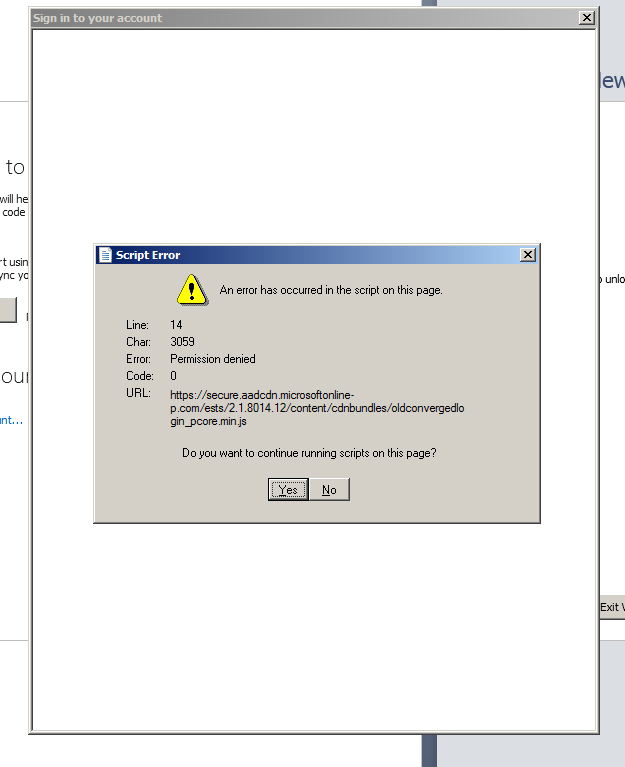

# Troubleshooting

## Visual Studio Sign-In Script Error

When attempting to sign in to your account within Visual Studio, you may encounter the following script error message. One solution to this is to ensure that [JavaScript is enabled for Windows](https://support.microsoft.com/en-us/help/3135465/how-to-enable-javascript-in-windows) and that you have [deleted cookies, etc](https://social.msdn.microsoft.com/Forums/vstudio/en-US/e8fb58cf-35fb-4653-8d00-93f51e7cda31/troubleshooting-connections-from-internet-explorer-amp-visual-studio-to-visual-studio-online?forum=TFService).

