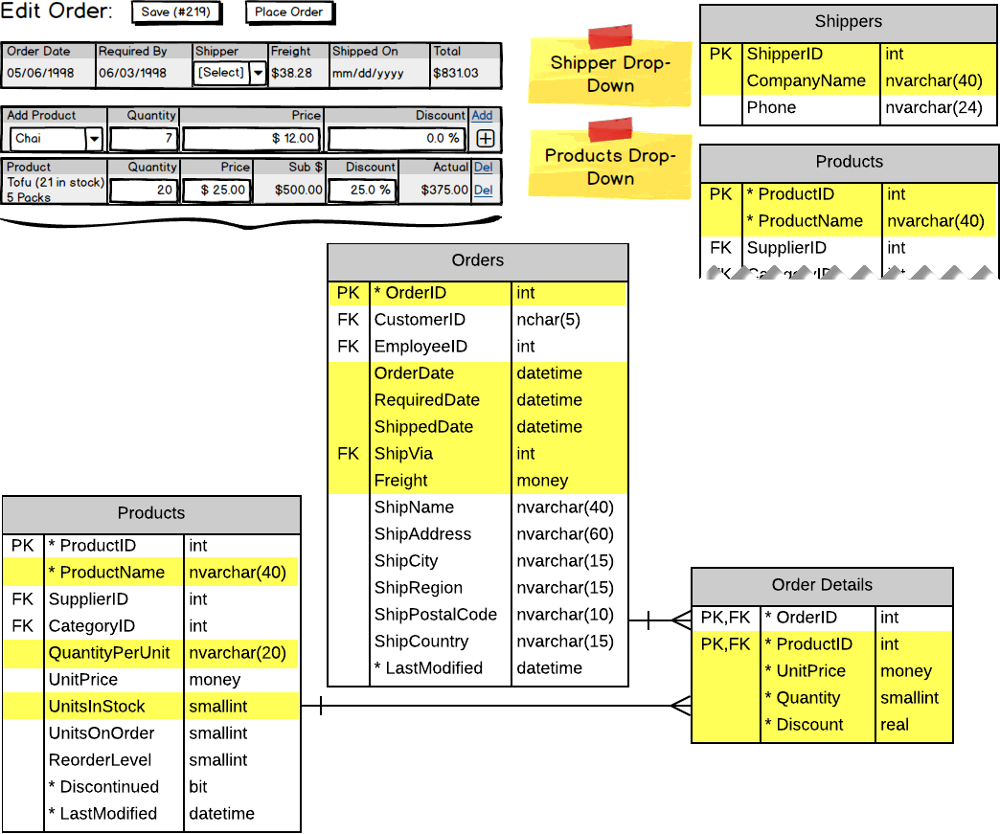

# Customer Orders - Design Plan

Yellow 

## Page Load

> **Customer Selection** (`<asp:DropDownList>`)

```csharp
// SalesController class
[DataObjectMethod(DataObjectMethodType.Select)]
public List<KeyValueOption> ListCustomerNames()
```


## Selecting a Customer

> **Customer Summary Info** (disabled textboxes)

```csharp
// SalesController class
public CustomerSummary GetCustomerSummary(string customerId)
```

> **Order History Filters** (`<asp:RadioButtonList>`)

```csharp
// SalesController class
[DataObjectMethod(DataObjectMethodType.Select)]
public List<KeyValueOption> GetOrderHistoryFilters()
```

> **Order History** (`<asp:GridView>`)

```csharp
// SalesController class
[DataObjectMethod(DataObjectMethodType.Select)]
public List<CustomerOrder> GetOrdersByCustomer(string customerId, string filter)
```


----

## Starting New/Existing Order

```csharp

```



----

## Saving Order

```csharp

```


----

## Placing Customer Order

