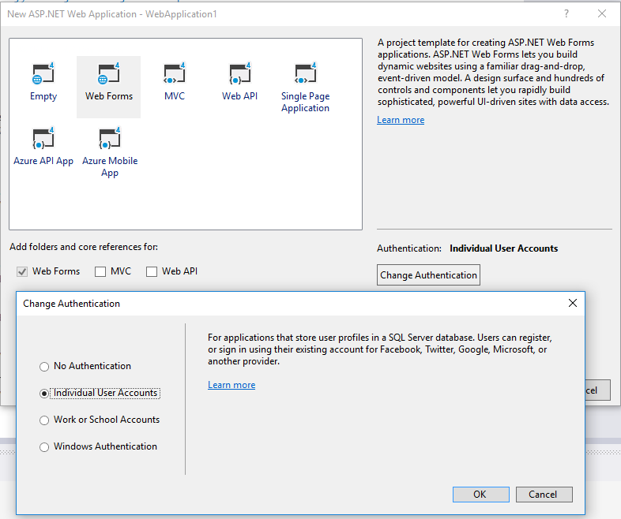
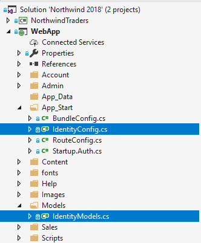
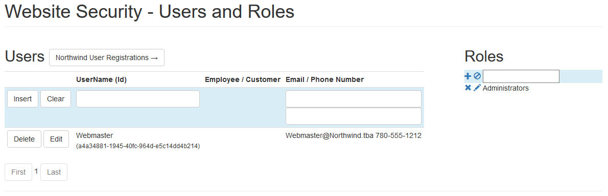

# ASP.NET Identity

> This discussion about using the built-in security features of ASP.Net Identity 2.x assume a **Web Application Project** using *Web Forms*. While details may vary for different starter templates, the general concepts remain the same.

When you create a new web application project, you have the opportunity to specify the authentication for the application. The "Individual User Accounts" option is the one that makes use of ASP.Net Identity.



Two files contain the classes that you can edit which build on ASP.Net Identity. They are the `IdentityConfig.cs` file (which holds the `ApplicationUserManager` class, among others) and the `IdentityModel.cs` file (which holds the `ApplicationUser` and `ApplicationDbContext` classes). It is this latter file that we will be editing to customize ASP Identity for our site.



## Customizing the `ApplicationUser`

In order to associate  a website user (`ApplicationUser`) with a particular employee or customer of Northwind, we will add a couple of properties to the `ApplicationUser` class that effectively work as "nullable foreign key" references to the `Employees` and `Customers` tables (though, without any foreign key constraints).

These new properties in the `ApplicationUser` will be generated as columns in the `AspNetUsers` database table.

```csharp
public class ApplicationUser : IdentityUser
{
    #region Custom Properties
    // An application user, in this web app, can be either an Employee or a Customer
    public int? EmployeeId { get; set; }
    public string CustomerId { get; set; }
    #endregion

    // ... other items remain untouched
}
```

## Seeding the Database

Generally, it's a good idea to ensure that your web application's database is pre-populated with any security roles and default users that your application will need. Specifically, you should consider specifying some user to be the "webmaster" for the site. The following sections detail one good way to accomplish this.

### AppSettings

The `<appSettings>` section of the `Web.config` file is a good place to put application-specific settings that you might want to be changing on the production site. The reason for using a configuration file is that it is simply a text file, and can be edited in any text editor such as NotePad. Also, the web server (IIS) will secure the `.config` files, make sure not to directly expose them to anyone via a web browser.

In the code below, a number of startup security roles are specified, along with details for the administrator account and other notable accounts. There's even a default password for when we want to programmatically add new users to the site.

```xml
  <appSettings>
    <add key="startupRoles" value="Administrators;Employees;Customers;RegisteredUsers" />
    <add key="adminUserName" value="Webmaster" />
    <add key="adminEmail" value="Webmaster@Northwind.tba" />
    <add key="adminPassword" value="Pa$$w0rd" />
    <add key="adminRole" value="Administrators" />
    <add key="customerRole" value="Customers" />
    <add key="employeeRole" value="Employees" />
    <add key="newUserPassword" value="Pa$$word1" />
  </appSettings>
```

### Database Initializer

Since ASP.Net Identity with Entity Framework is already configured to generate the security tables if they do not exist, a good plan to prepopulate the database is to use a **database initialization** class to do the work. The following is a simple example that uses the data from our `web.config` file to add those users and roles. You can place this file anywhere in the web application; for my purposes, I placed it under the `~\Admin\Security\` folder.

> Check out this tutorial about [Database Initialization Strategies in EF6](http://www.entityframeworktutorial.net/code-first/database-initialization-strategy-in-code-first.aspx).

```csharp
public class SecurityDbContextInitializer : CreateDatabaseIfNotExists<ApplicationDbContext>
{

    protected override void Seed(ApplicationDbContext context)
    {
        #region Seed the roles
        var roleManager = new RoleManager<IdentityRole>(new RoleStore<IdentityRole>(context));
        var startupRoles = ConfigurationManager.AppSettings["startupRoles"].Split(';');
        foreach(var role in startupRoles)
            roleManager.Create(new IdentityRole { Name = role });
        #endregion

        #region Seed the users
        string adminUser = ConfigurationManager.AppSettings["adminUserName"];
        string adminRole = ConfigurationManager.AppSettings["adminRole"];
        string adminEmail = ConfigurationManager.AppSettings["adminEmail"];
        string adminPassword = ConfigurationManager.AppSettings["adminPassword"];
        var userManager = new ApplicationUserManager(new UserStore<ApplicationUser>(context));
        var result = userManager.Create(new ApplicationUser
        {
            UserName = adminUser,
            Email = adminEmail
        }, adminPassword);
        if (result.Succeeded)
            userManager.AddToRole(userManager.FindByName(adminUser).Id, adminRole);
        #endregion

        // ... etc. ...

        base.Seed(context);
    }
}
```

### Modifying `ApplicationDbContext`

In order for our database context to use the initializer we created in the previous step, we need to specify that in the constructor for our `ApplicationDbContext`.

```csharp
public ApplicationDbContext()
    : base("DefaultConnection", throwIfV1Schema: false)
{
    Database.SetInitializer<ApplicationDbContext>(new SecurityDbContextInitializer());
}
```

It's a good idea at this time to also edit the `Web.config` file to point the `DefaultConnection` to your actual database. In this case, it's pointing to the same Northwind database used by the rest of the application.

```xml
  <connectionStrings>
    <add name="DefaultConnection"
         connectionString="Data Source=.;Initial Catalog=Northwind_DMIT2018;Integrated Security=true"
         providerName="System.Data.SqlClient" />
    <add name="NW2018"
         connectionString="Data Source=.;Initial Catalog=Northwind_DMIT2018;Integrated Security=true"
         providerName="System.Data.SqlClient" />
  </connectionStrings>
```

----

## Managing Users and Roles

The starter template for using ASP.Net Identity does not include a UI for managing users and roles. The following is a simple user/role management plan for Northwind Traders. It includes a `SecurityController` to act as a BLL in front of ASP Identity's UserManager and RoleManager, as well as a simple CRUD-based UI.

## Security Controller (CRUD)

This controller class provides basic CRUD-like services for users and roles. You can place this file anywhere in the web application; for my purposes, I placed it under the `~\Admin\Security\` folder.

```csharp
[DataObject]
public class SecurityController
{
    #region Constructor & Dependencies
    private readonly ApplicationUserManager UserManager;
    private readonly RoleManager<IdentityRole> RoleManager;
    public SecurityController()
    {
        UserManager = HttpContext.Current.Request.GetOwinContext().GetUserManager<ApplicationUserManager>();
        RoleManager = new RoleManager<IdentityRole>(new RoleStore<IdentityRole>(new ApplicationDbContext()));
    }
    #endregion

    #region ApplicationUser CRUD
    [DataObjectMethod(DataObjectMethodType.Select)]
    public List<ApplicationUser> ListUsers()
    {
        return UserManager.Users.ToList();
    }

    private void CheckResult(IdentityResult result)
    {
        if (!result.Succeeded)
            throw new Exception($"Failed to add new user:<ul> {string.Join(string.Empty, result.Errors.Select(x => $"<li>{x}</li>"))}</ul>");
    }

    [DataObjectMethod(DataObjectMethodType.Insert)]
    public void AddUser(ApplicationUser user)
    {
        IdentityResult result = UserManager.Create(user, ConfigurationManager.AppSettings["newUserPassword"]);
        CheckResult(result);
    }

    [DataObjectMethod(DataObjectMethodType.Update)]
    public void UpdateUser(ApplicationUser user)
    {
        var existing = UserManager.FindById(user.Id);
        if (existing == null)
            throw new Exception("The specified user was not found");
        else if (existing.UserName == ConfigurationManager.AppSettings["adminUserName"] && existing.UserName != user.UserName)
            throw new Exception("You are not allowed to modify the website administrator's user name");
        // Change certain parts of the found user
        existing.EmployeeId = user.EmployeeId;
        existing.Email = user.Email;
        existing.CustomerId = user.CustomerId;
        existing.PhoneNumber = user.PhoneNumber;
        existing.UserName = user.UserName; // Generally NOT a good idea to change this!
        var result = UserManager.Update(existing);
        CheckResult(result);
    }

    [DataObjectMethod(DataObjectMethodType.Delete)]
    public void DeleteUser(ApplicationUser user)
    {
        var existing = UserManager.FindById(user.Id);
        if (existing == null)
            throw new Exception("The specified user was not found");
        else if (existing.UserName == ConfigurationManager.AppSettings["adminUserName"])
            throw new Exception("You are not allowed to delete the website administrator");
        var result = UserManager.Delete(existing);
        CheckResult(result);
    }
    #endregion

    #region IdentityRole CRUD
    [DataObjectMethod(DataObjectMethodType.Select)]
    public List<IdentityRole> ListRoles()
    {
        return RoleManager.Roles.ToList();
    }

    [DataObjectMethod(DataObjectMethodType.Insert)]
    public void AddRole(IdentityRole role)
    {
        CheckResult(RoleManager.Create(role));
    }

    [DataObjectMethod(DataObjectMethodType.Update)]
    public void UpdateRole(IdentityRole role)
    {
        var existing = RoleManager.FindById(role.Id);
        if (existing == null)
            throw new Exception("The specified role could not be found");
        else if (existing.Name == ConfigurationManager.AppSettings["adminRole"])
            throw new Exception("Cannot rename the administrator role");
        existing.Name = role.Name;
        CheckResult(RoleManager.Update(existing));
    }

    [DataObjectMethod(DataObjectMethodType.Delete)]
    public void DeleteRole(IdentityRole role)
    {
        var existing = RoleManager.FindById(role.Id);
        if (existing == null)
            throw new Exception("The specified role could not be found");
        if (existing.Name == ConfigurationManager.AppSettings["adminRole"])
            throw new Exception("Cannot delete the administrator role");
        CheckResult(RoleManager.Delete(existing));
    }
    #endregion
}
```

## Security Management UI

The user interface for managing application users and security roles is fairly simple at this stage, providing a way to do simple CRUD operations. Once again, you can place this file anywhere in the web application; I placed it under the `~\Admin\Security\` folder along with the `SecurityController.cs` file.



```xml
<h1 class="page-header">Website Security - Users and Roles</h1>
<div class="row">
    <div class="col-md-12">
        <uc1:MessageUserControl runat="server" ID="MessageUserControl" />
    </div>
</div>
<div class="row">
    <div class="col-md-9">
        <h2>Users</h2>
        <asp:ListView ID="UsersListView" runat="server"
            DataSourceID="UsersDataSource" DataKeyNames="Id"
            InsertItemPosition="FirstItem"
            ItemType="WebApp.Models.ApplicationUser">
            <EditItemTemplate>
                <tr style="">
                    <td style="white-space:nowrap;">
                        <asp:Button runat="server" CommandName="Update" Text="Update" CssClass="btn btn-default" ID="UpdateButton" />
                        <asp:Button runat="server" CommandName="Cancel" Text="Cancel" CssClass="btn btn-default" ID="CancelButton" />
                    </td>
                    <td>
                        <asp:TextBox Text='<%# BindItem.UserName %>' runat="server" ID="UserNameTextBox" CssClass="form-control" />
                    </td>
                    <td>
                        <asp:TextBox Text='<%# BindItem.EmployeeId %>' runat="server" ID="EmployeeIdTextBox" />
                        <asp:TextBox Text='<%# BindItem.CustomerId %>' runat="server" ID="CustomerIdTextBox" />
                    </td>
                    <td>
                        <asp:TextBox Text='<%# BindItem.Email %>' runat="server" ID="EmailTextBox" CssClass="form-control" />
                        <asp:TextBox Text='<%# BindItem.PhoneNumber %>' runat="server" ID="PhoneNumberTextBox" CssClass="form-control" />

                    </td>
                </tr>
            </EditItemTemplate>
            <InsertItemTemplate>
                <tr class="bg-info">
                    <td style="white-space:nowrap;">
                        <asp:Button runat="server" CommandName="Insert" Text="Insert" CssClass="btn btn-default" ID="InsertButton" />
                        <asp:Button runat="server" CommandName="Cancel" Text="Clear" CssClass="btn btn-default" ID="CancelButton" />
                    </td>
                    <td>
                        <asp:TextBox Text='<%# BindItem.UserName %>' runat="server" ID="UserNameTextBox" CssClass="form-control" />
                    </td>
                    <td>
                    </td>
                    <td>
                        <asp:TextBox Text='<%# BindItem.Email %>' runat="server" ID="EmailTextBox" CssClass="form-control" />
                        <asp:TextBox Text='<%# BindItem.PhoneNumber %>' runat="server" ID="PhoneNumberTextBox" CssClass="form-control" />
                    </td>
                </tr>
            </InsertItemTemplate>
            <ItemTemplate>
                <tr style="">
                    <td style="white-space:nowrap;">
                        <asp:Button runat="server" CommandName="Delete" Text="Delete" CssClass="btn btn-default" ID="DeleteButton" />
                        <asp:Button runat="server" CommandName="Edit" Text="Edit" CssClass="btn btn-default" ID="EditButton" />
                    </td>
                    <td>
                        <asp:Label Text='<%# Item.UserName %>' runat="server" ID="UserNameLabel" />
                        <br />
                        <small>(<asp:Label Text='<%# Item.Id %>' runat="server" ID="IdLabel" />)</small>
                    </td>
                    <td>
                        <asp:Label Text='<%# Item.EmployeeId %>' runat="server" ID="EmployeeIdLabel" />
                        <asp:Label Text='<%# Item.CustomerId %>' runat="server" ID="CustomerIdLabel" />
                    </td>
                    <td>
                        <asp:Label Text='<%# Item.Email %>' runat="server" ID="EmailLabel" />
                        <asp:Label Text='<%# Item.PhoneNumber %>' runat="server" ID="PhoneNumberLabel" />
                    </td>
                </tr>
            </ItemTemplate>
            <LayoutTemplate>
                <table runat="server">
                    <tr runat="server">
                        <td runat="server">
                            <table runat="server" id="itemPlaceholderContainer" class="table table-condensed table-hover">
                                <tr runat="server" style="">
                                    <th runat="server"></th>
                                    <th runat="server">UserName (Id)</th>
                                    <th runat="server">Employee / Customer</th>
                                    <th runat="server">Email / Phone Number</th>
                                </tr>
                                <tr runat="server" id="itemPlaceholder"></tr>
                            </table>
                        </td>
                    </tr>
                    <tr runat="server">
                        <td runat="server" style="">
                            <asp:DataPager runat="server" ID="DataPager1">
                                <Fields>
                                    <asp:NextPreviousPagerField ButtonType="Button" ShowFirstPageButton="True" ShowNextPageButton="False" ShowPreviousPageButton="False" ButtonCssClass="btn btn-default"></asp:NextPreviousPagerField>
                                    <asp:NumericPagerField NumericButtonCssClass="btn btn-default"></asp:NumericPagerField>
                                    <asp:NextPreviousPagerField ButtonType="Button" ShowLastPageButton="True" ShowNextPageButton="False" ShowPreviousPageButton="False" ButtonCssClass="btn btn-default"></asp:NextPreviousPagerField>
                                </Fields>
                            </asp:DataPager>
                        </td>
                    </tr>
                </table>
            </LayoutTemplate>
        </asp:ListView>
    </div>
    <div class="col-md-3">
        <h2>Roles</h2>
        <asp:ListView ID="RolesListView" runat="server"
            DataSourceID="RolesDataSource" DataKeyNames="Id" InsertItemPosition="FirstItem"
            ItemType="Microsoft.AspNet.Identity.EntityFramework.IdentityRole">
            <LayoutTemplate>
                <div id="itemPlaceholder" runat="server"></div>
            </LayoutTemplate>
            <ItemTemplate>
                <div>
                    <asp:LinkButton runat="server" CommandName="Delete" ID="DeleteButton"><i class="glyphicon glyphicon-remove"></i></asp:LinkButton>
                    <asp:LinkButton runat="server" CommandName="Edit" ID="EditButton"><i class="glyphicon glyphicon-pencil"></i></asp:LinkButton>
                    <%# Item.Name %>
                </div>
            </ItemTemplate>
            <EditItemTemplate>
                <div>
                    <asp:LinkButton runat="server" CommandName="Update" ID="UpdateButton"><i class="glyphicon glyphicon-ok"></i></asp:LinkButton>
                    <asp:LinkButton runat="server" CommandName="Cancel" ID="CancelButton"><i class="glyphicon glyphicon-arrow-left"></i></asp:LinkButton>
                    <asp:TextBox ID="RoleName" runat="server" Text="<%# BindItem.Name %>"></asp:TextBox>
                </div>
            </EditItemTemplate>
            <InsertItemTemplate>
                <div class="bg-info">
                    <asp:LinkButton runat="server" CommandName="Insert" ID="InsertButton"><i class="glyphicon glyphicon-plus"></i></asp:LinkButton>
                    <asp:LinkButton runat="server" CommandName="Cancel" ID="CancelButton"><i class="glyphicon glyphicon-ban-circle"></i></asp:LinkButton>
                    <asp:TextBox ID="RoleName" runat="server" Text="<%# BindItem.Name %>"></asp:TextBox>
                </div>
            </InsertItemTemplate>
        </asp:ListView>
    </div>
</div>

<asp:ObjectDataSource ID="UsersDataSource" runat="server"
    DataObjectTypeName="WebApp.Models.ApplicationUser"
    DeleteMethod="DeleteUser"
    InsertMethod="AddUser"
    OldValuesParameterFormatString="original_{0}"
    SelectMethod="ListUsers"
    TypeName="WebApp.Admin.Security.SecurityController"
    UpdateMethod="UpdateUser"
    OnUpdated="CheckForExceptions"
    OnInserted="CheckForExceptions"
    OnDeleted="CheckForExceptions"></asp:ObjectDataSource>

<asp:ObjectDataSource ID="RolesDataSource" runat="server"
    DataObjectTypeName="Microsoft.AspNet.Identity.EntityFramework.IdentityRole"
    DeleteMethod="DeleteRole"
    InsertMethod="AddRole"
    OldValuesParameterFormatString="original_{0}"
    SelectMethod="ListRoles"
    TypeName="WebApp.Admin.Security.SecurityController"
    UpdateMethod="UpdateRole"
    OnUpdated="CheckForExceptions"
    OnInserted="CheckForExceptions"
    OnDeleted="CheckForExceptions"></asp:ObjectDataSource>

```