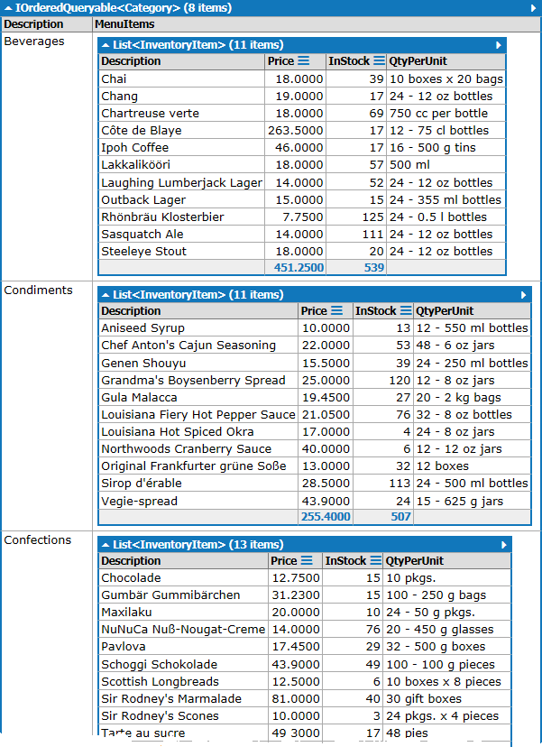

# C# Program

The Program context in LinqPad allows you to create more complex C# code snippets. The Program context gives you a `Main()` method and allows you to create additional methods and/or classes.

## Products by Category

```csharp
void Main()
{
    var data = from cat in Categories
               orderby cat.CategoryName
               select new Category()
               {
               Description = cat.CategoryName,
               MenuItems = from item in cat.Products
                           where !item.Discontinued
                           orderby item.ProductName
                           select new InventoryItem()
                           {
                               Description = item.ProductName,
                               Price = item.UnitPrice.Value,
                               QtyPerUnit = item.QuantityPerUnit,
                               InStock = item.UnitsInStock
                           }
               };
    data.Dump();
}
// Define other methods and classes here
public class Category
{
    public string Description { get;set;}
    public IEnumerable MenuItems { get;set;}
}
public class InventoryItem
{
    public string Description { get;set;}
    public decimal Price { get;set;}
    public int? InStock {get;set;}
    public string QtyPerUnit { get; set; }
}
```


