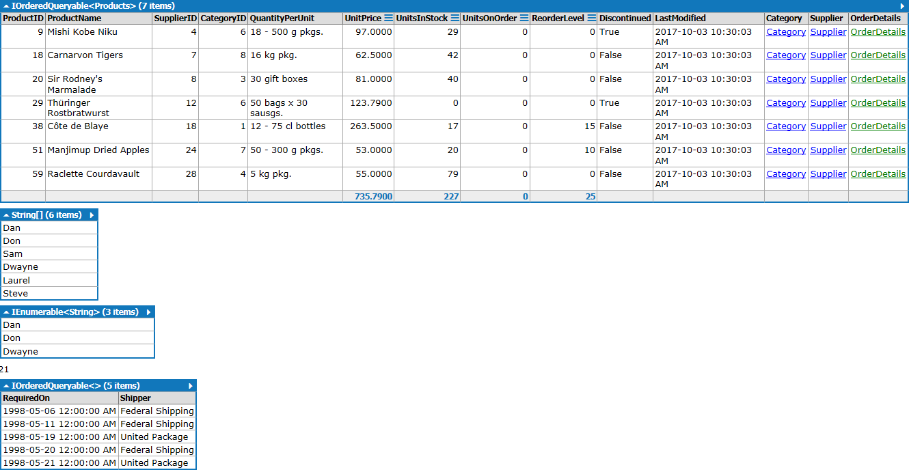
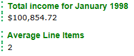
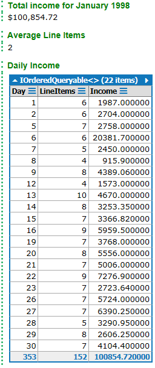

# C# Statements

When using the statement context in LinqPad, you write complete lines of code as though you were writing in the body of a method. To output results in LinqPad, you need to use the `.Dump()` extension method on the objects you want to output.

## A Series of Examples

This example of C# Statements in LinqPad include both LINQ Queries on database tables and simple arrays.

```csharp
/* Example 1: Querying data from Northwind */
var result = from row in Products
             where row.UnitPrice > 50
             select row;

// The following line won't work in your VS project....
result.Dump(); // the .Dump() method is an extension method in LinqPad - it's not in .NET
               /* Example 2: Query a simple array of strings */
string[] names = { "Dan", "Don", "Sam", "Dwayne", "Laurel", "Steve" };
names.Dump();
var shortList = from person in names
                where person.StartsWith("D")
                select person;
shortList.Dump();

/* Example 3: Find the Orders that are due to be shipped */
var toShip = from due in Orders
             where !due.ShippedDate.HasValue
             orderby due.RequiredDate
             select new // declaring an "anonymous type" on-the-fly
             {          // using an initializer list to set the properties
                 RequiredOn = due.RequiredDate,
                 Shipper = due.ShipViaShipper.CompanyName
             };
toShip.Count().Dump(); // show the count of items
toShip.Take(5).Dump(); // show the first 5 items
```



---

## Income and Business Volume Summary

LinqPad allows you to set a title for your output by sending a string into the `.Dump()` method.

The following query shows the total income for the previous month and the number of patrons served.

```csharp
// Get the following from the Orders table for a specific month:
// OrderDate, ID, count of distinct items, total sale
// for items that have been shipped
// Then display the total income for the month and the average line items.
DateTime searchPeriod = new DateTime(1998,1,1);
var billsThisMonth = from item in Orders
                     where item.ShippedDate.HasValue
                     && item.OrderDate.Value.Month == searchPeriod.Month
                     && item.OrderDate.Value.Year == searchPeriod.Year
                     orderby item.OrderDate descending
                     select new
                     {
                         OrderDate = item.OrderDate,
                         OrderId = item.OrderID,
                         DistinctItems = item.OrderDetails.Count,
                         TotalSale = item.OrderDetails.Sum(od => od.Quantity * od.UnitPrice)
                     };

var title = string.Format("Total income for {0} {1}", searchPeriod.ToString("MMMM"), searchPeriod.Year);
// billsThisMonth.Dump();
billsThisMonth.Sum(tm => tm.TotalSale).ToString("C").Dump(title, true);
billsThisMonth.Average(tm => tm.DistinctItems).Dump("Average Line Items", true);
```



---

## Daily Income Report

With LinqPad, you can incrementally build your queries in multiple statements.

```csharp
// Get the following from the Orders table for a specific month:
// OrderDate, ID, count of distinct items, total sale
// for items that have been shipped
// Then display the total income for the month and the average line items.
DateTime searchPeriod = new DateTime(1998,1,1);
var billsThisMonth = from item in Orders
                     where item.ShippedDate.HasValue
                     && item.OrderDate.Value.Month == searchPeriod.Month
                     && item.OrderDate.Value.Year == searchPeriod.Year
                     orderby item.OrderDate descending
                     select new
                     {
                         OrderDate = item.OrderDate,
                         OrderId = item.OrderID,
                         DistinctItems = item.OrderDetails.Count,
                         TotalSale = item.OrderDetails.Sum(od => od.Quantity * od.UnitPrice)
                     };

var title = string.Format("Total income for {0} {1}", searchPeriod.ToString("MMMM"), searchPeriod.Year);
// billsThisMonth.Dump();
billsThisMonth.Sum(tm => tm.TotalSale).ToString("C").Dump(title, true);
billsThisMonth.Average(tm => tm.DistinctItems).Dump("Average Line Items", true);

var report = from item in billsThisMonth
             group item by item.OrderDate.Value.Day into dailySummary
             select new
             {
                 Day = dailySummary.Key,
                 LineItems = dailySummary.Sum(s => s.DistinctItems),
                 Income = dailySummary.Sum(s => s.TotalSale)
             };
report.OrderBy(r => r.Day).Dump("Daily Income");
```


