---
title: eRestaurant Background Story
---
# eRestaurant Background Story

This is a background story for the eRestaurant sample used in class.

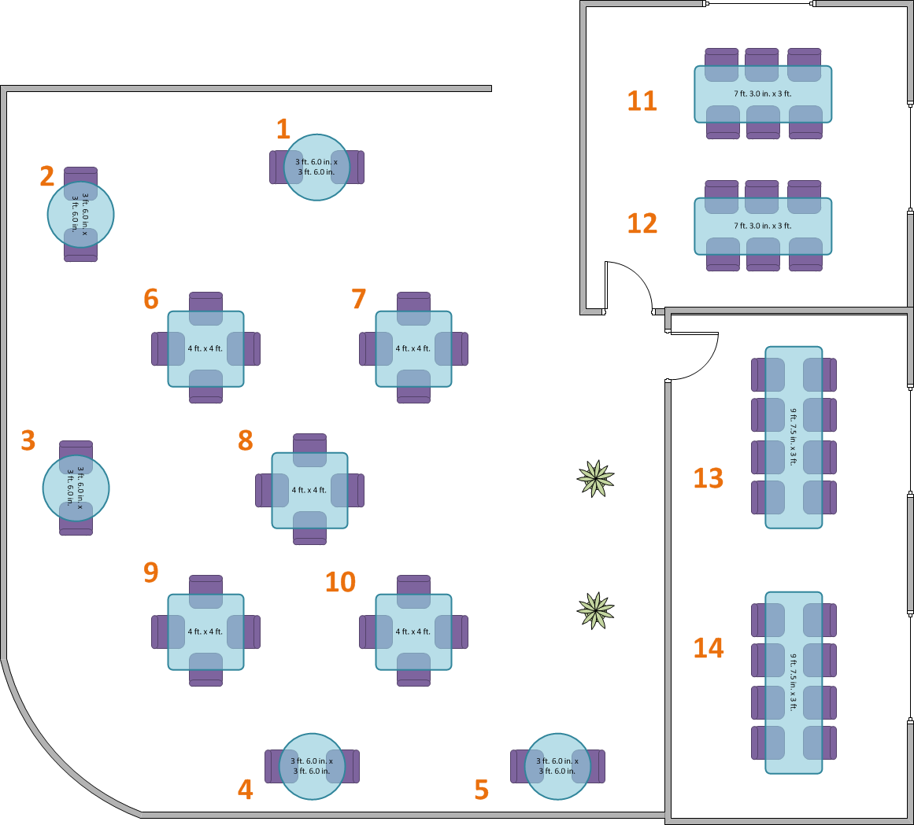

## EatIn - An eRestaurant

At EatIn, a small restaurant that takes walk-in customers as well as reservations, they need a system to make it easier for their waiters and kitchen staff to communicate over customer orders and plan reservations. The system is a web-based application supported by a database.

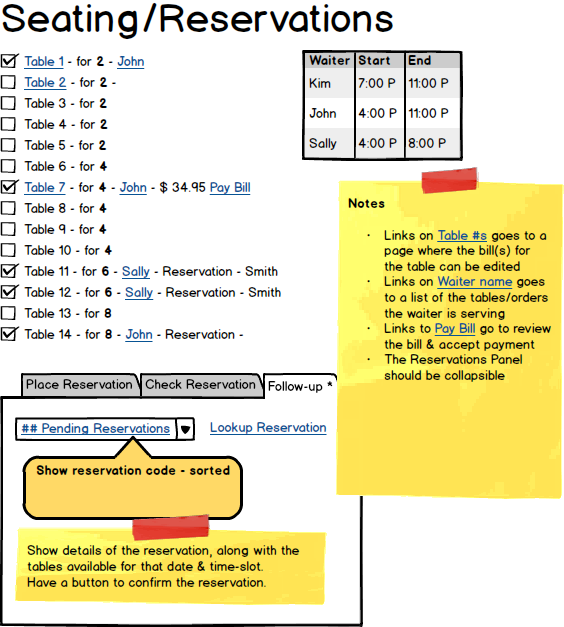

### Servers

Waiters need to seat *customers* when they arrive and tables are available. They then *take customer orders* and *update orders* as customers change their minds or order extra items. When waiters enter the order details on their hand-held device (e.g.: smartphone or tablet), the order information is automatically available to the kitchen. Waiters are notified by the kitchen when the *order is ready* so that they can get the order and serve the customer. At the end, the waiter gives the bill to the customer and the customer goes to pay for the order.

Additionally, waiters are sometimes asked to split the bill for the party, or combine bills for the party at the table(s).

### Online Menu

Customers like to see the online menu. Additionally, we are looking at incorporating special [Multitouch Coffee Table](http://ideum.com/coffee-tables/) that customers can peruse while waiting to be seated.

### Kitchen

The Kitchen staff prepare orders as they are received from the waiters. When the *order is ready*, the staff note it on the bill and the waiters are automatically updated (*SignalR - Advanced scenario*).

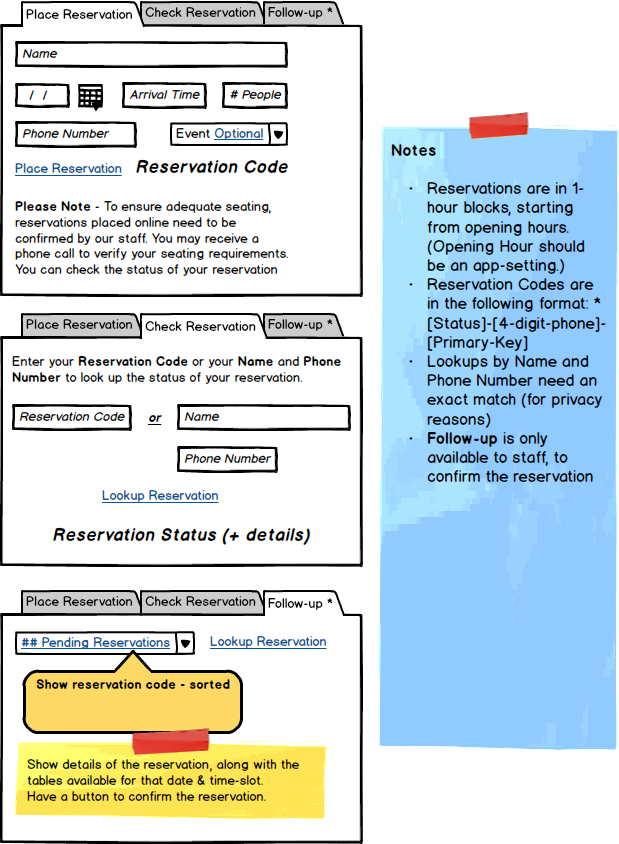

### Online Reservation

Customers are able to place reservations on-line, and can indicate if the reservation is for a special event. Staff use the same system to place reservations received by phone. (When customers place the reservation, they need to use a captcha; logged-in staff do not need to use a captcha).

### Managers

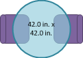 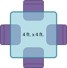 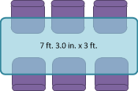 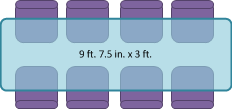

These images can be used in your app.

Managers perform administrative tasks (including placing reservations). Data that needs to be maintained includes managing *menu items*, *waiters*, *tables/seating*, and *special event categories*.

## eRestaurant ERD

Each **Waiter** may be *in charge of* one or more **Bills**. Each **Bill** must be *managed by* one and only one **Waiter**.

Each **Bill** may be *made up of* one or more **BillItems**, wherein each **BillItem** must be *for* one and only one **Item** on the menu. Each **Item** on the menu may be *ordered as part of* one or more **BillItems** where the **BillItem** must be *associated with* one and only one **Bill**.

Each **Bill** must be *associated with* either one and only one **Table** or one and only one **Reservation**. Each **Table** may be *used to identify* one or more **Bills** at the current moment. Likewise, each **Reservation** may be *paid for through* one or more **Bills** at the time of the reservation.

Each **Reservation** may be *placed for* one and only one **SpecialEvent**. Each **SpecialEvent** may be *the occasion for* one or more **Reservations**.

Each **Reservation** must be *specifically allocated for* one or more **Tables**. Each **Table** may be *reserved for* one or more **Reservations**. (This many-to-many association is resolved through an intermediary **ReservationTable**.)

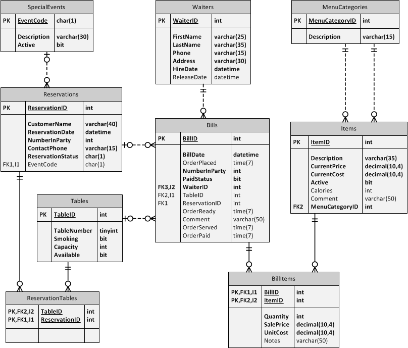

### Template

Each **Table** [must|may] be *relationship* one [and only one|or more] **Table2**.

## Demo/Practice Usage

The following list outlines the usage of the various parts of the eRestaurant database as demos and practice items.

1. **Entitles & DAL**
  - **Demo** - `Table`, `SpecialEvent`, `Reservation` - Use the following business rules: <br /> 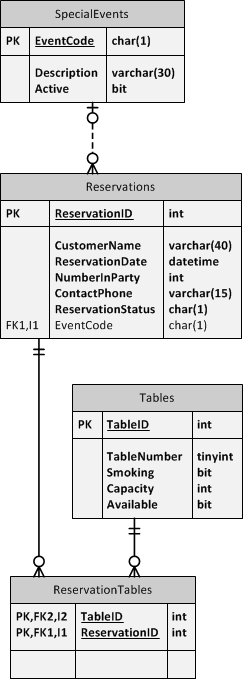
    - **Table.TableNumber** - - int, required, sequential, unique
    - **Table.Capacity** - values of 2, 4, 6, 8, or 10 only
    - **Table.Smoking** - disabled (no longer allowed in public restaurants)
    - **SpecialEvent.EventCode** - required, PK, 1 character
    - **SpecialEvent.Description** - required, 5-30 characters
    - **SpecialEvent.Active** - default is True for all new Special Events (managed in Constructor)
  - **Practice** - `Waiter`, `Item`, `Bill`, `MenuCategory` - Use the following business rules: <br /> 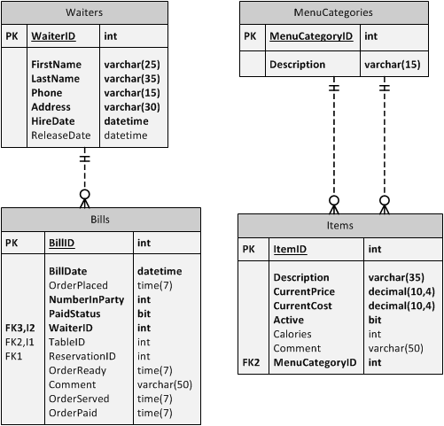
    - **Waiter.FirstName** - required, 2-25 characters
    - **Waiter.LastName** - required, 2-35 characters
    - **Waiter.Phone** - required, 4-15 characters
    - **Waiter.Address** - required, 8-30 characters
    - **Waiter.HireDate** - required
    - **Waiter.ReleaseDate** - optional
    - **Item.Description** - required, 5-35
    - **Item.CurrentPrice** - required, >0, <=50
    - **Item.CurrentCost** - required, >0, <=50
    - **Item.Calories** - optional, >=0
    - **Item.Comment** - optional
    - **Item.MenuCategoryID** - required
  - **Post-Practice** - BillItem (with navigation properties) - Use the following business rules: <br /> ![Tables for Post-Practice usage]./(eRestaurant_ERD_entity-post-practice-tables.png)
    - **BillItem.Quantity** - required, >0
    - **BillItem.SalePrice** - required, >=0.00
    - **BillItem.UnitCost** - required, >=0.00
    - **BillItem.Notes** - (for BLL usage) when the sale price and/or unit cost are zero or the sale price does not equal the quantity times the unit cost, then a note is required
1. **BLL**
  - **Demo** - CRUD methods for Table and SpecialEvent, with `[DataObjectMethod()]` attributes for SpecialEvent methods.
  - **Practice** - CRUD methods for Waiter, Item and MenuCategory, with `[DataObjectMethod()]` attribues for Item methods.
1. **PL - CRUD functionality**
  - **Demo**
    - **Table** - Create a simple CRUD form for managing table information using code-behind (similar to how it was done in the previous course) <br /> 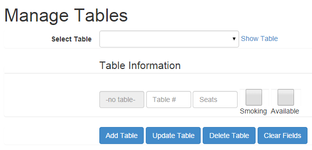
    - **SpecialEvent** - Create a CRUD form for managing SpecialEvent information using a ListView and ObjectDataSource. <br /> 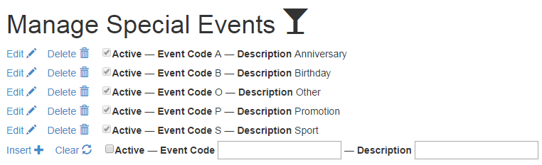
  - **Practice**
    - **Waiter** - Create a simple CRUD form for managing Waiter information using code-behind (similar to how it was done in the previous course) <br /> 
    - **Item & MenuCategory** - Create a CRUD form for managing menu items and their categories using a pair of ListView and ObjectDataSource controls; manage both items on the same page. <br /> 
1. **CQRS**
  - **Menu Items** - Displaying menu item information to the end-user

```csharp
// LinqPad snippet for getting menu items
from cat in MenuCategories
orderby cat.Description
select new
{
    Description = cat.Description,
    MenuItems = from item in cat.Items
                where item.Active
                orderby item.Description
                select new
                {
                Description = item.Description,
                Price = item.CurrentPrice,
                Calories = item.Calories,
                Comment = item.Comment
                }
}
```
