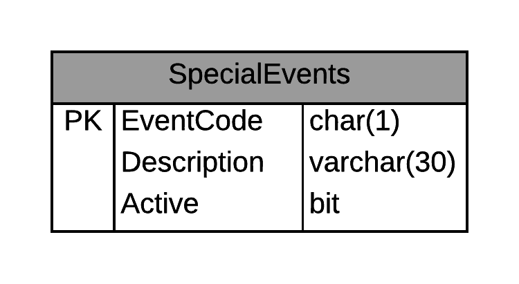

# BLL - eRestaurant Manage Special Events

Estimated time to complete this demo is 15 minutes.

The following steps are to create a Controller class in your BLL to perform basic CRUD operations for managing Special Event data in the eRestaurant database. The goal of this is to support the creation of a CRUD form in a later lesson.



- Begin by creating a class in your BLL folder. Name the class `RestaurantAdminController`.

```csharp
    public class RestaurantAdminController
    {
    }
```

- Include the System.ComponentModel namespace in your file.

```csharp
using System.ComponentModel; // needed for [DataObject] and related attribute classes
```

- Add a DataObject attribute to the class.

```csharp
[DataObject]
public class RestaurantAdminController
{
}
```

- Add a method to list all the special events.

```csharp
[DataObjectMethod(DataObjectMethodType.Select, false)]
public List ListAllSpecialEvents()
{
    // This using statement ensures that our connection to the database is
    // properly "closed" once we are done "using" our DAL object.
    // (context is our DAL object)
    using (RestaurantContext context = new RestaurantContext())
    {
        return context.SpecialEvents.ToList();
    }
}
```

- Add a method to add a special event.

```csharp
[DataObjectMethod(DataObjectMethodType.Insert, false)]
public void AddSpecialEvent(SpecialEvent item)
{
    using (var context = new RestaurantContext())
    {
        // Add the item to the dbContext
        var added = context.SpecialEvents.Add(item);
        // p.s. - we aren't really going to do anything with the variable 'added'
        // I just want you to be aware that the Add() method will return the
        // newly added object. (This can be useful in other situations, which
        // we will see later.)

        // Save the changes to the database
        context.SaveChanges();
    }
}
```

- Add a method to update a special event.

```csharp
[DataObjectMethod(DataObjectMethodType.Update, false)]
public void UpdateSpecialEvent(SpecialEvent item)
{
    using (RestaurantContext context = new RestaurantContext())
    {
        // First attach the item to the dbContext collection
        var attached = context.SpecialEvents.Attach(item);

        // Second, get the entry for the existing data that should match for
        // this specific special event
        var existing = context.Entry(attached);

        // Third, mark that the object's values have changed
        existing.State = System.Data.Entity.EntityState.Modified;

        // Lastly, save the changes in the database
        context.SaveChanges();
    }
}
```

- Add a method to delete a special event.

```csharp
[DataObjectMethod(DataObjectMethodType.Delete, false)]
public void DeleteSpecialEvent(SpecialEvent item)
{
    using (var context = new RestaurantContext())
    {
        // First, get a reference to the actual item in the Db
        // Find() is a method to look up an item by it's primary key.
        var existing = context.SpecialEvents.Find(item.EventCode);

        // Second, remove the item from the database context
        context.SpecialEvents.Remove(existing);

        // Lastly, save the changes to the database
        context.SaveChanges();
    }
}
```

- As an alternative to deleting special events, you could create a method that will simply "deactivate" a special event.

```csharp
[DataObjectMethod(DataObjectMethodType.Delete, false)]
public void DeactivateSpecialEvent(SpecialEvent item)
{
    using (var context = new RestaurantContext())
    {
        // First, get a reference to the actual item in the Db
        // Find() is a method to look up an item by it's primary key.
        var existing = context.SpecialEvents.Find(item.EventCode);

        // Second, remove the item from the database context
        existing.Active = false; // Modifies the property on the SpecialEvent
        var updatable = context.Entry(existing); // Get a reference to the special event as an Entity in the database context
        // Specify a particular property as being changed.
        updatable.Property(x => x.Active).IsModified = true;

        // Lastly, save the changes to the database
        context.SaveChanges();
    }
}
```
