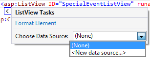

# ListView Sample/Demo with eRestaurant

This example presumes that you have a BLL class with CRUD methods for managing `SpecialEvent` data and that the BLL class and method have the appropriate `[DataObject]` and `[DataObjectMethod]` attributes. Additionally, the web.config file should have the connection string settings for the database as well as the `<context>` element in the `<entityFramework>` section to disable database initialization.

Estimated time to complete this demo is 20 minutes.

The following steps are to create a basic CRUD style form for managing Special Event data for eRestaurant. The goal of this is to create a form that looks similar to this screenshot.


1. Drag a ListView control onto the form and modify its id to match the following:

```xml
<asp:ListView ID="SpecialEventsListView" runat="server"></asp:ListView>
```

2. Add an ObjectDataSource control to the form, either by dragging it onto the form or by clicking the SpecialEventListView control's smart tag, choosing Choose Data Source: <New Data Source> and choosing an ObjectDataSource control. Name the ObjectDataSource SpecialEventDataSource.



3. Configure the DataSource using the wizard to use the BLL class that serves the CRUD methods for SpecialEvent objects. When you are done, the markup for the control will look like this.

```csharp
<asp:ObjectDataSource runat="server" ID="SpecialEventDataSource"
    DataObjectTypeName="eRestaurant.Entities.SpecialEvent" DeleteMethod="DeleteSpecialEvent"
    InsertMethod="AddSpecialEvent" OldValuesParameterFormatString="original_{0}"
    SelectMethod="ListAllSpecialEvents" TypeName="eRestaurant.BLL.RestaurantAdminController"
    UpdateMethod="UpdateSpecialEvent"></asp:ObjectDataSource>
```

4. Ensure the ListView control has a reference to the ObjectDataSource control, as in the following code snippet

```csharp
<asp:ListView ID="SpecialEventListView" runat="server" DataSourceID="SpecialEventDataSource">
</asp:ListView>
```

5. The ListView uses templates to display it contents. At a minimum, two templates are needed: LayoutTemplate and ItemTemplate. Modify the ListView to use the following LayoutTemplate inside the ListView.

```xml
    <LayoutTemplate>
        <fieldset runat="server" id="itemPlaceholderContainer" style="">
            <div runat="server" id="itemPlaceholder" />
        </fieldset>
    </LayoutTemplate>

```

6. Modify the ListView to also include an ItemTemplate (either above or below the LayoutTemplate). When you have applied these changes, you can view the page in the browser to see the item contents. (Note: The Edit link will not work because there is no EditItemTemplate yet.) Notice that the binding to property values on the SpecialEvent type is done as `Eval()` calls; the `Eval()` method is a one-way data-binding that reads information from a databound object. Since the ItemTemplate is only used to display contents, the `Eval()` method is used for binding.

```xml
    <ItemTemplate>
        <div>
            <asp:LinkButton runat="server" CommandName="Edit" ID="EditButton">Edit
                <span class="glyphicon glyphicon-pencil"></span></asp:LinkButton>
            &nbsp;&nbsp;
            <asp:LinkButton runat="server" CommandName="Delete" ID="DeleteButton">Delete
                <span class="glyphicon glyphicon-trash"></span></asp:LinkButton>
            &nbsp;&nbsp;&nbsp;
            <asp:CheckBox Checked='<%# Eval("Active") %>' runat="server" ID="ActiveCheckBox" Enabled="false" Text="Active" />
            &mdash;
            <asp:Label ID="Label1" runat="server" AssociatedControlID="EventCodeLabel"  CssClass="control-label">Event Code</asp:Label>
            <asp:Label Text='<%# Eval("EventCode") %>' runat="server" ID="EventCodeLabel" />
            &mdash;
            <asp:Label ID="Label2" runat="server" AssociatedControlID="DescriptionLabel" CssClass="control-label">Description</asp:Label>
            <asp:Label Text='<%# Eval("Description") %>' runat="server" ID="DescriptionLabel" />
        </div>
    </ItemTemplate>
```

7. To add support for inserting new items, include the following InsertItemTemplate in the ListView. When you have added this template, you can view the page in the browser and test the Insert Item funcitonality. Notice that the binding to property values on the SpecialEvent type in this template is done as `Bind()` calls; the `Bind()` method is a two-way data-binding used to read from and write to a databound object. All templates that need to write to a databound object should use the `Bind()` method for accessing the databound object's properties.

```xml
    <InsertItemTemplate>
        <span style="">
            <asp:LinkButton runat="server" CommandName="Insert" ID="InsertButton">Insert 
                <span class="glyphicon glyphicon-plus"></span></asp:LinkButton>
            &nbsp;&nbsp;
            <asp:LinkButton runat="server" CommandName="Cancel" ID="CancelButton">Clear
                <span class="glyphicon glyphicon-refresh"></span></asp:LinkButton>
            &nbsp;&nbsp;&nbsp;
            <asp:CheckBox Checked='<%# Bind("Active") %>' runat="server" ID="ActiveCheckBox" Text="Active" />
            &mdash;
            <asp:Label ID="Label3" runat="server" AssociatedControlID="EventCodeTextBox"  CssClass="control-label">Event Code</asp:Label>
            <asp:TextBox Text='<%# Bind("EventCode") %>' runat="server" ID="EventCodeTextBox" />
            &mdash;
            <asp:Label ID="Label4" runat="server" AssociatedControlID="DescriptionTextBox"  CssClass="control-label">Description</asp:Label>
            <asp:TextBox Text='<%# Bind("Description") %>' runat="server" ID="DescriptionTextBox" />
        </span>
    </InsertItemTemplate>
```

8. To add support for editing existing items, include the following EditItemTemplate. View the page in the browser and test this functionality.

```xml
    <EditItemTemplate>
        <span style="">
            <asp:LinkButton runat="server" CommandName="Update" ID="UpdateButton">Update
                <span class="glyphicon glyphicon-ok"></span></asp:LinkButton>
            &nbsp;&nbsp;
            <asp:LinkButton runat="server" CommandName="Cancel" ID="CancelButton">Cancel
                <span class="glyphicon glyphicon-remove"></span></asp:LinkButton>
            &nbsp;&nbsp;&nbsp;
            <asp:CheckBox Checked='<%# Bind("Active") %>' runat="server" ID="ActiveCheckBox" Text="Active" />
            &mdash;
            <asp:Label ID="Label5" runat="server" AssociatedControlID="EventCodeTextBox" CssClass="control-label">Event Code</asp:Label>
            <asp:TextBox Text='<%# Bind("EventCode") %>' runat="server" ID="EventCodeTextBox" />
            &mdash;
            <asp:Label ID="Label6" runat="server" AssociatedControlID="DescriptionTextBox" CssClass="control-label">Description</asp:Label>
            <asp:TextBox Text='<%# Bind("Description") %>' runat="server" ID="DescriptionTextBox" />
        </span>
    </EditItemTemplate>
```

9. Lastly, in the event that there are no items to display in the ListView, add an EmptyDataTemplate, as follows.

```xml
    <EmptyDataTemplate>
        <span>No data was returned.</span>
    </EmptyDataTemplate>
```

----

A word of caution about configuing the ListView using the smart tag and selecting a layout: The Configure ListView dialog will map **all** the properties of the entity, including navigation properties. Since navigation properties are lazy-loaded by default, you will get an error running the page because the SpecialEvent's Reservations are not loaded (and not accessible because the connection to the database was closed in the BLL).

Since there is a high likelihood of needing to edit the ListView's templates, it can be just as quick to avoid the Configure ListView dialog and edit the template directly, as was shown in the steps of this demo.


----

Here is the complete listing of code for the ListView.

```xml
<asp:ListView ID="SpecialEventsListView" runat="server" DataSourceID="SpecialEventsDataSource" InsertItemPosition="LastItem">
    <EditItemTemplate>
        <span style="">
            <asp:LinkButton runat="server" CommandName="Update" ID="UpdateButton">Update
                <span class="glyphicon glyphicon-ok"></span></asp:LinkButton>
            &nbsp;&nbsp;
            <asp:LinkButton runat="server" CommandName="Cancel" ID="CancelButton">Cancel
                <span class="glyphicon glyphicon-remove"></span></asp:LinkButton>
            &nbsp;&nbsp;&nbsp;
            <asp:CheckBox Checked='<%# Bind("Active") %>' runat="server" ID="ActiveCheckBox" Text="Active" />
            &mdash;
            <asp:Label ID="Label5" runat="server" AssociatedControlID="EventCodeTextBox" CssClass="control-label">Event Code</asp:Label>
            <asp:TextBox Text='<%# Bind("EventCode") %>' runat="server" ID="EventCodeTextBox" />
            &mdash;
            <asp:Label ID="Label6" runat="server" AssociatedControlID="DescriptionTextBox" CssClass="control-label">Description</asp:Label>
            <asp:TextBox Text='<%# Bind("Description") %>' runat="server" ID="DescriptionTextBox" />
        </span>
    </EditItemTemplate>
    <EmptyDataTemplate>
        <span>No data was returned.</span>
    </EmptyDataTemplate>
    <InsertItemTemplate>
        <span style="">
            <asp:LinkButton runat="server" CommandName="Insert" ID="InsertButton">Insert 
                <span class="glyphicon glyphicon-plus"></span></asp:LinkButton>
            &nbsp;&nbsp;
            <asp:LinkButton runat="server" CommandName="Cancel" ID="CancelButton">Clear
                <span class="glyphicon glyphicon-refresh"></span></asp:LinkButton>
            &nbsp;&nbsp;&nbsp;
            <asp:CheckBox Checked='<%# Bind("Active") %>' runat="server" ID="ActiveCheckBox" Text="Active" />
            &mdash;
            <asp:Label ID="Label3" runat="server" AssociatedControlID="EventCodeTextBox"  CssClass="control-label">Event Code</asp:Label>
            <asp:TextBox Text='<%# Bind("EventCode") %>' runat="server" ID="EventCodeTextBox" />
            &mdash;
            <asp:Label ID="Label4" runat="server" AssociatedControlID="DescriptionTextBox"  CssClass="control-label">Description</asp:Label>
            <asp:TextBox Text='<%# Bind("Description") %>' runat="server" ID="DescriptionTextBox" />
        </span>
    </InsertItemTemplate>
    <ItemTemplate>
        <div>
            <asp:LinkButton runat="server" CommandName="Edit" ID="EditButton">Edit <span class="glyphicon glyphicon-pencil"></span></asp:LinkButton>
            &nbsp;&nbsp;
            <asp:LinkButton runat="server" CommandName="Delete" ID="DeleteButton">Delete <span class="glyphicon glyphicon-trash"></span></asp:LinkButton>
            &nbsp;&nbsp;&nbsp;
            <asp:CheckBox Checked='<%# Eval("Active") %>' runat="server" ID="ActiveCheckBox" Enabled="false" Text="Active" />
            &mdash;
            <asp:Label ID="Label1" runat="server" AssociatedControlID="EventCodeLabel"  CssClass="control-label">Event Code</asp:Label>
            <asp:Label Text='<%# Eval("EventCode") %>' runat="server" ID="EventCodeLabel" />
            &mdash;
            <asp:Label ID="Label2" runat="server" AssociatedControlID="DescriptionLabel" CssClass="control-label">Description</asp:Label>
            <asp:Label Text='<%# Eval("Description") %>' runat="server" ID="DescriptionLabel" />
        </div>
    </ItemTemplate>
    <LayoutTemplate>
        <fieldset runat="server" id="itemPlaceholderContainer" style="">
            <div runat="server" id="itemPlaceholder" />
        </fieldset>
    </LayoutTemplate>
</asp:ListView>
```
