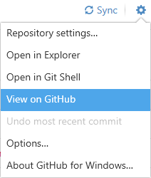

# Sample/Demo

In this sample, follow these steps to create a code repository for a Website in Visual Studio, being sure to set it up correctly for tracking the website's bin folder.

- Create a new blank Visual Studio solution in your local GitHub folder (under My Documents) and name it Repo Practice. Then add a web site in your solution folder, naming it as Repo Website. When you are done, close down Visual Studio, saving all your changes.


- Drag the solution folder onto GitHub Desktop. This will allow you to turn your solution folder into a git repository. Make sure that you choose "Visual Studio" as the .gitignore selection.


> Note that the first commit is for creating the .gitattributes and .gitignore files.

- Commit your visual studio files and solution.


- Run an extra "Shell" activity (`git add -f "repo-relative\path\to\website\bin\*"`):
  - Open Shell from GitHub Desktop
  - Run the following to add the .refresh files related to DLLs and EXEs in the website bin:

```shell
git add -f "**\*.*.refresh"
```

        <!-- Note: These files are normally ignored in the .gitignore - the -f flag means to force add the files for tracking. Normally we won't track DLLs and EXEs because they are binary and we don't want merge conflicts with recompiled binaries; however, the ones in the \\website\\Bin\ are *not* being recompiled because they come from NuGet packages rather than being compiled from our source code ( like our class library DLLs would be).  
        Note that the text `**\*.*.refresh` is a) inside quotes, and b) includes a wild-card folder reference so that it git can "find" the Bin folder where the .refresh files are.
    - Run the following to commit these changes (force-added files must be committed from the command line):
        
        ```
        git commit -m "Force-add *.dll.refresh and *.exe.refresh in website's Bin folder"
        ``` -->

- Publish the repository to GitHub (you can leave it as a public repository).


If you have multiple accounts or organizations that you can publish to, you can select it from the drop-down.

- Test that you did it correctly
  - Log off of your current computer, and log onto a different computer in the lab.
  - Using GitHub Desktop, clone your repository.
  - Open the solution and press CTRL \+ F5. If you did everything right, it should build and launch in the browser.
  - If you have build errors, it is likely that the reason is due to missing various files in the bin folder. To correct this, return to your previous computer and re-try the commit to force-add the website's bin files.
  - You can return to your original computer once you have confirmed that it is working correctly.
- From the Tools and Options menu, select View on GitHub.



- Ensure that you are logged onto your GitHub account. If you are, then under your list of files you should see a message recommending that you add a README file. Click the button to add the README, then edit and commit that file. Include the following in that file:
  - Your name
  - Your GitHub account name


- Open the Repo Practice.sln on your computer, and edit the website (change text on a page or add another page to the site). Then save your changes and make another commit in GitHub Desktop. At this point, you should see that there are both local and remote commits that can be synchronized by pressing the Sync button.


Additional commits can be done from the GitHub Desktop user interface. Remember to use meaningful descriptions for your commit message.


