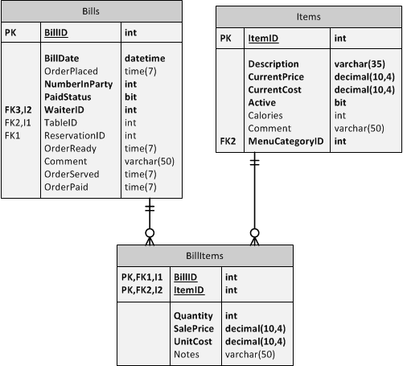

---
title: eRestuarant Practice - Solution
---
# eRestuarant Practice - Solution


These classes are the final solution to the practice entities and the updated `RestaurantContext`. They include additional navigation properties to represent the complete set of relationships in the database. In addition, the `BillItem` entity for the BillItems table is provided as a post-practice demo.

## Coding the Entities

### The `MenuCategory` Class

The following is the entity for the MenuCategories table.

```csharp
public class MenuCategory
{
    public int MenuCategoryID { get; set; }
    [Required(ErrorMessage = "A Description is required (5-35 characters)")]
    [StringLength(35, MinimumLength = 5, ErrorMessage = "Descriptions must be from 5 to 35 characters in length")]
    public string Description { get; set; }

    public virtual ICollection<Item> MenuItems { get; set; }
}
```

### The `Item` Class

The Item entity below includes attributes that reflect the constraints and other table properties. Although a `[Required]` attribute was not technically needed for the `MenuCategoryID`, it has been included nonetheless so as to provide a descriptive reason for it being `NOT NULL`.

```csharp
public class Item
{
    [Key]
    public int ItemID { get; set; }

    [Required(ErrorMessage = "A Description is required (5-35 characters)")]
    [StringLength(35, MinimumLength = 5, ErrorMessage = "Descriptions must be from 5 to 35 characters in length")]
    public string Description { get; set; }

    [Required(ErrorMessage="Current Price information is required")]
    [Range(0.01, 50.00, ErrorMessage="Prices for menu items must be greater than zero and less than or equal to $50.00")]
    public decimal CurrentPrice { get; set; }

    [Required(ErrorMessage = "Current Cost information is required")]
    [Range(0.01, 30.00, ErrorMessage = "Costs for menu items must be greater than zero and less than or equal to $30.00")]
    public decimal CurrentCost { get; set; }

    public bool Active { get; set; }

    [Range(0, int.MaxValue, ErrorMessage="Calories noted for a menu item must be greater than or equal to zero")]

    public int? Calories { get; set; }

    public string Comment { get; set; }

    [Required(ErrorMessage="Every menu item must be categorized")]
    public int MenuCategoryID { get; set; }

    public virtual MenuCategory Category { get; set; }

    public Item()
    {
        Active = true;
    }
}
```

### The `Waiter` Class

The Waiter entity has an additional property that is not mapped to a column in the database: `FullName`. The `[NotMapped]` attribute allows entities to contain extra properties not in the mapped table, thus allowing the entity to become a "richer" model in the application.

```csharp
public class Waiter
{
    public int WaiterID { get; set; }
    [Required(AllowEmptyStrings=false), StringLength(25)]

    public string FirstName { get; set; }
    [Required(AllowEmptyStrings = false), StringLength(35)]

    public string LastName { get; set; }
    [Required(AllowEmptyStrings = false), StringLength(15, MinimumLength=4)]

    public string Phone { get; set; }
    [Required(AllowEmptyStrings = false), StringLength(30, MinimumLength=8)]

    public string Address { get; set; }

    public DateTime HireDate { get; set; }

    public DateTime? ReleaseDate { get; set; }
    [NotMapped]

    public string FullName { get { return FirstName + " " + LastName; } }

    // Navigation Properties
    public virtual ICollection<Bill> Bills { get; set; }
}
```

### The `Bill` Class

Additional navigation properties are shown in this code sample that are not part of the practice: `ICollection<BillItem> Items`, `Waiter` and `Table`.

```csharp
public class Bill
{
    public int BillID { get; set; }
    public DateTime BillDate { get; set; }
    public DateTime? OrderPlaced { get; set; }
    public int NumberInParty { get; set; }
    public bool PaidStatus { get; set; }
    public int WaiterID { get; set; }
    public int? TableID { get; set; }
    public int? ReservationID { get; set; }
    public bool OrderReady { get; set; }
    public string Comment { get; set; }

    // Navigation Properties
    public virtual ICollection<BillItem> Items { get; set; }
    public virtual Waiter Waiter { get; set; }
    public virtual Table Table { get; set; }

    public Bill()
    {
        BillDate = DateTime.Now;
    }
}
```

## Coding the Database Context

The complete database context for eRestaurant is as follows.

```csharp
internal class RestaurantContext : DbContext
{
    public RestaurantContext() : base("name=EatIn") { }

    public DbSet<Table> Tables { get; set; }
    public DbSet<SpecialEvent> SpecialEvents { get; set; }
    public DbSet<Reservation> Reservations { get; set; }

    public DbSet<Bill> Bills { get; set; }
    public DbSet<BillItem> BillItems { get; set; }
    public DbSet<Item> Items { get; set; }
    public DbSet<MenuCategory> MenuCategories { get; set; }
    public DbSet<Waiter> Waiters { get; set; }

    protected override void OnModelCreating(DbModelBuilder modelBuilder)
    {
        modelBuilder
            .Entity<Reservation>().HasMany(r => r.Tables)
            .WithMany(t => t.Reservations)
            .Map(mapping =>
            {
                mapping.ToTable("ReservationTables");
                mapping.MapLeftKey("ReservationID");
                mapping.MapRightKey("TableID");
            });
        base.OnModelCreating(modelBuilder);
    }
}
```

## Post-Practice Demo

The BillItems table uses a Composite Key. In order to map that reality in our entity, we need to use the `[Key]` and `[Column]` attributes together.



The BillItem supports the following business rules:

- Quantity must be a minimum of 1 and maximum of 20.
- Sale price is between $0.00 and $50.00 inclusive.
- Unit cost is betwee $0.01 and $30.00 inclusive.

```csharp
public class BillItem
{
    [Key, Column(Order = 1)]
    public int BillID { get; set; }
    [Key, Column(Order = 2)]
    public int ItemID { get; set; }

    [Required(ErrorMessage="Quantity is required"), Range(1, 20, ErrorMessage="Quantity must be between 1 and 20")]
    public int Quantity { get; set; }
    [Required(ErrorMessage = "Sale Price is required"), Range(0.00, 50, ErrorMessage = "Sale Price must be between zero and $50.00 inclusive")]
    public decimal SalePrice { get; set; }
    [Required(ErrorMessage = "Unit Cost is required"), Range(0.01, 30, ErrorMessage = "Unit Cost must be between $0.01 and $30 inclusive")]
    public decimal UnitCost { get; set; }
    public string Notes { get; set; }

    // Navigation Properties
    public virtual Bill Bill { get; set; }
    public virtual Item Item { get; set; }
}
```
