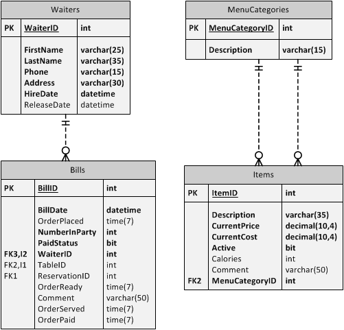

# eRestuarant Practice

This sample uses the Entity Framework (EF) in a code-first approach for an existing database. Rather than reverse-engineer the database, these steps walk through creating the entities and the database context classes manually. The purpose of this is to gain a better understanding of how EF works as an ORM to map entities to a database.

## Coding the Entities

Base your work off of the eRestaurant demo. Write the code for the following practice tables. Apply the rules specified and also support basic restrictions of the database (column length, `NOT NULL`, etc.). Ignore the BillItems table and the Navigation Properties to that table. Additionally, you do not have to create navigation properties for relationships not shown on this partial ERD.

- Menu Categories
  - Description is required and must at least 5 characters long
- Items
  - Descriptoin is required and must be at least 5 characters long
  - Current prices for menu items must fit between a minimum of 1 ¢ to a maximum of $50.00
  - Current costs for menu items must fit between a minimum of 1 ¢ to a maximum of $30.00
  - New menu items are active by default
  - Calories must be a number greater than or equal to zero
- Waiters
  - Phone number must be at least 4 characters (for an extension in the restaurant)
  - Address must be at least 8 characters long
- Bills
  - A bill's BillDate is the current date/time
  - A bill must be associated with either a single table or a reservation. (This rule will only be enforceable in the BLL)

## Coding the Database Context

For the database context, add properties for the tables created in the previous step. Do not write any code to resolve relationships to or through the BillItems table.
