# C# Expression

LinqPad expression queries return the results from evaluating the LINQ query.

## Select All

The simplest way to get all the rows of a table is to just reference the table. In this case, there is no LINQ being used at all.

```csharp
Waiters
```

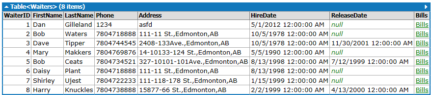

The equivalent code using LINQ to get all the rows looks like this.

```csharp
from person in Waiters
select person
```

If the above statement was written using method syntax, it would look like this.

```csharp
Waiters
   .Select (person => person)
```


---

## Simple Where Clause

Results from a select can be filtered by using a where clause, as in this example that checks the value in a given column.

```csharp
from row in Tables
where row.Capacity > 3
select row
```

This is also a good time to check out the output window on LinqPad to compare the *Results*, *λ (method syntax)* and *SQL* for the LINQ expression entered.

```csharp
// λ - Method syntax
Tables
   .Where (row => (row.Capacity > 3))
```

Remember that in this sample, `row` is mearly a variable name; we could have named it anything we wanted. Also remember that the table called `Tables` holds data about physical tables in the restaurant.

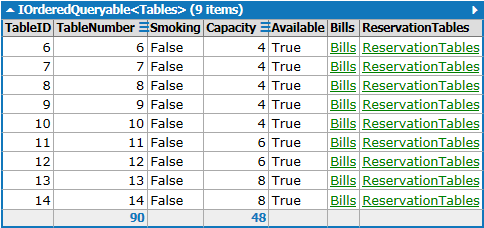

Observe that the header of the results identifies the data type of the collection: `IOrderedQueryable<Table>`. Depending on the code you write in the LinqPad editor, the results could be a generic kind that is evaluated by generating SQL (one of the `IQueryable` types) or producing an in-memory result (`IEnumerable`) or even a strongly-typed result (as in one of the examples on the bottom of the page). Also notice that in LinqPad, the Results window shows a column for the Bills and the Reservations. Clicking on those will bring up the bills & reservations that have been recorded on that table.

If you have experience in working with databases, you may be tempted to start "thinking in SQL", particularly when you see keywords such as `from`, `where` and `select`. LINQ, however, is **L**anguage **IN**tegrated **Q**ueries, meaning that the code you are writing is actually part of the C# (or VB) syntax. Keep that in mind, particularly as you look at writing the conditional expression in your `where` clauses.

```csharp
from booking in Reservations
where booking.EventCode.Equals("A")
select booking
```

:::tip
Remember - LINQ is still C#, so expressing a boolean expression in the where clause is written as C# (*not SQL*).
:::

Notice that the method syntax makes uses of **Lambda** expressions. Lambdas are common when performing LINQ with the Method syntax.

```csharp
Reservations
   .Where (booking => booking.EventCode.Equals ("A"))
```

:::tip
Note that in this example, we are using the `.Equals()` method of the string class, rather than the equal-to sign `==`. The reason for this is that the EventCode column can contain `NULL` values. Using the `.Equals()` avoids the problem of possible database `NULL` values causing a run-time error. Whenever a string column states it can hold `NULL` values, use the `.Equals()` when comparing values in your where clause.
:::

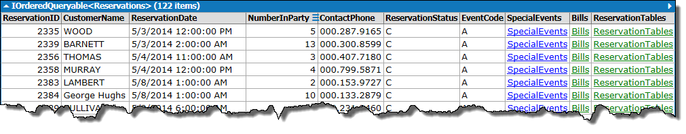

Just to drive home the point, see this example that uses the C# `!` operator. Also note that the column it is checking allows `NULL` values, and in C# this is being represented as a **nullable data type**.

```csharp
from booking in Reservations
where !booking.EventCode.HasValue
select booking
```

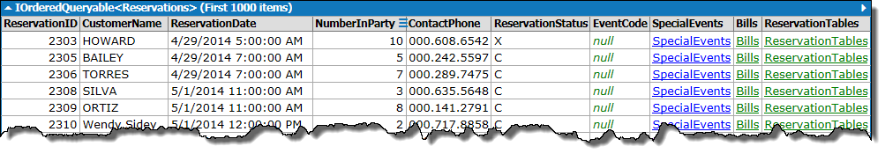

### Try this

- In the LinqPad example above, when you click on the Bills and Reservations, what does that tell you about the relationship between these and the Tables data?

---

## Simple OrderBy

By default, sorting is done in ascending order.

```csharp
from food in Items
orderby food.Description
select food
```

```csharp
// λ - Method Syntax
Items
   .OrderBy (food => food.Description)
```

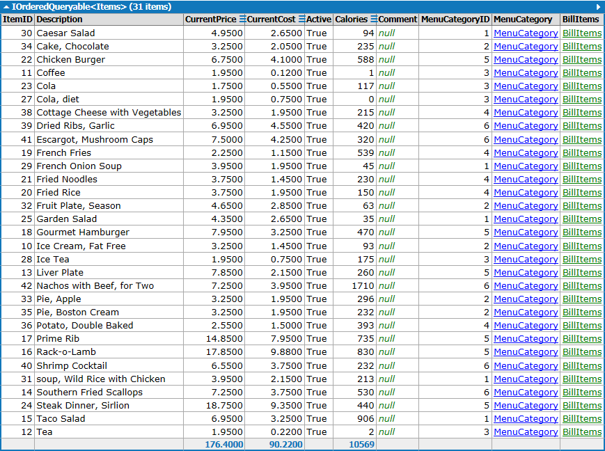

You can specify the descending and ascending order explicitly.

```csharp
from food in Items
orderby food.CurrentPrice descending
select food
```

```csharp
// λ - Method Syntax
Items
   .OrderByDescending (food => food.CurrentPrice)
```

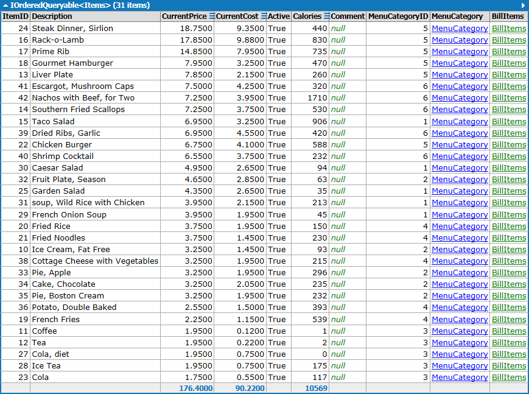

```csharp
from food in Items
orderby food.Calories ascending
select food
```

```csharp
// λ - Method Syntax
Items
   .OrderBy (food => food.Calories)
```

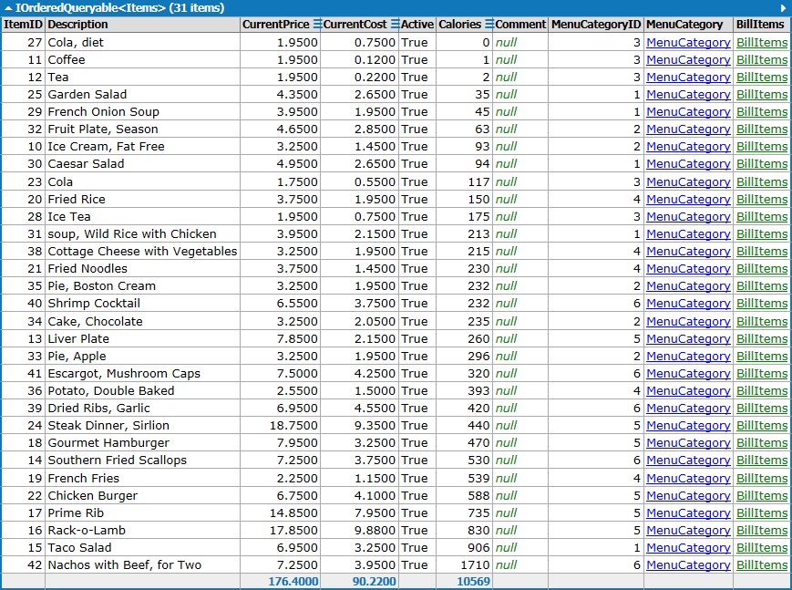

You can sort by multiple columns.

```csharp
from food in Items
orderby food.CurrentPrice descending, food.Calories ascending
select food
```

```csharp
// λ - Method Syntax
Items
   .OrderByDescending (food => food.CurrentPrice)
   .ThenBy (food => food.Calories)
```

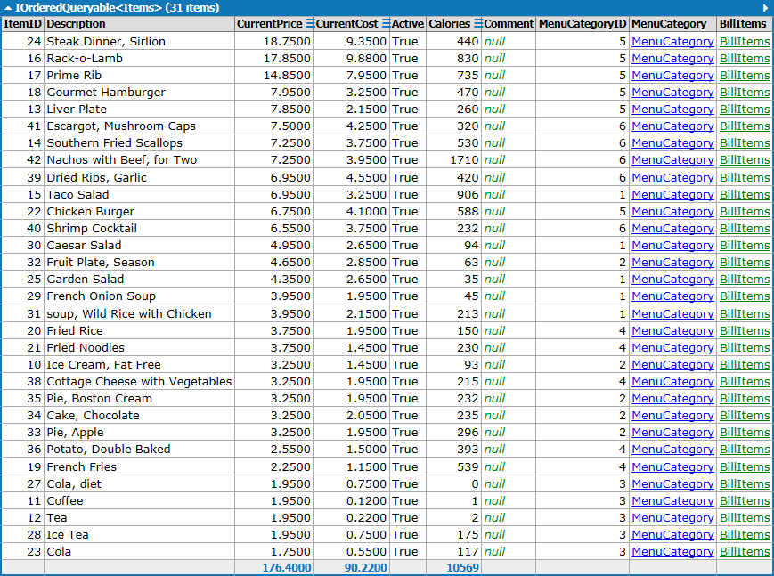

---

## Grouping

Grouping can be used as a result in itself, without the `select` clause. Grouping produces a result that has two parts: a Key value, and the grouped items.

```csharp
from food in Items
    group food by food.MenuCategoryID
```

```csharp
// λ - Method Syntax
Items
   .GroupBy (food => food.MenuCategoryID)
```

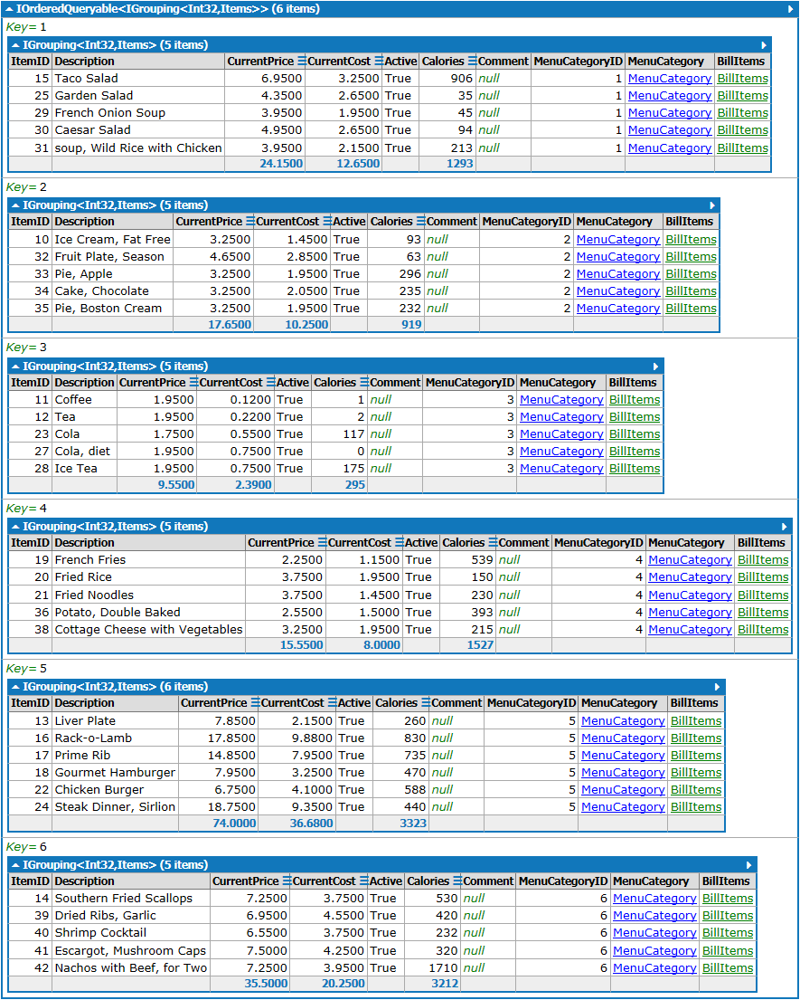

Like ordering, grouping can include more than one column. All you have to do is use an anonymous type for your grouping condition.

```csharp
from food in Items
    group food by new {food.MenuCategoryID, food.CurrentPrice}
```

Notice the use of `new {food.MenuCategoryID, food.CurrentPrice}`. This is an example of **anonymous types** (used in the grouping clause). You will read more about anonymous types in the result set of the select later on.

```csharp
// λ - Method Syntax
Items
   .GroupBy (
      food =>
        new  
        {
          MenuCategoryID = food.MenuCategoryID,
          CurrentPrice = food.CurrentPrice
        }
   )
```

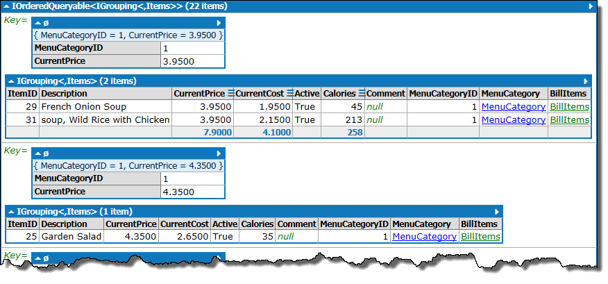

A group can become something from which you can select your actual data. All you have to do is give a name to the resulting group.

```csharp
from food in Items
group food by food.MenuCategoryID into result
select result
```

```csharp
// λ - Method Syntax
Items
   .GroupBy (food => food.MenuCategoryID)
   .Select (result => result)
```

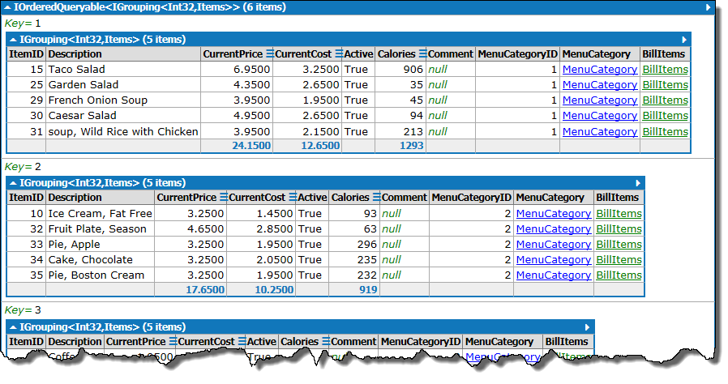

---

## Combining Clauses

Combining clauses is simple, and the order of the `where` and `orderby` clauses (relative to each other) is not important. These two examples give the same result.

```csharp
from food in Items
where food.MenuCategory.Description == "Entree"
orderby food.CurrentPrice descending
select food
```

```csharp
from food in Items
orderby food.CurrentPrice descending
where food.MenuCategory.Description =="Entree"
select food
```

```csharp
// λ - Method Syntax
Items
   .Where (food => (food.MenuCategory.Description == "Entree"))
   .OrderByDescending (food => food.CurrentPrice)
```

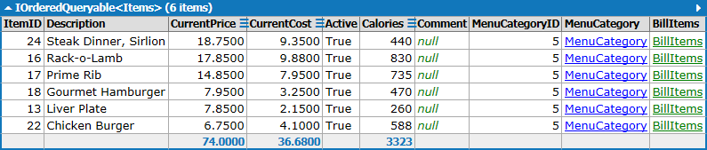

This example gets the entrees and beverages, sorted by price and grouped by category.

```csharp
from food in Items
where food.MenuCategory.Description == "Entree" || food.MenuCategory.Description == "Beverage"
orderby food.CurrentPrice descending
group food by food.MenuCategoryID into result
select result
```

```csharp
// λ - Method Syntax
Items
   .Where (
      food => 
            ((food.MenuCategory.Description == "Entree") || 
               (food.MenuCategory.Description == "Beverage")
            )
   )
   .OrderByDescending (food => food.CurrentPrice)
   .GroupBy (food => food.MenuCategoryID)
   .Select (result => result)
```

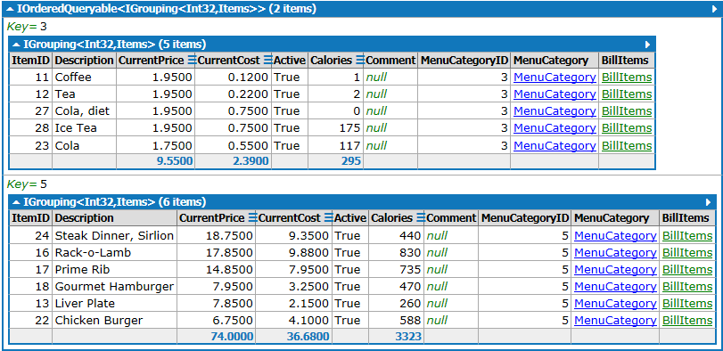

---

## Anonymous Types

All of the examples so far demonstrated selecting the complete set of results or entire table sets. Because C# supports the concept of Anonymous Types – a feature of C# that stands apart from LINQ itself – we can select only the data we want to see, as in these exampes.

To identify what data you want in your select, simply name properties in the initializer list and assign the values from your query's result set.

```csharp
from food in Items
where food.MenuCategory.Description == "Entree" && food.Active
orderby food.CurrentPrice descending
select new
{
    Description = food.Description,
    Price = food.CurrentPrice,
    Calories = food.Calories
}
```

```csharp
// λ - Method Syntax
Items
   .Where (food => ((food.MenuCategory.Description == "Entree") && food.Active))
   .OrderByDescending (food => food.CurrentPrice)
   .Select (
      food =>
         new  
         {
            Description = food.Description,
            Price = food.CurrentPrice,
            Calories = food.Calories
         }
   )
```

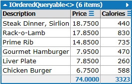

Part of the power of selecting into another type (anonymous or otherwise) is the ability to perform calculations

```csharp
from person in Waiters
    where person.ReleaseDate == null
    select new
    {
        Name = person.FirstName + " " + person.LastName,
        Phone = person.Phone,
        DaysEmployed = (DateTime.Today - person.HireDate).Days
    }
```

```csharp
// λ - Method Syntax
Waiters
   .Where (person => (person.ReleaseDate == (DateTime?)null))
   .Select (
      person => 
         new  
         {
            Name = ((person.FirstName + " ") + person.LastName), 
            Phone = person.Phone, 
            DaysEmployed = (DateTime.Today - person.HireDate).Days
         }
   )
```

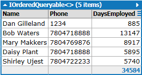

```csharp
from food in Items
where food.MenuCategory.Description == "Entree" || food.MenuCategory.Description == "Beverage"
orderby food.CurrentPrice descending
group food by food.MenuCategory into foodGroup
select new
{
    Category = foodGroup.Key.Description,
    MenuItems = foodGroup.ToList()
}
```

```csharp
// λ - Method Syntax
Items
   .Where (
      food => 
            ((food.MenuCategory.Description == "Entree") || 
               (food.MenuCategory.Description == "Beverage")
            )
   )
   .OrderByDescending (food => food.CurrentPrice)
   .GroupBy (food => food.MenuCategory)
   .Select (
      foodGroup => 
         new  
         {
            Category = foodGroup.Key.Description, 
            MenuItems = foodGroup.ToList ()
         }
   )
```

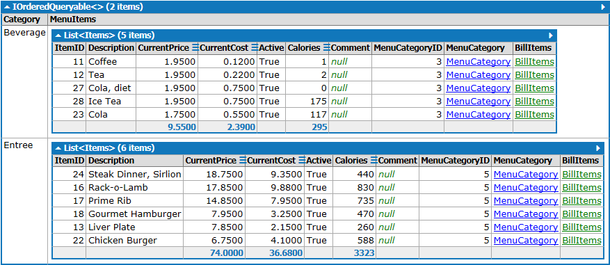

---

## Nested Queries

LINQ queries can be nested as well. When used together with navigation properties, it's possible to get very expressive results with straight-forward and readable queries.

```csharp
from cat in MenuCategories
where cat.Description == "Appetizer" || cat.Description == "Entree"
orderby cat.Description
select new
{
  Description = cat.Description,
  MenuItems = from item in cat.Items
              where item.Active
              orderby item.Description
              select new
              {
                Description = item.Description,
                Price = item.CurrentPrice,
                Calories = item.Calories,
                Comment = item.Comment
              }
}
```

```csharp
// λ - Method Syntax
MenuCategories
   .Where (cat => ((cat.Description == "Appetizer") || (cat.Description == "Entree")))
   .OrderBy (cat => cat.Description)
   .Select (
      cat => 
         new  
         {
            Description = cat.Description, 
            MenuItems = cat.Items.Where (item => item.Active).OrderBy (item => item.Description)
               .Select (
                  item => 
                     new  
                     {
                        Description = item.Description, 
                        Price = item.CurrentPrice, 
                        Calories = item.Calories, 
                        Comment = item.Comment
                     }
               )
         }
   )
```

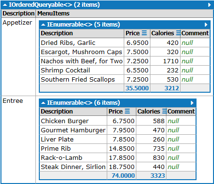
