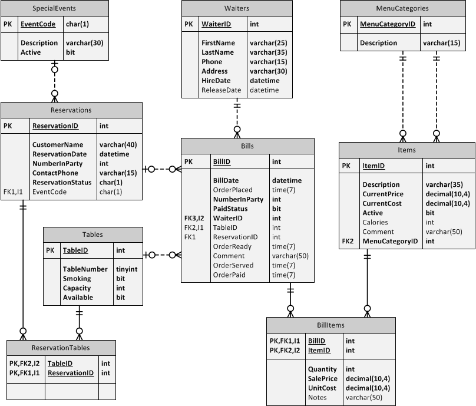
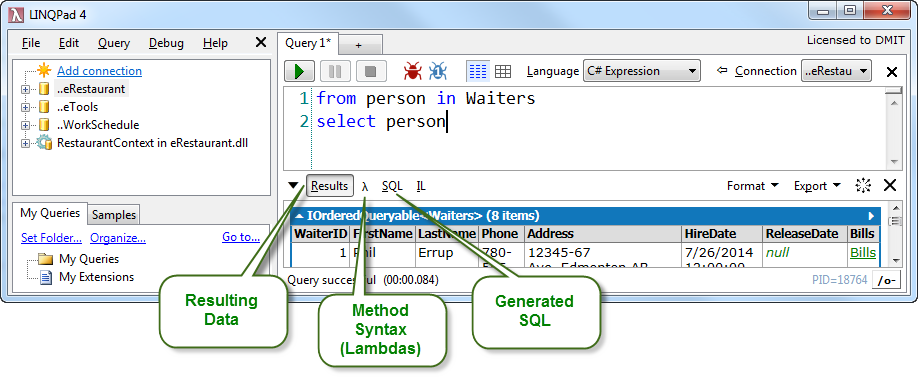

# LINQ - Query and Method Syntax

## Exploring the eRestaurant Database

This series of samples are written to be evaluated using **[linqpad](https://www.linqpad.net/)**. The database used in these samples is eRestaurant. When running these samples, choose the eRestuarant database as the LinqPad query's connection.

ERD

Simple LINQ statements can be written using *Query syntax* and/or *Method syntax*. The .NET framework includes a number of extensions for LINQ that provide additional LINQ capabilities that are only available through *Method syntax*. A key point to remember is that every *Query syntax* statement has an equivalent *Method syntax* version, but not all LINQ *Methods* can be written using *Query syntax*. It's also good to remember that you can mix & match query and method syntax (up to a point).

LinqPad is a perfect tool for exploring LINQ. It provides an editor to write your C# (or VB) code, and an output window that can show you the results of the LINQ statements as well as the method syntax and the equivalent SQL that LINQ generates when connecting to a database.

The following sections demonstrate LINQ queries in LinqPad, written as *expressions*, *statements* and a simple console-like *program* in C#.

- [C# Expressions](./LinqPad/expressions.md)
- [C# Statements](./LinqPad/statements.md)
- [C# Program](./LinqPad/program.md)
