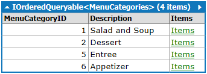
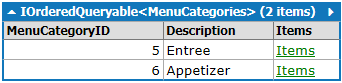
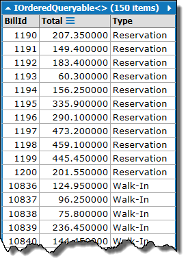

# LINQ - More Method Syntax

## Exploring the eRestaurant Database

This series of samples are written to be evaluated using **[linqpad](https://www.linqpad.net/)**. The database used in these samples is eRestaurant. When running these samples, choose the eRestuarant database as the LinqPad query's connection.

Many of the LINQ extension methods are available for both database-related collections and in-memory collections. Although it's an overly-simplistic distinction, database-related collections implement the `IQueryable<T>` interface while the in-memory collection implement the `IEnumerable<T>` interface.

The following LINQ extension methods are a summary of the most-commonly used methods. Note that while the examples focus on specific methods, those methods can be called from a context that is entirely LINQ methods or a combination of LINQ query syntax and method syntax. Also note that while the examples focus on retrieving (selecting) the value of the extension method, that extension method could also be used within the context of where filters.

For additional information on LINQ queries, see [The Standard LINQ Operators](http://odetocode.com/articles/739.aspx), by K. Scott Allen.

## Aggregates

LINQ aggregate operations can be done on any collection. Aggregates are used to produce a summary value with regard to a collection.

### .Count()

```csharp
MenuCategories.Count()
```

```csharp
from category in MenuCategories
select new
{
    Category = category.Description,
    Items = category.Items.Count()
}
```

```csharp
// λ - Method Syntax
MenuCategories
   .Select (
      category =>
         new  
         {
            Category = category.Description,
            Items = category.Items.Count ()
         }
   )
```

### .Sum()

The following example presumes the existance of a particular bill. If the bill does not exist in your copy of the database, then change the BillID to one that does exist.

This example totals the bill items for Bill #104 by starting from the BillItems table.

```csharp
(from theBill in BillItems
where theBill.BillID == 104
select theBill.SalePrice * theBill.Quantity).Sum()
```

This example does the same as the previous, but is written entirely in method syntax.

```csharp
BillItems
    .Where (theBill => theBill.BillID == 104)
    .Select(theBill => theBill.SalePrice * theBill.Quantity)
    .Sum()
```

This example totals the bill items for Bill #104 by starting from the Bills table.

```csharp
from customer in Bills
where customer.BillID == 104
select customer.BillItems.Sum (theBill => theBill.SalePrice * theBill.Quantity)
```

```csharp
// λ - Method Syntax
Bills
   .Where (customer => (customer.BillID == 104))
   .Select (
      customer =>
         customer.BillItems.Sum (theBill => (theBill.SalePrice * (Decimal)(theBill.Quantity)))
   )

```

### .Max()

This example finds out the largest bill of all paid bills.

```csharp
(from customer in Bills
where customer.PaidStatus == true
select customer.BillItems.Sum(theBill => theBill.SalePrice * theBill.Quantity)).Max()
```

### .Min()

This example finds out the smallest bill of all paid bills.

```csharp
(from customer in Bills
where customer.PaidStatus == true
select customer.BillItems.Sum(theBill => theBill.SalePrice * theBill.Quantity)).Min()
```

### .Average()

This example finds out the average of all paid bills.

```csharp
(from customer in Bills
where customer.PaidStatus == true
select customer.BillItems.Sum(theBill => theBill.SalePrice * theBill.Quantity)).Average()
```

---

## Conversions

LINQ work with both in-memory data and with data from a database. Sometimes we need to convert from one type to another (e.g.: `IQueryable` to `IEnumerable` or vice-versa). For an excellent discussion on this, see **[The Standard LINQ Operators](http://odetocode.com/articles/739.aspx)** and **[Lazy LINQ and Enumerable Objects](http://odetocode.com/blogs/scott/archive/2008/10/01/lazy-linq-and-enumerable-objects.aspx)** by K. Scott Allen.

### .ToList()

The benefit of using .ToList() on a LINQ to Entities query is that it forces the execution of the SQL generated by LINQ to Entities, thus bringing the data into memory to further manipulated or used in your C# program. Of course, that's also the downside, for if the results of the LINQ to Entities query is huge, then it will use up a lot of RAM. Still, it is quite useful for those situations when they kind of filtering you are attempting cannot be translated directly into SQL by LINQ to Entities.

```csharp
Waiters.ToList()
```

### .AsEnumerable()

```csharp
Waiters.AsEnumerable()
```

### .AsQueryable()

```csharp
Waiters.AsQueryable()
```

## Selection Filters

### .FirstOrDefault()

The `.First()` method can be called with a filter in the parameters or as a parameterless method. In either case, it returns the very first item in the result set, regardless of whether more than one items exist in the resulting sequence.

```csharp
Waiters.First()
```

```csharp
Waiters.First(person => person.FirstName.StartsWith("D"))
```

If the collection does not have any items in it, then an exception will be generated: InvalidOperationException: Sequence contains no elements.

```csharp
Waiters.First(person => person.FirstName.StartsWith("W"))
```

The `.FirstOrDefault()` method works exactly the same as the `.First()` method, except that if no items match the sequence, then it will return a default value (the value `null` for any non-primitive types, otherwise it will return the primitive's default value).

```csharp
Waiters.FirstOrDefault(person => person.FirstName.StartsWith("W"))
```

### .SingleOrDefault()

The `.Single()` method can be called with a filter in the parameters or as a parameterless method. In either case, it expects only one item in the result set. If more than one item exists in the collection, then an exception will be generated: InvalidOperationException: Sequence contains more than one element.

```csharp
Waiters.Single(person => person.FirstName.StartsWith("S"))
```

```csharp
Waiters.Single()
```

The `.SingleOrDefault()` method works exactly the same as the `.Single()` method, except that if no items match the sequence, then it will return a default value (the value `null` for any non-primitive types, otherwise it will return the primitive's default value).

```csharp
Waiters.SingleOrDefault(person => person.FirstName.StartsWith("W"))
```

### .Distinct()

The `.Distinct()` method will remove duplicate items.

```csharp
(from people in Reservations
select people.CustomerName).Distinct()
```

### .Take() & .TakeWhile()

The `.Take()` and `.Skip()` methods are very useful for situations involving paging.

`.Take()` is used to get a specific number of items in the collection; it will only return that many items.

```csharp
Items.Take(4)
```

`.TakeWhile()` does the same thing as `.Take()`, except it keeps taking items from the collection as long as the condition is true. Note that this is not the same thing as filtering, as the conditional expression is not evaluated first, separate from the "take" operation, but in conjuncture with it.

```csharp
Items.AsEnumerable().TakeWhile(food=>food.MenuCategory.Description != "Entree")
```

### .Skip() & .SkipWhile()

`.Skip()` is used to jump over a specific number of items in the collection; after skipping those items, it will return the remaining items in the collection.

```csharp
Items.Skip(20)
```

`.SkipWhile()` does the same thing as `.Skip()`, except it keeps skipping over items from the collection as long as the condition is true. Note that this is not the same thing as filtering, as the conditional expression is not evaluated first, separate from the "skip" operation, but in conjuncture with it.

```csharp
Items.AsEnumerable().SkipWhile(food=>food.MenuCategory.Description != "Dessert")
```

## Others

### .Any()

The `.Any()` method iterates through the entire collection to see if any of the items in it match the condition supplied. This method will return either true or false.

```csharp
from category in MenuCategories
where category.Items.Any(item => item.CurrentCost > 2.0m)
select category
```

```csharp
// λ - Method Syntax
MenuCategories
   .Where (category => category.Items.Any (item => (item.CurrentCost > 2.0m)))
```



```csharp
Bills.Any(customer => customer.PaidStatus == false)
```

```csharp
Bills.Any(customer => customer.Reservation.SpecialEvents.Description == "Birthday" && customer.PaidStatus == false)
```

### .All()

The `.All()` method iterates through the entire collection to see if all of the items in it match the condition supplied. This method will return either true only if all the items match the condition, otherwise it will return false.

```csharp
from category in MenuCategories
where category.Items.All(item => item.CurrentCost > 2.0m)
select category
```

```csharp
// λ - Method Syntax
MenuCategories
   .Where (category => category.Items.All (item => (item.CurrentCost > 2.0m)))
```



### .Union()

The `.Union()` method is similar to the idea of a union in SQL. With a union, you can "concatenate" two result-sets of a similar structure.

```csharp
(
from customer in Bills
where customer.ReservationID.HasValue
   && customer.PaidStatus == true
   && customer.BillDate.Year == 2014
   && customer.BillDate.Month == 10
   && customer.BillDate.Day > 23
select new
{
   BillId = customer.BillID,
   Total = customer.BillItems.Sum(item => item.Quantity * item.SalePrice),
   Type = "Reservation"
}
).Union(
from customer in Bills
where customer.TableID.HasValue
   && customer.PaidStatus == true
   && customer.BillDate.Year == 2014
   && customer.BillDate.Month == 10
   && customer.BillDate.Day > 22
select new
{
   BillId = customer.BillID,
   Total = customer.BillItems.Sum(item => item.Quantity * item.SalePrice),
   Type = "Walk-In"
}
)
```

```csharp
// λ - Method Syntax
Bills
   .Where (
      customer =>
            ((((customer.ReservationID.HasValue && (customer.PaidStatus == True)) &&
                     (customer.BillDate.Year == 2014)
                  ) &&
                  (customer.BillDate.Month == 10)
               ) &&
               (customer.BillDate.Day > 23)
            )
   )
   .Select (
      customer =>
         new  
         {
            BillId = customer.BillID, 
            Total = customer.BillItems.Sum (item => ((Decimal)(item.Quantity) * item.SalePrice)),
            Type = "Reservation"
         }
   )
   .Union (
      Bills
         .Where (
            customer =>
                  ((((customer.TableID.HasValue && (customer.PaidStatus == True)) &&
                           (customer.BillDate.Year == 2014)
                        ) &&
                        (customer.BillDate.Month == 10)
                     ) &&
                     (customer.BillDate.Day > 22)
                  )
         )
         .Select (
            customer =>
               new  
               {
                  BillId = customer.BillID,
                  Total = customer.BillItems.Sum (item => ((Decimal)(item.Quantity) * item.SalePrice)),
                  Type = "Walk-In"
               }
         )
   )

```



```sql
-- SQL
-- Region Parameters
DECLARE @p0 Int = 2014
DECLARE @p1 Int = 10
DECLARE @p2 Int = 23
DECLARE @p3 NVarChar(1000) = 'Reservation'
DECLARE @p4 Int = 2014
DECLARE @p5 Int = 10
DECLARE @p6 Int = 22
DECLARE @p7 NVarChar(1000) = 'Walk-In'
-- EndRegion
SELECT [t6].[BillID] AS [BillId], [t6].[value] AS [Total], [t6].[value2] AS [Type]
FROM (
    SELECT [t0].[BillID], (
        SELECT SUM([t2].[value])
        FROM (
            SELECT (CONVERT(Decimal(29,4),[t1].[Quantity])) * [t1].[SalePrice] AS [value], [t1].[BillID]
            FROM [BillItems] AS [t1]
            ) AS [t2]
        WHERE [t2].[BillID] = [t0].[BillID]
        ) AS [value], @p3 AS [value2]
    FROM [Bills] AS [t0]
    WHERE ([t0].[ReservationID] IS NOT NULL) AND ([t0].[PaidStatus] = 1) AND (DATEPART(Year, [t0].[BillDate]) = @p0) AND (DATEPART(Month, [t0].[BillDate]) = @p1) AND (DATEPART(Day, [t0].[BillDate]) > @p2)
    UNION
    SELECT [t3].[BillID], (
        SELECT SUM([t5].[value])
        FROM (
            SELECT (CONVERT(Decimal(29,4),[t4].[Quantity])) * [t4].[SalePrice] AS [value], [t4].[BillID]
            FROM [BillItems] AS [t4]
            ) AS [t5]
        WHERE [t5].[BillID] = [t3].[BillID]
        ) AS [value], @p7 AS [value2]
    FROM [Bills] AS [t3]
    WHERE ([t3].[TableID] IS NOT NULL) AND ([t3].[PaidStatus] = 1) AND (DATEPART(Year, [t3].[BillDate]) = @p4) AND (DATEPART(Month, [t3].[BillDate]) = @p5) AND (DATEPART(Day, [t3].[BillDate]) > @p6)
    ) AS [t6]

```
