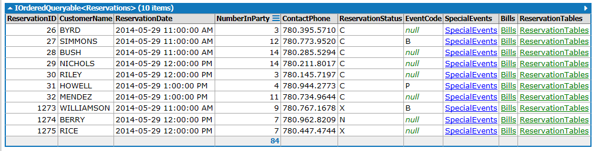
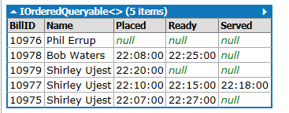
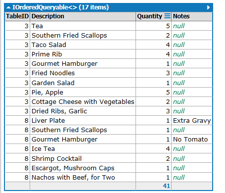
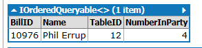
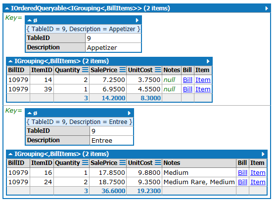
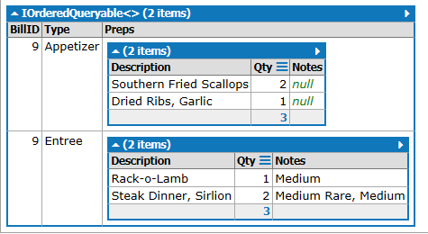

# Practice Linq

Try these problems as LINQ queries in LinqPad with eRestaurant. Sample output has been provide to indicate the data to be selected for each question. Nullable fields can be tested using .HasValue (example x.NullableFieldname.HasValue).

- The retaurant Host (who is in charge of the waiters, seats people and takes payments) needs the following information:
  - Show me the reservations slated for a given Year, Month and Day (ignoring the cancelled ones). (For sample dates, choose May 29, 2014 and September 20, 1014). - Advanced: Group the reservations by hour of the day



<details><summary>Solution 1</summary>

```csharp
from booking in Reservations
where booking.ReservationDate.Month == 9
    && booking.ReservationDate.Year == 2016
    & booking.ReservationDate.Day == 20
select booking
```

</details>

<details><summary>Solution 2</summary>

```csharp
from booking in Reservations
where booking.ReservationDate.Month == 9
    && booking.ReservationDate.Year == 2016
    & booking.ReservationDate.Day == 20
group booking by booking.ReservationDate.Hour into block
select block
```

</details>

- The retaurant Host (who is in charge of the waiters, seats people and takes payments) needs the following information:
  - Waiters with active customers (bills not paid) ordered by waiter.



<details><summary>Solution</summary>

```csharp
from mealBill in Bills
where !mealBill.PaidStatus
orderby mealBill.Waiter.LastName
select new
{
    BillId = mealBill.BillID,
    Name = mealBill.Waiter.FirstName + " " + mealBill.Waiter.LastName,
    Placed = mealBill.OrderPaid,
    Ready = mealBill.OrderReady,
    Served = mealBill.OrderServed
}
```

</details>

- The waiters need the following information:
  - Orders waiting to be served (sorted by table and showing the items on the order)



- The Waiters need the following information:
  - A list of Active tables waiting to place an order



<details><summary>Solution</summary>

```csharp
from customer in Bills
where !customer.OrderPlaced.HasValue
select new
{
    BillId = customer.BillID,
    Name = customer.Waiter.FirstName + " " + customer.Waiter.LastName,
    TableId = customer.TableID,
    NumberInParth = customer.NumberInParty
}
```

</details>

- The Kitchen Staff needs the following information:
  - Items to prepare for orders that have been placed but are not ready, grouped by the table number(s) and menu category description. Omit beverage items as the kitchen staff do not handle these items.
  - Advanced: Create an anonymous dataset from the group.




