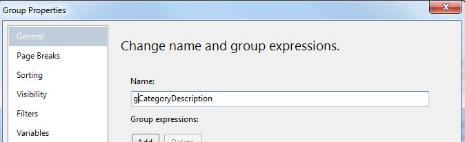

# Customizing your Report

Click on one of the colored rows. You should see the editing icons attach to the columns and rows. The columns will have a grey header at its top and row icons on the side. You may right click on the column grey area to add new columns or delete existing ones. Right clicking on the rows will access menus for row editing.


## Sizing Columns

This is done by placing your cursor on the column line header (grey area); your cursor will change to a two headed arrow, click and drag to desired size. Resize your columns so the Category Description and Item Description data does not wrap. Comment can also be enlarged but will probably wrap it the comment is quite large. Check your work by previewing.

## Sizing Rows

This is done by placing your cursor between two editing icons on the left; your cursor will change to a two headed arrow, click and drag to desired size.

## Field Arrangement

It is possible to rearrange, combine and/or delete the placement of fields making up your report.

Assume that you decide that the Comment is no longer desired. You can select the column at the top of Comment by right clicking in the grey and delete the column.

You can alter the column headers by selecting them and changing them:


## Report Header and Footers

You can add a Header and Footer to your page. To obtain these areas for editing, select the menu option Report and the desired page item. To remove them, repeat the process. You can also obtain these by the right menu of the report itself. To use the right menu, ensure that you are clicking off report to get the menu. These areas are generally used for titles, report ids, execution time, userid and page numbering.


## Creating a Header Item

Open the toolbar menu, select a textbox, drag and drop in the Page Header area. Select the textbox by right clicking the box and selecting the Expression Builder to generate the contents of the textbox. Expand the Built-in Fields selection. We will select Execution Time by double clicking the entry.

An easier method is to use the Report Data panel. Expand the Built-in Fields, select and drag the UserID to your header.

## Creating a Footer Item

Open the toolbar menu, select a textbox, drag and drop in the Page Footer area. Select the textbox. Use the Expression Builder to generate the contents of the textbox. Open Built-in Fields and using page number and total pages create the expression:

```vb
="Page " & Globals!PageNumber & " of " & Globals!TotalPages
```

When creating an expression you must start with an equal sign. The expression itself is based on VB syntax.

## Changing the Report/Column Title

You can place a report title on your report. Make a space above your report. Right click in this area and select Insert - TextBox. You can the go to Expression… and enter your title. You could also simply text your title into the textbox. Our sample (above) is set to Category Menu Items. No equal sign is required. However, if you were to concentrate a report value into the header then you must build the title using the Expression Builder and include the = sign (part of the syntax for an expression). You can then right click on the textbox and alter the TextBox properties, setting font, size and other features.

## Changing the data contents of a field

By selecting the Expression editor or Text Box properties dialog, the individual cells (which containing a textbox) can be altered. Right click on the cell of interest to get the textbox menu. Select the cell with \[Calories\] and chose the Expression builder option. Changing a value of the expression, such as including the string "/ 100g", requires concatenated to the Fields!Calories.Value. The expression uses VB script syntax.


## Data Display Customization

The Text Box properties dialog contains numerous features for customizing the display of your data. Figure 14 shows the customization of the execution date and the tuition to currency.

The Number option allows for various formats for your numeric data. You can also use this to format dates, currency, time, percentage, scientific values and a custom feature.

The Alignment option allows for horizontal and vertical text alignment within the cell’s textbox. You can also add padding to the display data.

The Font option allows for typical font sittings; font, size, bold, italic, color, etc.


Many times your report may need to be organized into groups to obtain the information you desire. Data is a set of values where information is the interpretation of the data in an organized fashion. We may wish to alter some of the group settings. Using the row menu on for the group row (Category), enter the Group Properties dialog.

- General - Name - gCategoryDescription
- Page Breaks - Select if you wish each group to start on a new page (greater for printing not so much for the viewer)
- Sort - Change your sort order (optional not need here because category descriptions are in alphabetical order already). You could also Add a new column such as ItemDescription.

All text is case sensitive on the report. When referencing other items on your report, capitals are capitals, lower case is lower case.

The report may often make reference an item called scope. In the case of a group, the scope is the Name of the group not the name of the field.



A group scope can be useful in calculating aggregates such as counts and sums. In our report, we are doing a row count on the number of items within the group. This aggregate can be built using the Expression Builder. Select a cell on the group row, right click, select the Expression (fx) builder. Open the Common Functions and select Aggregate. Select CountRows (double click). Enter the group name (scope).

```vb
Expression: ="Count of Items : " & CountRows("gCategoryDescription")
```

## Summary

These are just a few of the basic techniques you can use to create and customize a simple report. We have seen the Expression Builder is an integral component of this process. It would be to your advantage to spend some time investigating the abilities of the Expression builder.
