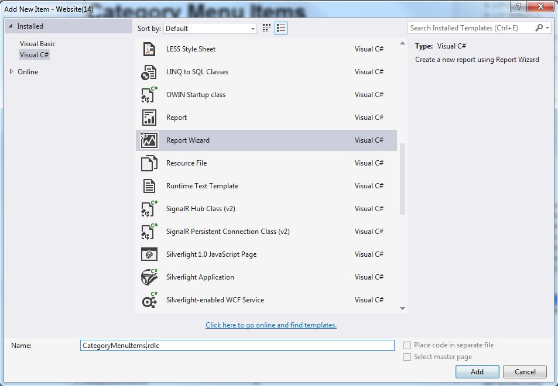
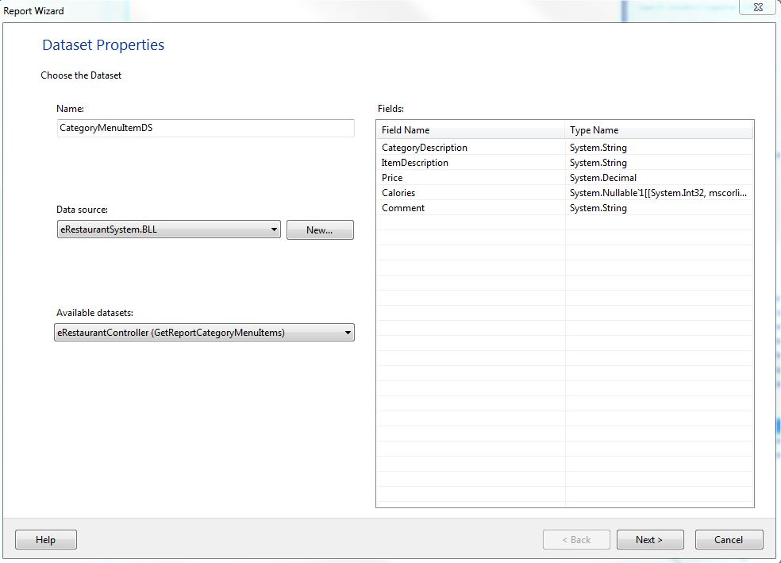
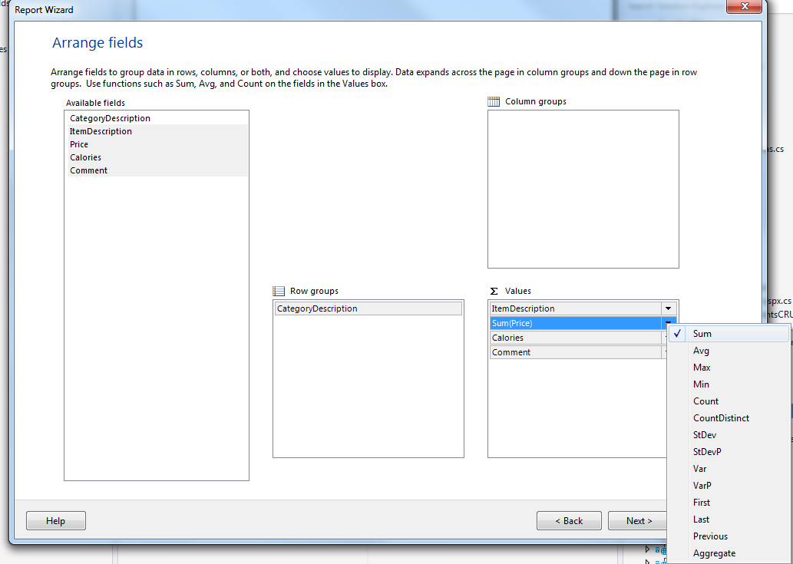
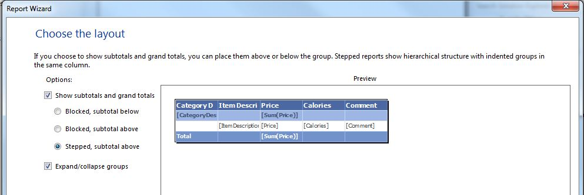
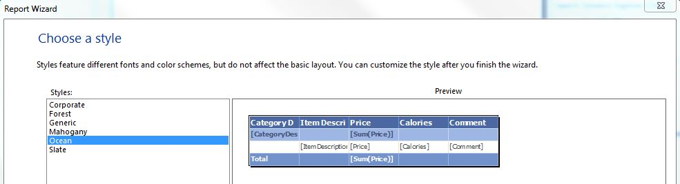
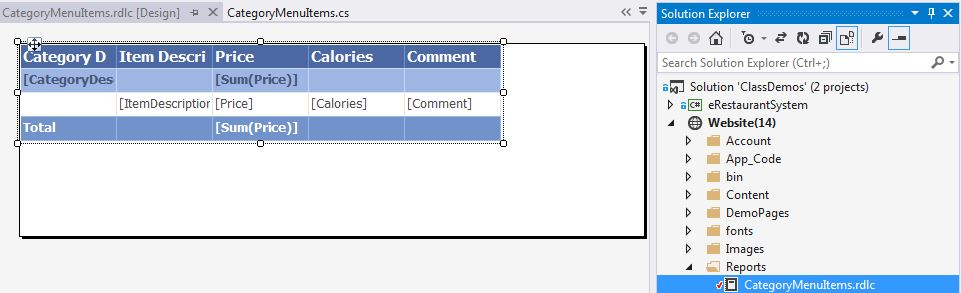
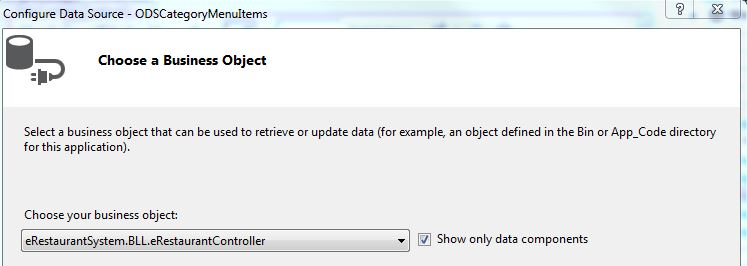
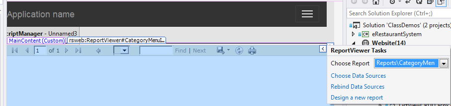
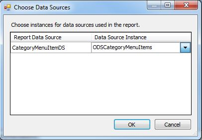

---
title: eRestaurant - Reporting Basics
---
# eRestaurant - Reporting Basics

You can add reports to your ASP.NET website using Microsoft's Report and ReportViewer. The data for a report can be supplied by any collection that supports iEnumerable, such as a List of Custom Business Objects (`List<T>`), a Typed DataSet, or a LINQ query.

The following steps demonstrate how to create a simple report based on a collection created by a Linq query within your Business Logic Layer (BLL) controller. The collection is defined by a POCO class called CategoryMenuItem. The data within this class is considered a flat data collection.

## Building the BackEnd

### Create the POCO collection class

Add a new class to your POCOs folder called CategoryMenuItem.

```csharp
namespace eRestaurantSystem.POCOs
{
    public class CategoryMenuItems
    {
        public string CategoryDescription { get; set; }
        public string ItemDescription { get; set; }
        public decimal Price { get; set; }
        public int? Calories { get; set; }
        public string Comment { get; set; }
    }
}
```

### Create the BLL method

Create a new DataObjectMethod called GetReportCategoryMenuItems() within your BLL controller class. This method will select from the Items DbSet and use the POCO class CategoryMenuItem. Preordering of the data can be done at this time or deferred to when the report runs. Since the Linq command is eventually run within SQL, why not use the optimization power of the database management system to sort the data. Notice the use of POCOs when qualifying the datatype on select new. This is required because there is also a DTO class by the same name. Remember to place a Using statement with the rest of your namespaces.

```csharp
[DataObjectMethod(DataObjectMethodType.Select, false)]
public List<POCOs.CategoryMenuItems> GetReportCategoryMenuItems()
{
    using (eRestaurantContext context = new eRestaurantContext())
    {
        var results = from cat in context.Items
                        orderby cat.MenuCategory.Description, cat.Description
                        select new POCOs.CategoryMenuItems
                        {
                            CategoryDescription = cat.MenuCategory.Description,
                            ItemDescription = cat.Description,
                            Price = cat.CurrentPrice,
                            Calories = cat.Calories,
                            Comment = cat.Comment
                        };

        return results.ToList(); // this was .Dump() in Linqpad
    }
}
```

## Create the Report

Create a new folder under the web site called Reports. All the report .rdlc files will be placed here. These files are an XML representation of the report definition.

### Select Report Details and Grouping

1. Right-click on your website (or a folder of your website) and select "Add New Item…". Select the Report Wizard template and give it the name "CategoryMenuItems.rdlc". This will bring up the report wizard.



2. In the Dataset Propertied dialog, enter "CategoryMenuItemDS" as the Name. Select your BLL controller as the Data source. Select the GetReportCategoryMenuItems as the Available datasets. Then, click Next.



3. In the Arrange fields, click on the item in Available Fields and drag it to either Row groups or Values as shown in the image. Values will create the Detail line of your report. The detail lines will be grouped under the Row group. Numerics are automatically assumed to be Sum(). To remove this Sum(), click on the down arrow and uncheck the Sum. Click Next.



4. In the Choose the layout, change from Blocked, subtotal below to Stepped, subtotal above. The Expand/collapse groups will allow for drill down of your display. Click Next.



5. Choose one of the default styles and click Next.



6. You now have your basic report with no customization or formatting. In your Solution you have a new entry which is the .rdlc file. This is the XML representation of the report definition. Open it and view the code but do not touch.



### Create the WebForm with a ReportViewer

- Add a new Web Form to your web site demonstration page folder naming it "ReportCategoryMenuItems.aspx".
  - In our Visual Studio 2013 website template, the site.master will have the ScriptManager by default.
  - You can check your site.master for a ScriptManager object. If you do not have this object on the .aspx page, drag a ScriptManager from the AJAX Extensions (or ToolscriptManager) control onto your form.


- Next, drag and ObjectDataSource to your form, and give it the ID "ODSCategoryMenuItems". The click the object data source's smart tag and select "Configure Data Source…". Configure your data source to the GetReportCategoryMenuItems within the BLL controller.



- From the Reporting set of tools in the Toolbox, drag a ReportViewer onto your form. Set its Width property to "100%". Then, click the ReportViewer's smart tag and select "CategoryMenutIems.rdlc" in the Choose Report drop-down.



- Click the ReportViewer's smart tag once more and click on Choose Data Sources. Select the "ODSCategoryMenuItems" as the Data Source Instance and click OK.



- Save the form, and then view it in the Browser. You should get a form that looks like the following.


