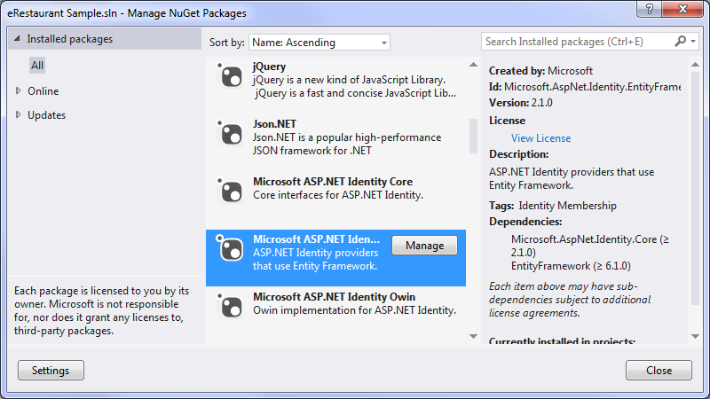

# ASP.NET Identity - eRestaurant Sample/Demo

> **Extra Reading**: [Security Sitemap Setup](http://weblogs.asp.net/jongalloway/asp-net-menu-and-sitemap-security-trimming-plus-a-trick-for-when-your-menu-and-security-don-t-match-up)

## Overview

The website template used to start our application has ASP.NET Identity already built-in. Unless otherwise noted in the demo, there will be no need to modify these files. Here are the key files that have been included (files in the ~/bin/ folder are not listed here, but are integral to the functioning of ASP.NET Identity):

Login Page - `~/Account/Login.aspx`
  ~ This page presents the login form that leverages ASP.NET Identity. There is no need to modify this form.

Manage Account - `~/Account/Manage.aspx`
  ~ This page allows the logged in user to manage their account, performing such actions as changing password, email, etc.

Register - `~/Account/Register.aspx`
  ~ This page allows new users to register onto the site. By default, new users are not added to any given security role.

Register External Logins - `~/Account/RegisterExternalLogin.aspx`
  ~ This page allows new users to register onto the site using 3rd-party sites for authentication, such as Microsoft Live, Facebook, Twitter, or Google. By default, new users are not added to any given security role.

3^rd^ Party Logins - `~/Account/OpenAuthProviders.ascx`
  ~ This user control lists the supported 3rd-party sites used for authentication, such as Microsoft Live, Facebook, Twitter, or Google.

Account Folder Configuration - `~/Account/Web.config`
  ~ This configuration file ensures that only authenticated users are allowed access to the pages in the Account folder, thereby forcing users who are not logged in to the only public page in the Account folder: ~/Account/Login.aspx

EF Identity Models - `~/App_Code/IdentityModel.cs`
  ~ This file contains core Identity and related Entity Framework classes (which should be moved out to a separate class library if you are using Migrations) along with a number of OWIN-related methods. OWIN is a middleware package for the ASP.NET pipeline that supports using 3rd-party sites for authentication, such as Microsoft Live, Facebook, Twitter, or Google.

Startup - `~/App_Code/Startup.Auth.cs`
  ~ Contains the Startup class which has a method for configuring authentication for the website. You can modify this file to allow authentication through Microsoft Live, Facebook, Twitter, Google, or other providers.

### Upgrading your site

To make use of the latest version of ASP.NET Identity, we will need to update our NuGet packages. First, right-click on your solution and select "Manage NuGet Packages for solution…". In the dialog box, select Update in the left panel and click **Update All**. This will update all the packages, including ASP.NET Identity, to the latest versions. Updating packages this way ensures that any dependencies in packages are also updated.


If you are prompted to overwrite any files, click "Yes to All".


In this demo, we will extend the built-in implementation of ASP.NET Identity to support the eRestaurant scenario, allowing sign-in for restaurant staff. Note that this demo will not discuss the architectural structure of ASP.NET Identity, but will simply leverage it for use in the eRestuarant application.

The Identity framework in the website uses its own database context class called `ApplicationDbContext` (inside the ~/App_Code/IdentityModel.cs file). It is configured to use a connection string called DefaultConnection.

This database context class is internally configured to generate the necessary database tables for storing the security-related information for the site whenever that context class is compiled. In the case of a *web site* template, this database context class is compiled "on-the-fly" when someone tries to access the Register.aspx or Login.aspx pages (which is why you won't see these tables unless you visit these pages, even if the DefaultConnection is pointing to the same database as the rest of your apps).


During your development, you may still run into changes in your database tables for ASP.NET Identity-related security (such as the one for adding the WaiterID to the `ApplicationUser` class). If you already have the ASP.NET Identity tables in your database and they do not reflect your most current version of your modifications, you can simply drop those tables. ASP.NET Identity is configured to create the tables if they don't exist.

Right-click on IIS Express in the taskbar and select "Exit".


Remember to either **rebuild your solution after you delete these ASP.NET Identity tables** or **manually stopping IIS Express**. This is necessary because your web application must be re-started so that the `ApplicationDbContext` can run the database initializer, which re-creates the necessary database tables for ASP.NET Identity.


Pulling Identity EntityFramework into your Class Library

These steps only apply if you are using an **ASP.NET Web Forms Site** *web site* template in your solution (as opposed to an **ASP.NET Web Application** – WAP – *project template*). For a discussion on the distinction between using a Web Site as opposed to a Web Project, see the following resources:

The core classes for using Identity EntityFramework are, by default, included in the App_Code folder of the website. Since our application already uses a class library for the Business Logic and Data Access layers as well as our application's Entity classes, it makes better sense to move the Identity EntityFramework classes into our class library. The reasons for this are as follows:

- Our application will leverage some kind of association with users
- We can more easily implement custom user profile information, integrating it with any other application-specific processes and data
- Encapsulating security in your class libary helps isolate the database context and enforce the use of the `UserManager` BLL class (thereby preventing the front-end from having direct access to the security related DAL)
- For future versions of our application, we can leverage Database Migrations (cannot be implemented in a Web Site, but requires a compilable project)

<details><summary>Expand for detailed steps</summary>

1. Right-click on your solution and choose "Manage NuGet Packages for Solution...". In the dialog, select the Installed packages and click "Manage" for the core Identity with Entity Framework package. Then check on the checkbox to include this with your class library. Screenshots




2. In your website, open `~/App_Code/IdentityModel.cs`. In the next steps, you will move the following classes out of this file and place them in your class library: the `ApplicationUser`, `ApplicationDbContext` and `UserManager` classes.
3. In your class library, create a sub-folder for your Entities folder called Security. Inside this folder, create a class called ApplicationUser. Replace the code for the class with the corresponding code from the website's `~/App_Code/IdentityModel.cs`. Expand for Code Details

```csharp
// You can add User data for the user by adding more properties to your User class, please visit http://go.microsoft.com/fwlink/?LinkID=317594 to learn more.
public class ApplicationUser : IdentityUser
{
}
```

4. In your class library, create a sub-folder for your DAL folder called Security. Inside this folder, create a class called ApplicationDbContext in your DAL folder. Replace the code for the class with the corresponding code from the website's `~/App_Code/IdentityModel.cs`. Notice also that we are making a single modification to make this DAL class `internal` to our class library. Expand for Code Details

```csharp
internal class ApplicationDbContext : IdentityDbContext<ApplicationUser>
{
    public ApplicationDbContext()
        : base("DefaultConnection")
    {
    }
}
```

5. In your class library, create a sub-folder for your BLL folder called Security. Inside this folder, create a class in your BLL folder called UserManager. Replace the code for the class with the corresponding code from the website's `~/App_Code/IdentityModel.cs`. Expand for Code Details

```csharp
public class UserManager : UserManager<ApplicationUser>
{
    public UserManager()
        : base(new UserStore<ApplicationUser>(new ApplicationDbContext()))
    {
    }
}
```

6. Decide on your namespace names for these three classes. Originally, the namespace used in the website was `Website`. If you wish, you can use this same namespace for the classes you pasted into your class library project. However, if you keep the Visual Studio's default namespacing pattern when you created your classes above, then you will need to reconcile the references in the various pages under ~/Account/ in your website as well as in some of the files in your ~/App_Code/ folder (such as `~/App_Code/IdentityModel.cs`). The easiest way to do this is to build your solution and go to each error, resolving the namespace associated with the `ApplicationUser` and `UserManager` classes by adding `using namespace;` statements.
7. If you are doing version control, this is a good time to commit your changes. Changed Files

```shell
git add .
modified:   eRestaurant/Website/Account/Login.aspx.cs
modified:   eRestaurant/Website/Account/Manage.aspx.cs
modified:   eRestaurant/Website/Account/Register.aspx.cs
modified:   eRestaurant/Website/Account/RegisterExternalLogin.aspx.cs
modified:   eRestaurant/Website/App_Code/IdentityModels.cs
new file:   eRestaurant/eRestaurant/BLL/Security/UserManager.cs
new file:   eRestaurant/eRestaurant/DAL/Security/ApplicationDbContext.cs
new file:   eRestaurant/eRestaurant/Entities/Security/ApplicationUser.cs
modified:   eRestaurant/eRestaurant/eRestaurant.csproj
```

Adding a Role Manager

The basic implimentation of ASP.NET Identity above only contains a BLL class to manage users. It would be helpful to also include a class to manage security roles. You can add the following class to provide access to the built-in `IdentityRole` information in ASP.NET Identity.

Expand for Code Details

```
public class RoleManager : RoleManager<IdentityRole>
{
    public RoleManager()
        : base(new RoleStore<IdentityRole>(new ApplicationDbContext()))
    {
    }
}
```

RoleManager

Setting the Connection String Expand for Code Details

```
    <add name="DefaultConnection" 
        connectionString="Data Source=.;Initial Catalog=eRestaurant;Integrated Security=true;"
        providerName="System.Data.SqlClient" />

```

Web.config - Connection Strings

Extending ASP.NET Identity Modify ApplicationUser, UserManager, and RoleManager

- Add a reference to WaiterID - Modify ApplicationUser to have a nullable reference to our Waiter ID Expand for Code Details
    
    ```
        // You can add User data for the user by adding more properties to your User class, please visit http://go.microsoft.com/fwlink/?LinkID=317594 to learn more.
        public class ApplicationUser : IdentityUser
        {
            public int? WaiterID { get; set; }
        }
    
    ```
    
    ApplicationUser.cs
    
- Add a method to create default user accounts (one for each waiter) Expand for Code Details
    
    ```
        #region Constants
        private const string STR_DEFAULT_PASSWORD = "Pa$$word1";
        /// <summary>Requires FirstName and LastName</summary>
        private const string STR_USERNAME_FORMAT = "{0}.{0}";
        /// <summary>Requires UserName</summary>
        private const string STR_EMAIL_FORMAT = "{0}@eRestaurant.tba";
        private const string STR_WEBMASTER_USERNAME = "Webmaster";
        #endregion
    ```
    
    UserManager.cs - Constants
    
    ```
    public void AddDefaultUsers()
    {
        using (var context = new RestaurantContext())
        {
            var employees = from data in context.Waiters
                            where !data.ReleaseDate.HasValue
                            select data;
            foreach (var person in employees)
            {
                // Check if they exist
                if (!Users.Any(u => u.WaiterID.HasValue && u.WaiterID.Value == person.WaiterID))
                {
                    string userName = string.Format(STR_USERNAME_FORMAT, person.FirstName, person.LastName);
                    var appUser = new ApplicationUser()
                    {
                        UserName = userName,
                        Email = string.Format(STR_EMAIL_FORMAT, userName),
                        WaiterID = person.WaiterID
                    };
                    // NOTE: The following needs to use the this keyword in order to have access to the extension method
                    //       Create(ApplicationUser user, string password)
                    this.Create(appUser, STR_DEFAULT_PASSWORD);
                }
            }
            // Add a web  master user
            if (!Users.Any(u => u.UserName.Equals(STR_WEBMASTER_USERNAME)))
            {
                var webMasterAccount = new ApplicationUser()
                {
                    UserName = STR_WEBMASTER_USERNAME,
                    Email = string.Format(STR_EMAIL_FORMAT, STR_WEBMASTER_USERNAME)
                };
                this.Create(webMasterAccount, STR_DEFAULT_PASSWORD);
            }
        }
    }
    ```
    
    UserManager.AddDefaultUsers()
    
- Add a method to create default security roles; you can place it in the /Entities/Security/ folder. Expand for Code Details
    
    ```
        internal static class SecurityRoles
        {
            public const string WebsiteAdmins = "WebsiteAdmins";
            public const string RegisteredUsers = "RegisteredUsers";
            public const string Staff = "Staff";
            public static List<string> DefaultSecurityRoles
            {
                get
                {
                    List<string> value = new List<string>();
                    value.Add(WebsiteAdmins);
                    value.Add(RegisteredUsers);
                    value.Add(Staff);
                    return value;
                }
            }
        }
    
    ```
    
    SecurityRoles.cs
    
    ```
    public void AddDefaultRoles()
    {
        foreach (string roleName in SecurityRoles.DefaultSecurityRoles)
        {
            // Check if it exists
            if (!Roles.Any(r => r.Name == roleName))
            {
                this.Create(new IdentityRole(roleName));
            }
        }
    }
    ```
    
    RoleManager.AddDefaultRoles()
    
- Managing User Profile Changes - delete tables vs. enabling Migrations Expand for screenshot
    
    Changes to databases in different releases of your software is a natural process. To manage those changes through Entity Framework, you can enable Migrations in your project. However, the topic of Entity Framework Migrations is beyond the scope of this course.
    
    During your development, you may still run into changes in your database tables for ASP.NET Identity-related security (such as the one for adding the WaiterID to the `ApplicationUser` class). If you already have the ASP.NET Identity tables in your database and they do not reflect your most current version of your modifications, you can simply drop those tables. ASP.NET Identity is configured to create the tables if they don't exist.
    
    Expand for ScreenShots
    
    Right-click on IIS Express in the taskbar and select "Exit".
    
      
    
    
    Exit IIS Express
    
    If you drop the tables, you will need to have the web server (IIS Express) re-start your application so that the database initializer is ready to re-create the necessary database tables. This can be done by either **manually stopping IIS Express** or by **rebuilding your solution after you delete these ASP.NET Identity tables**. By re-building your solution, IIS Express (if it is running) will recognize that a change has been made in the DLLs and thus it will re-start the application when you refresh the page. This is necessary because your web application must be re-started so that the `ApplicationDbContext` can run the database initializer, which re-creates the necessary database tables for ASP.NET Identity.
    
    Expand for ScreenShots
    
    
    
    SQL Server Object Explorer - Drop Tables
    
    
    
    Drop Tables - Update Database
    

Website Security Form Manage Users and Roles

- Add a page to manage users and logins Expand for Code Details
    
    Notice that we are also adding an ObjectDataSource control to list the waiters. This will be used when we associate a user account to a particular waiter.
    
    ```
    <asp:Content ID="Content1" ContentPlaceHolderID="MainContent" runat="Server">
        <div class="row jumbotron">
            <h1>Site Administration</h1>
        </div>
        <div class="row">
            <div class="col-md-9">
                <h2>Users</h2>
            </div>
            <div class="col-md-3">
                <h2>Roles</h2>
            </div>
        </div>
        <%--List of Waiters--%>
        <asp:ObjectDataSource runat="server" ID="WaiterDataSource" OldValuesParameterFormatString="original_{0}" SelectMethod="ListAllWaiters" TypeName="eRestaurant.BLL.RestaurantAdminController"></asp:ObjectDataSource>
    </asp:Content>
    ```
    
    ~/Admin/Security/Default.aspx
    
- Create the form - two ListView controls - Layout + Item template only Expand for Code Details
    
    There are a number of properties to the `ApplicationUser` that we may wish to show (the majority being those inherited from the `IdentityUser` class). For our purposes, however, we are interested primarily in the `UserName`, `Email`, `Roles`, and our custom property for `WaiterID`.
    
    ```
    <asp:ListView ID="UserListView" runat="server"
        ItemType="eRestaurant.Entities.Security.ApplicationUser"
        OnItemCommand="UserListView_ItemCommand">
        <EmptyDataTemplate>
            <table runat="server">
                <tr>
                    <td>
                        No users in this site.
                        <asp:LinkButton runat="server" CommandName="AddWaiters" Text="Add Waiters as users" ID="AddWaitersButton" />
                    </td>
                </tr>
            </table>
        </EmptyDataTemplate>
        <ItemTemplate>
            <tr>
                <td>
                    <asp:LinkButton runat="server" CommandName="Edit" Text="Edit" ID="EditButton" />
                    <asp:LinkButton runat="server" CommandName="Delete" Text="Delete" ID="DeleteButton" />
                </td>
                <td>
                    <asp:Label Text='<%# Item.UserName %>' runat="server" ID="UserNameLabel" /></td>
                <td>
                    <asp:Label Text='<%# Item.Email %>' runat="server" ID="EmailLabel" /></td>
                <td><em>password is hashed</em></td>
                <td>
                    <asp:Label Text='<%# Item.WaiterID %>' runat="server" ID="WaiterIDLabel" />
                    <asp:DropDownList ID="WaiterIDDropDown_Item" runat="server"
                        AppendDataBoundItems="true" SelectedValue='<%# Item.WaiterID %>'
                        DataSourceID="WaiterDataSource" Enabled="false"
                        DataTextField="FullName" DataValueField="WaiterID">
                        <asp:ListItem Value="">[none]</asp:ListItem>
                    </asp:DropDownList>
                </td>
                <td>
                    <asp:Label runat="server" ID="RolesCountLabel"
                        Text='<%# string.Join(", ", Item.Roles.Select(x=>x.RoleId).ToArray()) %>' />
                </td>
            </tr>
        </ItemTemplate>
        <LayoutTemplate>
            <table runat="server">
                <tr runat="server">
                    <td runat="server">
                        <table runat="server" id="itemPlaceholderContainer"
                            class="table table-condensed table-hover table-striped">
                            <tr runat="server">
                                <th runat="server">Action</th>
                                <th runat="server">User Name</th>
                                <th runat="server">Email</th>
                                <th runat="server">Password</th>
                                <th runat="server">Waiter</th>
                                <th runat="server">Roles</th>
                            </tr>
                            <tr runat="server" id="itemPlaceholder"></tr>
                        </table>
                    </td>
                </tr>
                <tr runat="server">
                    <td runat="server">
                        <asp:DataPager runat="server" ID="DataPager1">
                            <Fields>
                                <asp:NextPreviousPagerField ButtonType="Button" ShowFirstPageButton="True" ShowLastPageButton="True"></asp:NextPreviousPagerField>
                            </Fields>
                        </asp:DataPager>
                    </td>
                </tr>
            </table>
        </LayoutTemplate>
    </asp:ListView>
    ```
    
    UserListView
    
    When displaying the security roles for the system, the only properties we will need to display are the `Name` of the role and the # of users in that role.
    
    ```
    <asp:ListView ID="RoleListView" runat="server"
        ItemType="Microsoft.AspNet.Identity.EntityFramework.IdentityRole"
        OnItemCommand="RoleListView_ItemCommand">
        <EmptyDataTemplate>
            <table runat="server">
                <tr>
                    <td>
                        No roles in this site.
                        <asp:LinkButton runat="server" CommandName="AddDefaultRoles" Text="Add default security roles" ID="AddDefaultRolesButton" />
                    </td>
                </tr>
            </table>
        </EmptyDataTemplate>
        <ItemTemplate>
            <tr>
                <td>
                    <asp:LinkButton runat="server" CommandName="Edit" Text="Edit" ID="EditButton" />
                    <asp:LinkButton runat="server" CommandName="Delete" Text="Delete" ID="DeleteButton" />
                </td>
                <td><asp:Label Text='<%# Item.Name %>' runat="server" ID="NameLabel" /></td>
                <td><asp:Label Text='<%# Item.Users.Count %>' runat="server" ID="UsersCountLabel" /></td>
            </tr>
        </ItemTemplate>
        <LayoutTemplate>
            <table runat="server">
                <tr runat="server">
                    <td runat="server">
                        <table runat="server" id="itemPlaceholderContainer"
                            class="table table-condensed table-hover table-striped">
                            <tr runat="server">
                                <th runat="server">Action</th>
                                <th runat="server">Role Name</th>
                                <th runat="server">Users</th>
                            </tr>
                            <tr runat="server" id="itemPlaceholder"></tr>
                        </table>
                    </td>
                </tr>
                <tr runat="server">
                    <td runat="server">
                        <asp:DataPager runat="server" ID="DataPager2">
                            <Fields>
                                <asp:NextPreviousPagerField ButtonType="Button" ShowFirstPageButton="True" ShowLastPageButton="True"></asp:NextPreviousPagerField>
                            </Fields>
                        </asp:DataPager>
                    </td>
                </tr>
            </table>
        </LayoutTemplate>
    </asp:ListView>
    ```
    
    RoleListView
    
- Add code-behind - view users/roles Expand for Code Details
    
    ```
        protected void Page_Load(object sender, EventArgs e)
        {
            if (!IsPostBack)
            {
                DataBindUserList();
                DataBindRoleList();
            }
        }
        private void DataBindRoleList()
        {
            // Populate the Roles Info
            RoleListView.DataSource = new RoleManager().Roles.ToList();
            RoleListView.DataBind();
        }
        private void DataBindUserList()
        {
            // Populate the Users Info
            UserListView.DataSource = new UserManager().Users.ToList();
            UserListView.DataBind();
        }
    
    ```
    
    Page_Load() and methods to populate ListView controls
    
- LinkButton click event handler to add default users/roles Expand for Code Details
    
    ```
        protected void UserListView_ItemCommand(object sender, ListViewCommandEventArgs e)
        {
            switch (e.CommandName)
            {
                case "AddEmployees":
                    new UserManager().AddDefaultUsers();
                    DataBindUserList();
                    break;
                default:
                    break;
            }
        }
        protected void RoleListView_ItemCommand(object sender, ListViewCommandEventArgs e)
        {
            switch (e.CommandName)
            {
                case "AddDefaultRoles":
                    new RoleManager().AddDefaultRoles();
                    DataBindRoleList();
                    break;
                default:
                    break;
            }
        }
    
    ```
    
    ListView ItemCommand event handlers
    
- Edit User Info - EditItemTemplate and Code-behind Expand for Code Details
    
    In the markup for the form, add the following `EditItemTemplate` to the ListView that handles edting user information.
    
    ```
        <EditItemTemplate>
            <tr>
                <td>
                    <asp:LinkButton runat="server" CommandName="Update" Text="Update" ID="UpdateButton" />
                    <asp:LinkButton runat="server" CommandName="Cancel" Text="Cancel" ID="CancelButton" />
                </td>
                <td>
                    <asp:TextBox ID="UserNameTextBox" runat="server"
                        ToolTip="User name"
                        Text='<%# BindItem.UserName %>' />
                </td>
                <td>
                    <asp:TextBox ID="EmailTextBox" runat="server"
                        ToolTip="Email"
                        Text='<%# BindItem.Email %>' />
                    <br />
                    <asp:TextBox ID="EmailConfirmedTextBox" runat="server"
                        ToolTip="Confirm the Email" />
                </td>
                <td>
                    <asp:TextBox ID="Password" runat="server"
                        ToolTip="Password for the user"
                        Text='3tools.default' />
                    <br />
                    <asp:TextBox ID="PasswordConfirmedTextBox" runat="server"
                        ToolTip="Confirm Password for the user" />
                </td>
                <td>
                    <asp:DropDownList ID="WaiterIDDropDown" runat="server"
                        AppendDataBoundItems="true" DataSourceID="WaiterDataSource"
                        DataTextField="FullName" DataValueField="WaiterID"
                        SelectedValue='<%# BindItem.WaiterID %>'>
                        <asp:ListItem Value="0">[Select an Waiter]</asp:ListItem>
                    </asp:DropDownList>
                </td>
                <td>
                    <asp:ListBox ID="UserRolesListBox" runat="server" SelectionMode="Multiple"
                        DataSource="<%# UserRoles %>" DataTextField="Name" DataValueField="Name"></asp:ListBox>
                </td>
            </tr>
        </EditItemTemplate>
    ```
    
    UserListView - EditItemTemplate
    
    For the code-behind, to handle the Editing of user information, modify the `UserListView_ItemCommand()` method to include the following case in the `switch` statement.
    
    Extra case in `UserListView_ItemCommand()` method's `switch`
    
- Add User - InsertItemTemplate and code-behind Expand for Code Details
    
    In the markup for the form, add the following `InsertItemTemplate` to the ListView that handles adding new users.
    
    ```
        <InsertItemTemplate>
            <tr>
                <td>
                    <asp:LinkButton runat="server" CommandName="Insert" Text="Insert" ID="InsertButton" />
                    <asp:LinkButton runat="server" CommandName="Cancel" Text="Clear" ID="CancelButton" />
                </td>
                <td>
                    <asp:TextBox ID="UserNameTextBox" runat="server"
                        ToolTip="User name"
                        Text='<%# BindItem.UserName %>' />
                </td>
                <td>
                    <asp:TextBox ID="EmailTextBox" runat="server"
                        ToolTip="Email"
                        Text='<%# BindItem.Email %>' />
                    <br />
                    <asp:TextBox ID="EmailConfirmedTextBox" runat="server"
                        ToolTip="Confirm the Email" />
                </td>
                <td>
                    <asp:TextBox ID="Password" runat="server"
                        ToolTip="Password for the user"
                        Text='3tools.default' />
                    <br />
                    <asp:TextBox ID="PasswordConfirmedTextBox" runat="server"
                        ToolTip="Confirm Password for the user" />
                </td>
                <td>
                    <asp:DropDownList ID="WaiterIDDropDown" runat="server"
                        AppendDataBoundItems="true" DataSourceID="WaiterDataSource"
                        DataTextField="FullName" DataValueField="WaiterID"
                        SelectedValue='<%# BindItem.WaiterID %>'>
                        <asp:ListItem Value="0">[Select an Waiter]</asp:ListItem>
                    </asp:DropDownList>
                </td>
                <td>
                    <asp:ListBox ID="UserRolesListBox" runat="server" SelectionMode="Multiple"
                        DataSource="<%# UserRoles %>" DataTextField="Name" DataValueField="Name"></asp:ListBox>
                </td>
            </tr>
        </InsertItemTemplate>
    
    ```
    
    UserListView - InsertItemTemplate
    
    For the code-behind, to handle the Inserting of user information, modify the `UserListView_ItemCommand()` method to include the following case in the `switch` statement.
    
    Extra case in `UserListView_ItemCommand()` method's `switch`
    
- **Practice!** Edit Role - EditItemTemplate and Code-behind Expand for Code Details
    
- **Practice!** Add Role - InsertItemTemplate and code-behind Expand for Code Details
    
- About Us page for temp listing of the test usernames + passwords

### TODO: Write up details

#### Established Steps

- Update the Web.sitemap to link to the security page
- Run the application to test viewing security and adding roles/users
- Register on the site as a new user, and then view the security page again
- Passing the `System.Security.Principle.IPrinciple` instance from the page (`this.User`) to your BLL for processing. 
    
    ```
    // Needed to be able to call such extension methods as User.Identity.GetUserId()
    using Microsoft.AspNet.Identity;
    // …
        var userName = user.Identity.GetUserName();
    // …
    ```
    

##### Steps to re-work

- Add web.config to the Staff folder to require login
- Modify root web.config to enable securitytrimming in the sitemap
- Run the application to test logging in as staff
- Add web.config to the Admin folder to require login by managers and super users
- Restrict the Registration page