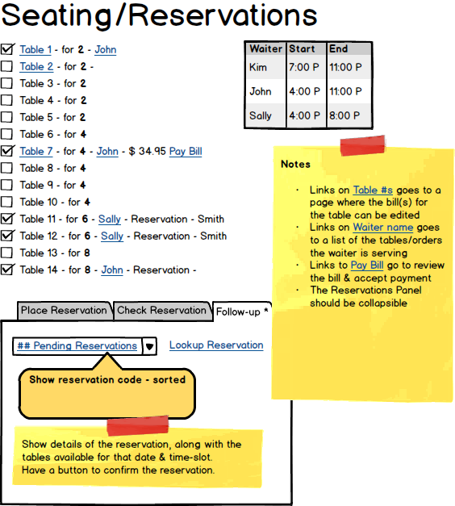
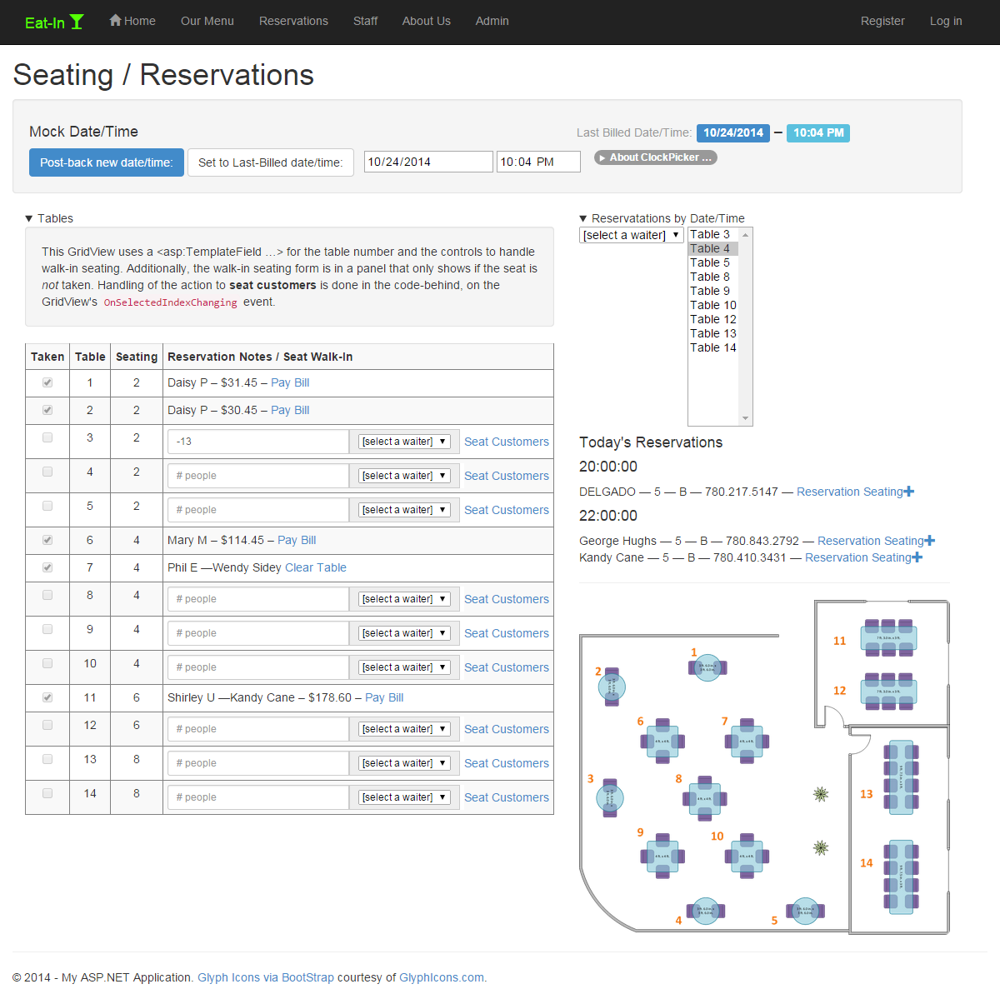

---
title: Working Toward a Functional UX
---
# Sample/Demo - Working Toward a Functional UX

## Various Approaches

There is no single "right" way to design and build applications. Each approach needs to be tailored to the needs of the client and the knowlege and skills of the developers. The approaches shown in this demo are only one way to tackle the job of building the eRestaurant application.

While this approach puts more emphasis on manual testing and exploration during development, other approaches (such as BDD and DDD) tend to make heavier use of automated testing through unit tests and acceptance tests. These approaches, however, don't have to be mutually exclusive.

Any time you build an application, you are engaging in an exploration. That includes learning about the technology you need to use. But more importantly, it's an exercise in discovering *what you **don't know** about the problem* you are trying to solve. When it comes to "making it work", you, as the developer, are on the front-line of facing all those niggling "details" that make up the app.

The functionality of the eRestaurant website revolves around the following scenarios:

- Taking reservations (Reservations.aspx)
- Seating customers (FrontDesk.aspx)
- Serving customers (ServingTables.aspx)
- Creating the meals (KitchenOrders.aspx)

This demo will focus on building the functionality for **seating customers**. The original mockup for the Front Desk page focused on allowing the host/hostess seat walk-in customers as well as reservation customers. In the final version, we will show the "current" occupancy of the restaurant (using a GridView and TemplateColumns) along with a list of the reservations for the day (using a ListView inside a Repeater).

