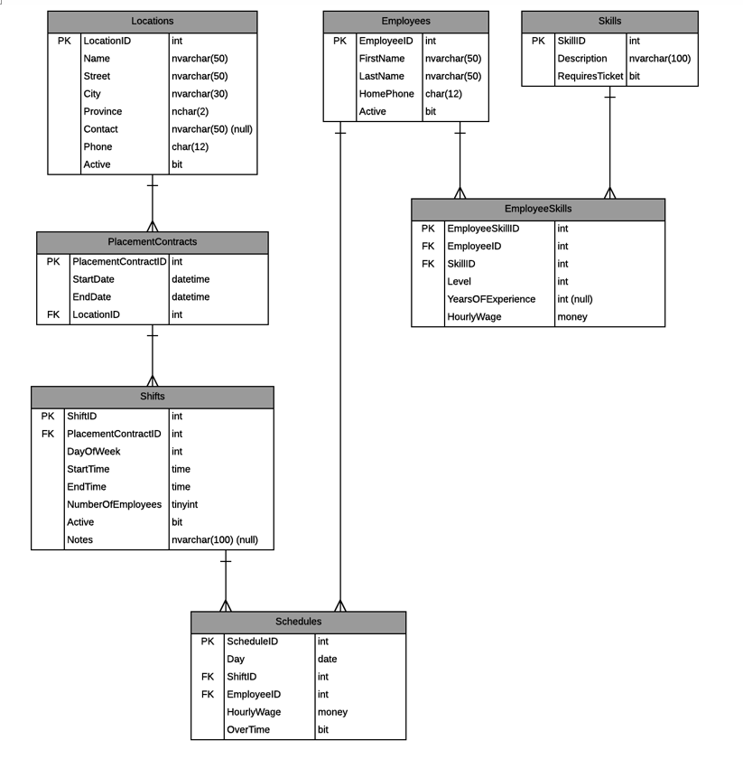
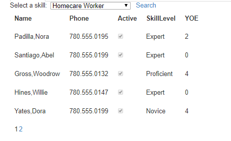
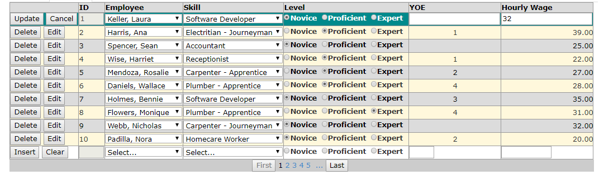

# Entity Framework - Code First CRUD Exercise (3 Marks)

> Your solution to this exercise must be demonstrated to your instructor **in class**.

> Be aware that this is the first exercise in a series of cumulative exercises - you must be prepared to complete each exercise in light of the possibility that any given exercise may depend on the **correct** implementation of previous exercises. Place this work in your private Exercise repository.

## Setup

Create a new VS Solution called **WorkScheduleSolution** with a Web Forms application project and appropriate class library project(s); be sure to use the .Net Framework versions of these project types. In the "Entities" folder of your class library, generate the entity and context classes using Code-First from Database. Name your context class **WorkScheduleContext**. After the classes are generated, make the following adjustments:

- Modify the error messages for validation attributes on the properties of the **EmployeeSkill** class.
- Add a `[NotMapped]` property on the **Employee** class for the formal name of the employee ("*LastName, FirstName*").
- Change the namespace and location of the **WorkScheduleContext** class to the DAL folder and set the class to be an `internal` class.
- Ensure that the DbContext class does not generate a database if the connection string points to the wrong location.

## BLL

Create a controller class in your BLL that supports the following.

- All CRUD behaviours for the **EmployeeSkill** entity.
- List all employees.
- List all employees by skill (accept an integer for the `SkillID`).

These methods must have appropriate `[DataObjectMethod()]` attributes so as to support `<asp:ObjectDataSource>` access by the web forms.

## Web Forms

For each of the forms in this exercise, ensure you have a link in the navigational menu to each page.

### Employees by Skill

Create a web page to display the employees who have a specified skill. Use `<asp:ObjectDataSource>` controls to handle interaction with the BLL. Skills are to be displayed in a drop down list. Display the employee data in a customized data control which obtains its input parameter value from the drop down list. Your display requires appropriate page title, labels and layout. You will need a button on your page to force a post back.

### Manage Employee Skills

Create a web page that will maintain the EmployeSkill entity. You will be requried to insert, update and delete records for this entity. The Employee and Skill data displayed to the user must be human readable (don't display the IDs of the Employee and Skill information). Use `<asp:ObjectDataSource>` controls to handle interaction with the BLL.

