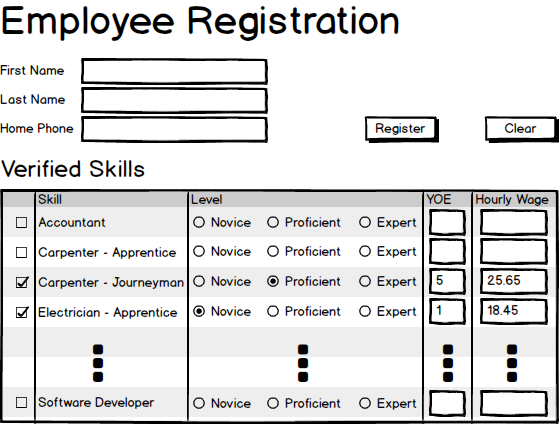

# Implementation Planning Exercise (4 marks)

Given the following user-interface, document your implementation plan for the **complete functionality** of this form. Follow the guidance and examples given by your instructor for your implementation plan. The form is designed to collect a new employee's basic information and set of skills. Remember that the entire form will be processed as a single transaction in the BLL.

Note the following requirements when processing in the BLL:

- First and Last Name as well as Home Phone are required
- Employees can have multiple skills
  - Years of Experience (YOE) and Hourly Wage are required for each selected skill.
    - Hourly Wage must fall between $15.00 and $100.00 inclusive.
    - Years of Experience must be in the range of 0 to 50 inclusive.
  - Appropriate skill level is provided for each selected skill.
