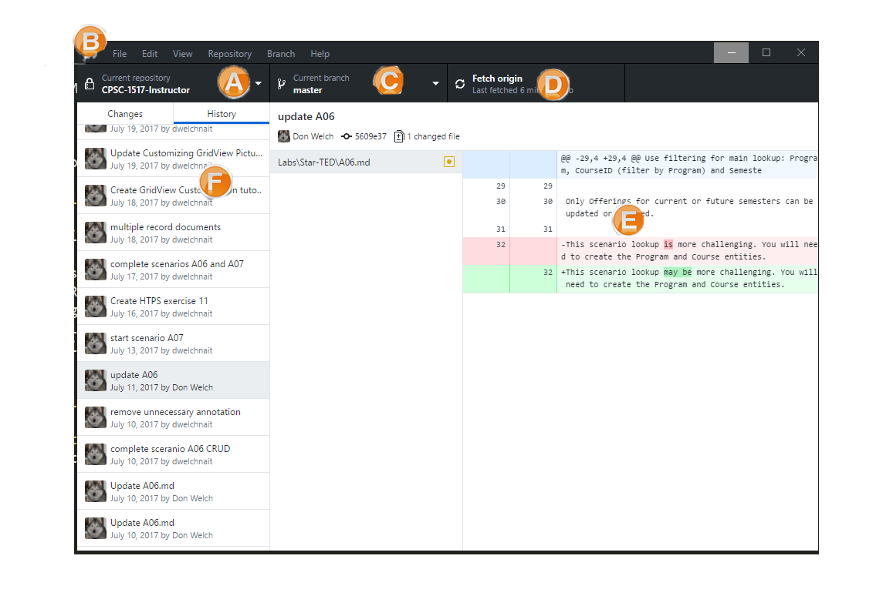

# GitHub Desktop (DVCS) - Exercise (2 Marks)

# Matching

Match the following descriptions of the GitHub Desktop user-interface with the labels on the screen-shot.

1.  Commits History/Changes
2.  Sync (push/pull) with Origin
3.  Alterations of committed item
4.  General Operational Tools for Maintenance
5.  Change branch
6.  Current (selection of) repository



Write the letter from the image into the matching item on the left.

# Using GitHub Desktop

Follow these steps to create a repository for your Visual Studio solution.

-   Create a new blank Visual Studio solution in your local GitHub folder (under My Documents) and name it DVCS Exercise and check Create new Git repository. Then add a web application in your solution folder, naming it as DVCS_Website. Select Web Forms and ensure Authentication is Individaul User Accounts. Turn off Host in cloud. When you are done, close down Visual Studio, saving all your changes.
-   Drag the solution folder onto GitHub Desktop. This will allow you to add your repository folder into the list of repositories in github DeskTop. Make sure that you a .gitignore file in your repository folder.
-   Commit your visual studio files and solution.
-   Publish the repository to GitHub (you must leave it as a public repository for this execise only). This will sync its contents with your GitHub account.
-   Test that you did it correctly
    -   Log off of your current computer, and log onto a different computer.
    -   Using GitHub Desktop, clone your repository.
    -   Open the solution and press CTRL + F5. If you did everything right, it should build and launch in the browser.
-   Through your browser on GitHub.com, ensure that your repository has a README file. Click the green Create ReadMe.md file button. Add your name to this file. Commit the changes.
-   Open your Visual Studio solution – "DVCS Exercise.sln" – and modify your Site.master file by putting your name in the navigation bar (replacing the "Application name").
    
    ```
    <a class="navbar-brand" runat="server" href="~/">Application name</a>
    ```
    
    Code to edit in Site.master
    
-   Commit your local changes, and synchronize your local and remote repositories.
-   Make five other changes to your solution (add web pages, etc.), committing each change separately. Be sure to use meaningful commit messages.

# Short Answer & Multiple Choice

Supply or identify the following short answer/multiple-choice questions.

1.  Under which menu item is the Show in Explorer option. ____________________________
2.  Under which menu item can you Add or Clone repositories. ____________________________
3.  Under which menu item can you open your Command Prompt. ____________________________
4.  List the four views that you can change to under View.
    
5.  List the two items you can edit under Repository → Repository settings ….
    
6.  A remote repository is .
    1.  A code repository that is on your local computer.
    2.  A database that is seldom used/accessed by an application (typically, a dormant web application).
    3.  A code repository that is not on your local computer.
    4.  A code repository that is kept in a location outside the continental USA.
7.  A local repository is .
    1.  A code repository that is on your local computer.
    2.  A database whose connection string specifies `data-source="."`.
    3.  A code repository that is not on your local computer.
    4.  A code repository that is kept in a location inside the continental USA.
8.  The remote repository that you synchronize with referred to as .
    1.  upstream
    2.  downstream
    3.  origin
    4.  clone
9.  When you make a local copy of a GitHub repository, you are effectively that repository.
    1.  forking
    2.  cloning
    3.  copying
    4.  replacing
10.  What is the order of Git tasks that are done when performing a sync in GitHub Desktop?
    1.  push, fetch, pull
    2.  fetch, merge, push
    3.  push, pull, clean
11.  The git pull command is equivalent to
    1.  `git fetch` and then `git merge`
    2.  `git pull` and then `git fetch`
    3.  `git get` and then `git pull`
    4.  `git fetch` and then `git pull`
12.  Which command is used to create a git repository?
    1.  `git repo`
    2.  `git pull`
    3.  `git clone`
    4.  `git init`
13.  Which command is used to stage files for a commit?
    1.  `git pull`
    2.  `git add .`
    3.  `git push`
    4.  `git init`
14.  Which of the following best describes what it means to stage files for a commit?
    1.  To stage files for a commit means to remove them from tracking in preparation for a commit.
    2.  Staging files for a commit means to identify files that may be new, modified, or deleted and marking those as being ready to commit.
    3.  Staging files for a commit means that the files are stashed so that they will be remembered after performing a pull and push.
    4.  To stage files for a commit means to change the files prior to committing them.
15.  Which command saves a snapshot of the changes to files in the repository?
    1.  `git commit -m "Commit message"`
    2.  `git save -m "Save message"`
    3.  `git push`
    4.  `git pull`
16.  Which of the following best describes what `git commit` does?
    1.  Confirms the deletion of files in the repository history.
    2.  Prepare files for being added (tracked) in the repository.
    3.  Record a snapshot of the changes that have happened in the repository since the last commit.
    4.  It performs transactional processing to synchronize remote and local repositories.
    5.  Reverses the previous snapshot of the state of the repository so that you can "undo" the edits of your source code.
