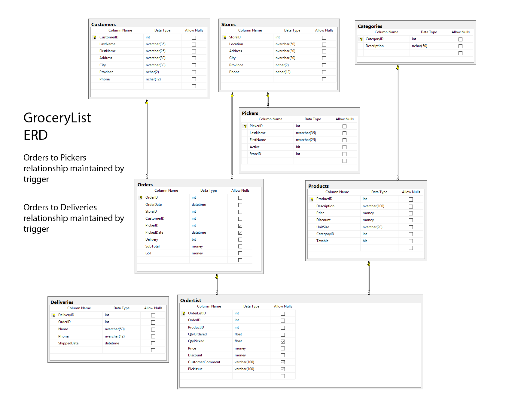

# LINQ and LinqPad Exercise (4 Marks)

## Private Classroom GitHub Repo Only

This exercise is based on the GroceryList database. For this exercise, provide your answers as LinqPad (.linq) document(s). Use either A) a single LinqPad document for each question (you will use Expressions as the LinqPad environment **or** B) a single LinqPad document containing all questions (you will need to use Statements as the LinqPad environment).

1. Create a product list which indicates what products are purchased by our customers and how many times that product was purchased. Sort the list by most popular product by alphabetic description.
    
2. We want a mailing list for a Valued Customers flyer that is being sent out. List the customer addresses for customers who have shopped at our stores. List by the store. Include the store location as well as the customer's complete address. Do NOT include the customer name in the results. List the customer address only once for a particular store.
    
3. Create a Daily Sales per Store request for a specified month. Sort stores by city by location. For Sales, show order date, number of orders, total sales without GST tax and total GST tax.
    
4. Print out all product items on a requested order (use Order #33). Group by Category and order by Product Description. You do not need to format money as this would be done at the presentation level. Use the QtyPicked in your calculations. Hint: You will need to use type casting (decimal). Use of the ternary operator will help.
    
5. Select all orders a picker has done on a particular week (Sunday through Saturday). Group and sorted by picker. Sort the orders by picked date. Hint: you will need to use the join operator.
    
6. List all the products a customer (use Customer #1) has purchased and the number of times the product was purchased. Sort the products by number of times purchased (highest to lowest) then description.
    
