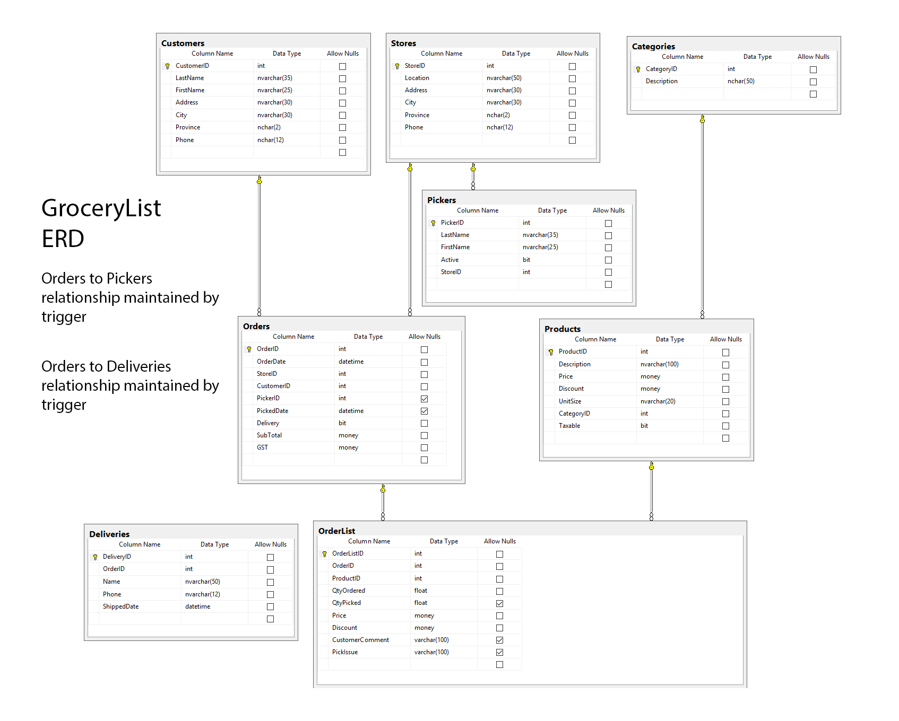
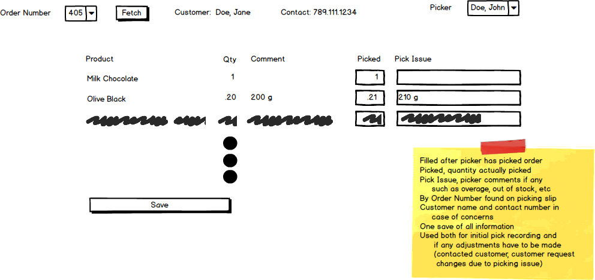
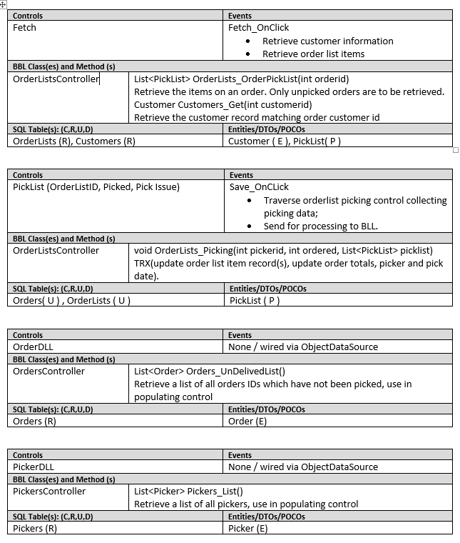

# OLTP Planning Exercise (6 Marks)

- [ ] Redo for a UI/Development Planning exercise

## Private GitHub Repo Only

Be aware that this is the continuation of the GroceryList exercises - you must be prepared to complete each exercise in light of the possibility that any given exercise may depend on the **correct** implementation of previous exercises. Place this work in your classroom private Exercise repository.

### Setup

No additional resources have been supplied.

### GroceryList ERD

### Web page

Create a new web page that will record the picking of the customer order based on the mockup below. The form will collect the picker id and picking list information. The entire form will be processed as a single transaction.

### UX Interface Tasks

Create the necessary code to implement the following user interface for your form. Picker id would normally be obtainted from the user login via security coding. This exercise does not have security coding so obtain the picker id from a drop down list. You will need to create any additional POCO classes.

