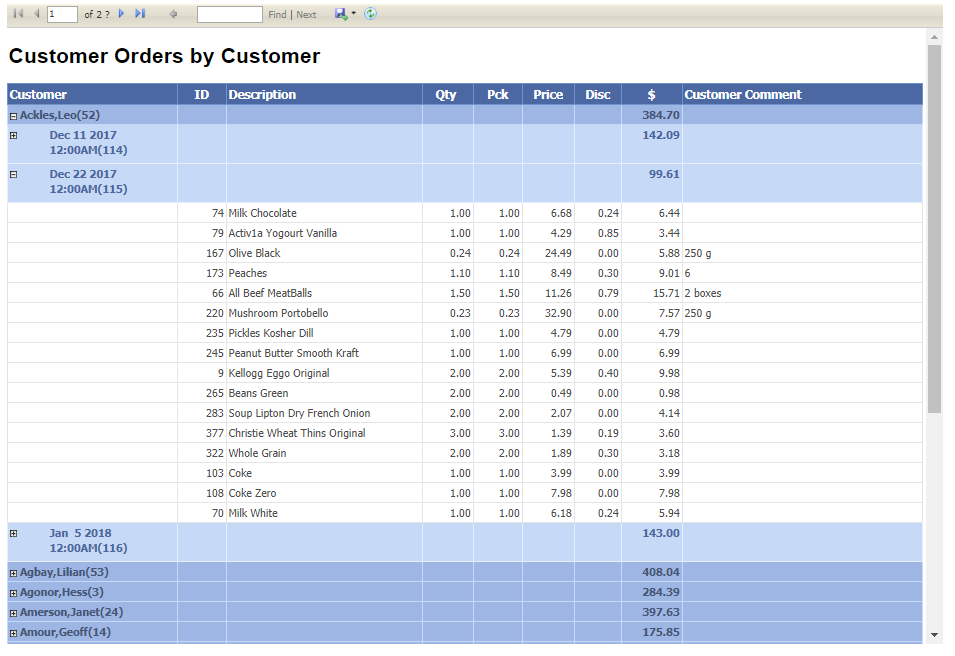

# Reporting:  Orders by Customer (3 Marks)

## Private GitHub Repo Only

Be aware that this is the continuation of the GroceryList exercises - you must be prepared to complete each exercise in light of the possibility that any given exercise may depend on the **correct** implementation of previous exercises. Place this work in your classroom private Exercise repository. 

#### Setup

You will need to have SSDT (Microsoft Sql Server Data Tools) installed on your home machine to complete this exercise outside of class. 

#### GroceryList ERD

#### Report

Managment has requested a report detailing orders by customer. The report is to contain their names and orders. The orders should show order id, product description, quantity ordered, quantity picked, price, discount, extended price and any customer comments. You are to reproduce the supplied report image.

Extended Price: Create this field in your report POCO as a read-only field.

