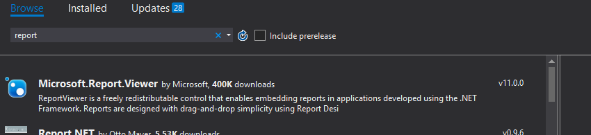

# Installing Sql Server Data Tools (SSDT) for VS 2017

# Part A – Install SSDT for Visual Studio 2017

1. Ensure that your version of VS 2017 is the 15.6.0 release (or higher). You can find this when checking under the Help menu and About Microsoft Visual Studio.
2. Ensure that all instances of VS 2017 are closed.
3. Go to <https://docs.microsoft.com/en-us/sql/ssdt/download-sql-server-data-tools-ssdt?view=sql-server-2017>
4. Run SSDT-Setup-ENU.exe
    - 
5. Acknowledge, press Next
6. Install against the VS Community or Enterprise instance.
7. Press Install

## Part B – Add Rdlc Report Designer Extension to VS 2017

1. Open Visual Studio 2017
2. From the menu chose Tools Extensions and Updates...
3. Select Online. Search using report. Select Microsoft Rdlc Report Designer for Visual Studio. Download. 
    - 
    - 
4. Reopen project. Modify. Press End Tasks until the Installation starts. Install may take awhile. 
    - 
5. If prompted to close Visual Studio, do so.

## Part C – Use the Report Viewer in your Projects

1. Open a solution with a Web Application project.
2. Open NuGet Manager. Browse.  
    1. Search for Microsoft.Report.Viewer. Install `Microsoft.Report.Viewer` by Microsoft.
    - 
    2. Search for Microsoft.SqlServer.Types. Install `Microsoft.SqlServer.Types version 11.0.0` by Microsoft.  
    - 
3. Add the follow handler tag to your web.config file under the system.webServer tag.
    - 
4. Right Click project Add New Item. Search report. Select Report Wizard. Press OK. Yoou my be presented with a trust dialog; Press Trust.
5. You should be presented with the following form. Drop down Data source. There should be a list of data sources. 
    - 
6. Create your report.
7. Open a web page which will display your report.
8. The ReportViewer control will not be visible in your Toolbox until you have a report .rdlc file in your project. You will get two new groups in the Toolbox. You will find the ReportViewer control under the Microsoft Report Viewer 2012.
    - **Note:** If you do not see the ReportViewer control in your Toolbox, you will need to manually add the following register directive just under the page directive on your .aspx page: `<%@ Register Assembly="Microsoft.ReportViewer.WebForms" Namespace="Microsoft.Reporting.WebForms" TagPrefix="rsweb" %>`
    - 
9. Create an ODS to point to your BLL method which produces the POCO for your report.
10. Drag a ReportViewer control from Microsoft Report Viewer 2012 onto your web page. The following image show the setup for the ReportViewer control. Type in the parameter details for the ReportViewer control following the path in the image below.
    - 
