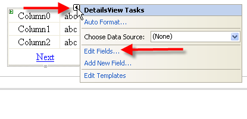
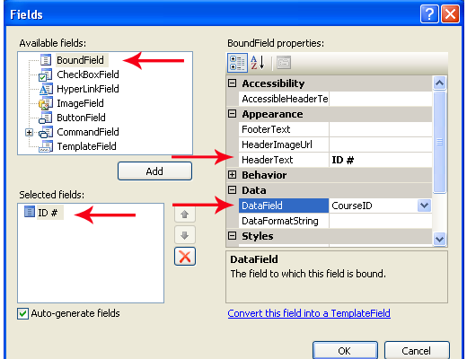
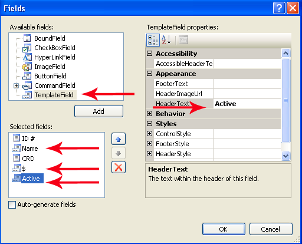
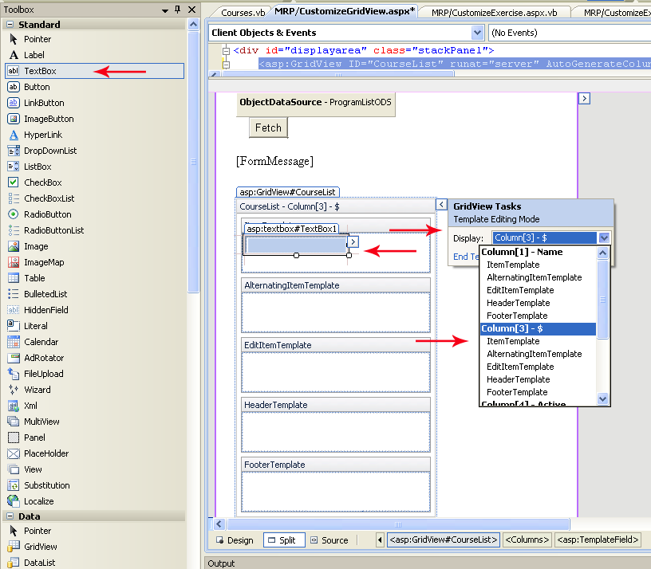
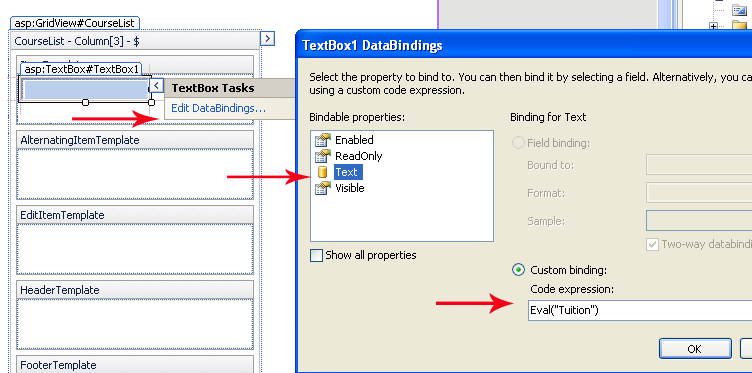

# Customizing a GridView/DetailsView

## GridView Column Editor

We will use the control's smart tag found at the top right corner of the gridview to enter the dialog(s) for customizing the control. All this customization could also be hand entered into the source code for the web page designer. It is strongly advisable that you know how to read and manipulate the source code for the control. At times, it is the only way to correct a problem on your web page, as the designer may not display the control due to some source error. Once you have become familiar with the source code to you web page controls, you may find it faster and easier to maintain and read the properties of your control.

Figure 1 shows the GridView control selected and the smart tag expanded; this is also available on the DetailsView control. Figure 2 shows the GridView Column editor IDE. The editor has 3 major component areas: Available Fields, Properties and Selected Fields.





The Available Fields allows the developer to select the type of field the GridView column or DetailsView row will contain. The BoundField is a string display of an assigned data item of a datatable. The CheckBoxField, HyperLinkField and ImageField are specific web type controls. The ButtonField allows you to use general-purpose buttons which can be handled by a method in the code-behind for the control's the OnCommand event. The CommandField controls are predefined event buttons related to common types of events: Select, Delete and Edit/Update/Cancel. The Template Field allows the GridView's column/DetailView's row to be further customized by the developer using various templates. To Add a field type, select the available field and press Add. The field will be added to the Selected Fields and the available properties list will be adjusted for that type of field.

The Properties allow the developer to assign appropriate values to standard properties for the selected Available Fields. We will concentrate on several major properties: the header text value, DataField value, DataField format and under the Style properties general alignment for display.

The Selected Fields area shows the order of the GridView's columns/DataView's rows as they will appear when the control is displayed. You can reorder or delete these selected fields using the buttons on the right of the list. To edit any entry, click on the field, and that field's properties appear on the right of the dialog, thereby allowing you to edit its current settings.

The Auto-Generate Fields check box will allow the developer to easily turn off the default generation properties. You may also change a field to a Template field using the link.

### BoundField

Creating a BoundField on the control will allow the developer to specify a certain data item of the data row from your data source. Figure 2 indicates a BoundField will have a header text of "ID #" and the actual data will come from a property called CourseID in the control's databound items. Notice that it will be displayed as the first item in the control's selected fields.

### TemplateField

We can use the same editor to create a Template. Open the editor (Edit Columns�) and select TemplateField then press Add. The first thing you should notice is the absence of the Data property area. With templates, you must supply the contents, either as a DataBoundLiteral or using a web control (such as TextBox, DropDownList, CheckBox, etc.). Figure 3 shows the template fields for *Name*, *$* and *Active*.



Fiqure 3: Adding Template Fields

Name was placed between ID # and CRD by using the up and down arrow arrangement buttons to the right of the Selected fields area. The followin code shows the markup that is generated in the .aspx page from these settings in the Fields dialog.

```xml
<asp:TemplateField HeaderText="Name">
    <ItemTemplate>
        <%# Eval("CourseName")%>
    </ItemTemplate>
</asp:TemplateField>
```

Within the design view of your GridView or DetailsView, you can click the control's smart tag and select Edit Templates. This will bring up the Template editor. You may select from the list of available template columns on the drop down list (note: the BoundFields do not show in the list). Figure 3 shows the $ column was selected, that a TextBox from the Toolbox Standard web controls has been dragged and dropped in the ItemTemplate area.



We will only concern ourselves with this template for now. The textbox control also has a smart tag. Opening the smart tag will allow us access to the Text DataBinding (Edit DataBindings). The Custom binding will allow us to enter the Eval( ) which will be associated with the Text= property of the Textbox control, Figure 4 (below). Once you have set up the Tuition column, press OK.



A checkbox is used as the web control for the Active data item. The Active data item is a bit (True / False). The checkbox is an excellent control to reflect the value. Change your Template Edit Mode:Display to Column\[4\] Active. Drag a checkbox into the ItemTemplate. Go to the Edit DataBndings dialog. Note the Binding property is set to Checked, which is appropriate for a CheckBox. Enter Eval("Active") and press OK.

### Using IIF

Sometimes the value supplied by the data item of the data source is not appropriate for setting the web control (bit value for a checkbox) or the display value is not desirable (use Yes or No instead of Y or N). The immediate IF (IIF) can be used to set the control to the desired results.

Syntax: `condition(s)?true result:false result`

Where conditions would represent a Boolean resolved test true result would be the returned value on the Boolean true false result would be the returned value on the Boolean false

The IIF can return only a single value. Let's assume the Active data item was a character (Y or N) instead of a bit datatype. The Checkbox's Checked property requires a Boolean True or False (why the bit datatype works), so, if the data item value was a Y or N, then the checkbox could not be set directly.

```xml
<asp:TemplateField HeaderText="Active">
     <ItemTemplate>
         <asp:CheckBox ID="Active" runat="server" Checked='<%# Eval("Active") %>' />
     </ItemTemplate>
</asp:TemplateField>
```

```xml
<asp:TemplateField HeaderText="Active">
     <ItemTemplate>
         <asp:CheckBox ID="Active" runat="server" 
         checked='<%# ((string)DataBinder.Eval(Container.DataItem,"Discontinued")) == "Y"?true:false  %>'/>
     </ItemTemplate>
</asp:TemplateField>
```

You will note that the Tuition column should have its Tuition format altered to look more like money. You may notice that the CRD column is left aligned (not good for numeric) and the textbox is much too large for the data. Listing 4 demonstrates how to alter the Text property for the textbox to format the data into currency mode.

```xml
<asp:TemplateField HeaderText="$">
                <ItemTemplate>
                    <asp:TextBox ID="Tuition" runat="server"
                        Text='<%# string.Format("{0:c}",Eval("Tuition")) %>'
                        Columns="8" ></asp:TextBox>
                </ItemTemplate>
            </asp:TemplateField>
```

Alignment of column header and data can be adjusted using the GridView Edit Columns dialog. Open the dialog and select the CRD field under Selected Fields. Go to the Styles group of the properties. Under the HeaderStyle and ItemStyle you will find horizontal alignment properties. Change these to right aligned. Switch to the Active field and change the ItemStyle to be center aligned.

### Paging

Paging can be implemented inn two ways, manually using code-behind (PageIndexChanging event) or by selecting paging from the GridView smart-tag (auto-implemented). Coding your own paging event should be considered if you have additional work that needs to be done when your GridView pages. Otherwise, simply selecting paging from the GridView smart-tag will allow paging to happen. the default for the paging properties is numeric page numbers, 10 page numbers before having the ... appear, and 10 rows per page. You may change paging properties using the Paging group of the GridView.

```csharp
protected void CourseResultList_PageIndexChanging(object sender, GridViewPageEventArgs e)
    {
        // set the new page index on the Gridview
        CourseResultList.PageIndex = e.NewPageIndex;

        //refresh the GridView from its data source
        ToolsController systemmgr = new ToolsController();
        List<Course> courseInfo = systemmgr.GetCourses();
        CourseResultList.DataSource = courseInfo;
        CourseResultList.DataBind();
    }
```
