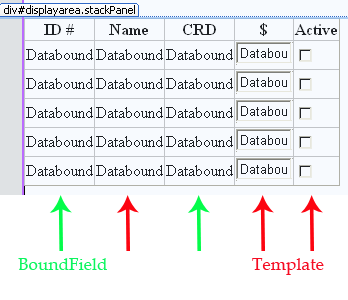

# GridView Control

The GridView is used to display multiple rows from a data source, typically a collection such as a List<T> where T is an object containing multiple members. The default display of the collection within the gridview uses all the collection instances and the member name as the gridview column header. This poses a problem if you wish to display specific columns, use alternate column headings or assign display formats that differ from the basic string display of the data.

We will discuss two popular techniques used in customizing a gridview, BoundFields and Templates. The BoundField is generally used for read-only displays. The default display format is string. You can assign various formatting patterns to your data. When used with the EditUpdate command button, the BoundField will be displayed within a textbox. The Template column allows for a more refined customization of the gridview column. There are several types of template columns: ItemTemplate, EditItemTemplate, AlternatingItemTemplate, HeaderTemplate and FooterTemplate. You must supply the content display or a basic standard web control (such as textbox, drop down list, checkbox) when setting up a template. Access to data is done using vb script.

You may have a combination of boundfields and template columns within a single gridview. When you do customize your gridview, set the AutoGenerateColumn property to "false" (default is "true") or you will get both your customized columns and the default set column setup.

A gridview is ideally used when your data source has 3 or more columns to display for multiple rows. If you have only 2 columns (description and an associated value), consider using a drop down list. Your columns should have limited size and any particular column data should not wrap to the following line.

GridView controls are used to display multiple record collections containing several but limited columns such that one row on the GridView represents one row of the query result. By default, the GridView displays all the rows of the collection at once. This could result in a very long list. Imagine Google displaying a search list of all 10,000 hits instead of a set 10 paged hits. We can do the same for the GridView control. The control has built in paging capabilities. These capabilities include the most commonly used paging symbols and styles found on the net.

The GridView contains several command buttons which allow you to isolate a piece of data from the control; Select, EditUpdateCancel and Delete. These buttons can be added to the control and will appear on each displayed row of the GridView. These command buttons are implemented in events on your web page.

## Data Source

The GridView data can be attached in several ways. One common technique is through a data source such as an ObjectDataSource, SQLDataSource, XmlDataSource LinqDataSource or EntityData Source. Another technique is through code. GridView allows only one technique to be used at a time. The default order of columns on a GridView is the same order as data members appear in the attached data source. You can, however, alter the order of the columns when you customize the GridView. You do not need to reorder your data source to match the desired order of columns as they appear on the GridView. The GridView matches the data source member (field) name to the supplied datafield name given to the GridView column. Additional data source members not used by the GridView are ignored. A common error when customizing a GridView is using a datafied name that does not exist in the data source.
