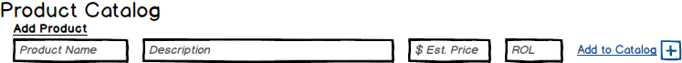
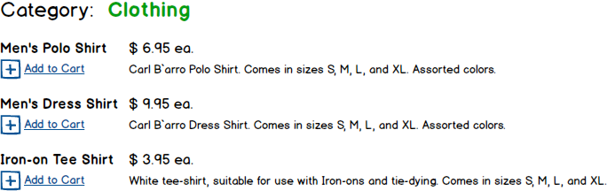

---
title: CQRS, POCOs, and DTOs
---
# CQRS, POCOs, and DTOs

## Gross Over-Simplification

The presentation of CQRS in this overview is really a gross oversimplification of what CQRS is all about and how to achieve it.

"True" CQRS is part of the Domain Driven Design (DDD) approach to development, and is acheived by using its principles alongside DI and other SOLID principles.

As a result, full-scale CQRS will involve creating separate classes for Commands and Queries along with using interfaces. In this course, the discussion around CQRS is limited to how CQRS thinking impacts the design of our DTOs and POCOs.

For a more "canonical" description, take a look at [Martin Fowler's article](http://martinfowler.com/bliki/CQRS.html) on it dated July 14, 2011. Or, for a Microsoft take on it, look at their article on the [CQRS Journey](http://msdn.microsoft.com/en-us/library/jj554200.aspx) in their Patterns & Practices section of MSDN. There's even a site with a multi-part tutorial on getting started with CQRS using ASP.Net MVC at [CQRS.nu](http://cqrs.nu/).

Command-Query Responsibility Segregation (CQRS) was devised by Bertrand Meyer as part of his pioneering work on the Eiffel programming language. The core objective of CQRS is to clearly distinguish *commands* (methods that change information, such as CREATE, UPDATE and DELETE) from *queries* (methods that just return information to the end-user).

## Let the Front-End Drive CQRS

What is most significant about CQRS is that the *shape* of information can be different depending on whether you need to modify the information or just read it. In other words, the details that are presented to the end-user (queried from the database) don't have to be the same details sent by the end-user when updating information (commands). As Martin Fowler states, At its heart is a simple notion that you can use a different model to update information than the model you use to read information. The differences can go further still, because the read and update models can also be different from the model as stored in the database.

This is best illustrated in an example. Imagine that you have a database table for products that you've modelled using the following entity class.

```csharp
public class Product
{
    public int ProductID { get; set; }
    public string Name { get; set; }
    public string Description { get; set; }
    public decimal UnitPrice { get; set; }
    public decimal UnitCost { get; set; }
    public int QuanityOnHand { get; set; }
    public int ReorderLevel { get; set; }

    // Navigation Properties
    public ICollection<Category> Categories { get; set; }
}

```

When it comes to editing this information in a standard CRUD form (e.g.: Add Product form), the actual data needed might look slightly different to a product manager who has to fill out information for new products in the catalog.



In this instance, the class needed to hold/represent the data for adding would be much simpler. Other information for the database might be filled in as part of normal business rules (e.g.: the default quantity on hand is zero, and the unit cost is null until the first order is placed with a supplier). Classes used for simple data-transfer are called DTOs (Data Transfer Objects). When those DTOs don't have any properties to reference other classes, they are commonly referred to as POCOs (Plain-Old CLR Objects) because the data types of their properties are the "primitive" ones built into the language.

```csharp
public class NewProduct
{
    public string Name { get; set; }
    public string Description { get; set; }
    public decimal EstimatedUnitPrice { get; set; }
    public int ReorderLevel { get; set; }
}

```

POCO Product class for use in adding new products

Now, contrast this further with a situation where we need to show a listing of products for a given category as requested by a visitor to the web site.



In this instance, our DTO or POCO class might look like this.

```csharp
public class ProductSummary
{
    public int ProductID { get; set; }
    public string Name { get; set; }
    public string Description { get; set; }
    public decimal UnitPrice { get; set; }
}

```

POCO Product class for use in displaying products

Although this is a simple example, it illustrates the point that the information needed at the front-end of an application does not have to be structured the same as it does when it's being processed or stored at the back-end. From this, it can be easy to see that the ultimate factor determining the "shape" or structure of our data will be how it is going to be used on the front-end. When the usage (be it for command or query actions) of the data differs from the storage of the data, this is a candidate for creating a new DTO or POCO. A word of caution, however: Beware of class explosion, where you are tempted to create many classes with subtle but non-essential differences.

## From Models to CQRS

When the DTOs and POCOs are in place, the next step on applying CQRS happens at the layer handling requests for the system - typically the BLL. Methods for commands can be made distinct from methods for queries in different ways. Sometimes its by placing them in separate BLL classes, other times they can be placed in the same class, but made cleanly distinct as separate "groups" of methods in the class. In any case, it's important to make sure that commands don't return anything (other than, perhaps, a simple primary key) and that queries don't make changes to the database.
