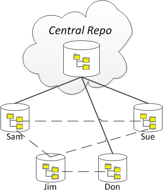

# Version Control in Software Development

:::tip IMPORTANT
When placing your material into online repositories such as GitHub, you (the student) are responsible to ensure that you use **private** repositories for any and all exercises, assessment, labs, and other items for marks. Also note that for some markable items, you may be instructed to **not** post the item(s) into online repositories.

Failure to follow these guidelines will result in you being assigned a mark of zero for the work and/or course.
:::

Software development is an exercise of discovery - both in understanding the problem that has to be solved and in coming to a good solution. **Version control** is a key aspect of modern software developement, precisely because it helps in a) the core process of discovery and b) the ability to work collaboratively on the software. Version control is possible through the use of version control software.

Version control works by storing "snapshots" of our software projects into a database. A database used to store code is called a **repository**. Each time you save a "snapshot" of your code, that process is called making a **commit**. These commits represent the state of our code at a specific point in time; the implication of this is that every repository contains a *history* of the "evolution" of the software project.

In general, there are two kinds of version control systems:

- Centralized Version Control System (CVCS)
- Distributed Version Control System (DVCS)

In this course, our focus will be on using Distributed Version Control Systems, and the DVCS of choice will be [git](http://git-scm.com/). Along with that, we will be using [GitHub](https://github.com/) as an online copy of our code repositories, which will make moving from room-to-room much easier over the term.

## CVCS vs DVCS

One of the earliest CVCSs is the Concurrent Versions System (CVS) dating back to the late '80s. in the early 2000s, an improved CVCS was developed that became known as Apache Subversion (SVN). Development of DVCSs dates back to the early-to-mid 2000s, with git and Mercurial emerging in 2005.(see Footnote #1)

The key difference between a *centralized* version control system and a *distributed* one is that in the CVCS there is only one repository (the central one), whereas in a DVCS there are many repositories. Developers of a CVCS access the central repository as an external or shared resource; they simply **check out** the file(s) that they need to work on (and then check them back in when they are done with them), committing changes to the central repository as they need to.

The major benefit of using a CVCS is that all developers changes are commited to the central repo, ensuring that each developer works off of  a copy of the same source code. A downside of this approach, however, is that the developers have less flexibility to work independently; they must always keep themselves "in sync" with the central repository. Additionally, if anything goes wrong with the central repository (such as someone committing a "broken" build, or the repository becoming corrupted), then that will impact everyone.

In a DVCS, however, each developer has their own, fully-independent copy of the repository. With a DVCS system, developers are able to share their repositories with each other (a shared repository is called a **clone**). Whenever developers make changes to their source code, they commit to their own repository. This means that developers are able to work more independently of each other; they only have to share their changes with each other if they want to. If a developer wants to share their latest work with another developer's clone, they can **merge** the differences between the two repositories. (As a side benefit, since each developer has their own repository/database, if one person's repository becomes corrupt or damaged, they can just grab a clone of someone else's repository.)

The downside of a DVCS is that since each developer is so free to work independently, the question comes up: "Who has the latest verion of everyone's contributions?" In other words, whose database represents the "truth" of all the source code for the project? A solution to this is to create another clone that everyone can regard as the "central" repository. In this approach, everyone is still working with DVCSs, but the developers regularly share their updates with the central repository (while still having the ability to share changes directly with each other). The central repository would be a clone that exists "in the cloud", such as hosted on GitHub.com, each individual's repository is a local clone stored on the individual's own computer.

In addition to people having their own local repository, they might also be using a Pull-Request approach to managing their code, in which they could have their \*\*local\*\* repository on their computer as well as a \*\*remote\*\* repository online, with the \*\*origin\*\* being the central repository.

## DVCS: git vs. Mercurial

In the world of DVCS, there are two top software products for doing DVCS: [Mercurial](http://mercurial.selenic.com/) and [git](http://git-scm.com/). While the underlying implementations of Mercurial and git differ, they are generally the same on the surface (at least, for beginning developers). For years, the Mercurial DVCS has been more popular among Windows users while git has been for the *nix and Mac users. With the use of online hosting for DVCS repositories (through sites such as [GitHub](https://github.com/) and [Kiln](https://www.fogcreek.com/kiln/)) and, more specifically, the release of platform-independent client-side tools such as [GitHub Desktop](https://desktop.github.com/) (formerly GitHub for Windows and GitHub for Mac), git has become the most popular DVCS in use today.

## git and GitHub

While git is a DVCS, GitHub is an online hosting provider for git repositories.

Git is basically a command-line piece of software. Experienced git users typically spend most or all of their time managing their repositories in the command prompt. Git works by tracking individual files in a repository. A repository is simply a folder that may have files and sub-folders. Two commonly used configuration files can be placed at the root of a repository - "*.gitignore*" and "*.gitattributes*". A repository can be configured to ignore (not track) certain kinds of files or folders (such as binary files) using the settings in ".gitignore". The ".gitattributes" file is for other configuration settings, such as telling git how to treat new line characters ([little endian](http://en.wikipedia.org/wiki/Endianness#Little-endian) or [big endian](http://en.wikipedia.org/wiki/Endianness#Big-endian)).

There are graphical programs to make working with git easier (at least, for beginners). GitHub has produced their own graphical tool for Windows and Mac users. These graphical programs typically have an option to launch a command prompt to directly enter git commands.

### Core git Commands

If you are not used to working within the command prompt, it can take a while to become comfortable working with git. An excellent on-line introduction to using command-line git is hosted at [try.github.com](http://try.github.com/). Another good play to learn about git is the [Git-Real course at CodeSchool](https://www.codeschool.com/courses/git-real).

- `git init` – This command is used to initialize (set up) a git repository in the current directory. When a git repository is set up, there will be a hidden folder named ".git" that contains all the history of commits for the repository.
- `git add .` – This command is used to stage un-tracked and modified files for a commit. If a file is not being tracked (and is not listed in .gitignore), this command will mark the file as a new item for the repository to track. If a file has been modified, then this command will mark it as ready to be committed.
- `git status` – This command is used to give you the status of your code repository.
- `git commit -m "message"` – The commit command is used to save staged files to the repository. When a commit occurs, all of the files staged for committal are compared against the last commit, and the changes between them becomes the new commit. Additionally, the user is identified for the commit (typically by a user name and e-mail) - this is called ***blame***.
- `git pull` – This command is used to get a remote repository and merge it with the local repository. Remote repositories are typically hosted online.
- `git push` – This command is used to take the local repository and send/merge it with a remote repository.

These are just a few of the commands available in git. For a good introduction to using git commands, work through the short tutorial at [try.github.com](http://try.github.com/).

### GitHub and GitHub Desktop

GitHub Desktop (formerly GitHub for Windows) monitors for available updates. When one is found, an animated blue up-arrow appears near the top right of the window. Click on it to get to the "About..." page, and then click the button to restart GitHub Desktop. It may take a few minutes for the update to complete.

[GitHub](https://github.com/) is a website that hosts git repositories, while [GitHub Desktop](https://desktop.github.com/) is a desktop application to help you manage git repositories on your computer and synchronize them with your GitHub online account.

You can [sign up for a free GitHub account](http://youtu.be/ezxRcdJ8glM); when you do so, be sure to use your NAIT e-mail address (e.g.: *StewDent3@studentmail.nait.ca*). Free GitHub accounts allow you to have an unlimited number of public repositories. After creating your GitHub account, you can sign up for free private repositories through [Education.GitHub.com](https://education.github.com/).

Throughout this course, you will be encouraged to use GitHub and GitHub Desktop to manage your copy of classroom code samples as well as selected assignments. Remember to always use private repositories for assignments. You can learn more about GitHub Desktop at [this video](http://youtu.be/YBbkvCrfDSo) on the [GitHub YouTube channel](https://www.youtube.com/user/github).

# Bibliography

- Footnote 1: Historical dates of DVCS and CVCS systems taken from Wikipedia at
  - [CVS](http://en.wikipedia.org/wiki/Concurrent_Versions_System)
  - [Subversion](http://en.wikipedia.org/wiki/Apache_Subversion#History)
  - [DVCS History](http://en.wikipedia.org/wiki/Distributed_revision_control#History)
  - [Mercurial](http://en.wikipedia.org/wiki/Mercurial_(software)#History)
  - [git](http://en.wikipedia.org/wiki/Git_(software)#History)
  