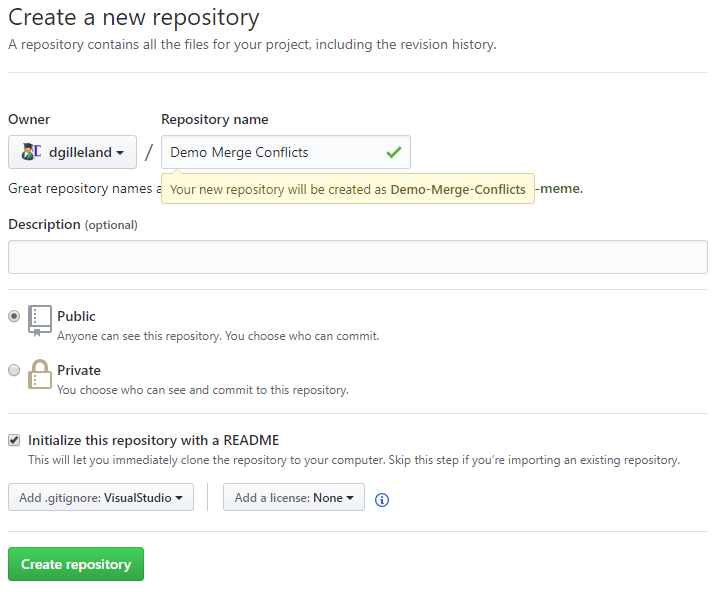

# Resolving Merge Conflicts

:::tip Alpha
This is a first-draft article on resolving merge conflicts. In this walkthrough, we will manually create and resolve a merge conflict.
:::

> This walkthrough on resolving merge conflicts assumes that you have the following installed on your computer.
>
> - Visual Studio 2017 or later
> - [GitHub Desktop](https://desktop.github.com)
> - [Visual Studio Code](https://code.visualstudio.com)
>
> The lab computers are already set up with Visual Studio, but you will probably need to install the remaining programs on your own before proceeding.

## Setting Up The Repository

Begin by creating a new repository on GitHub from your browser. Be sure to

- Initialize the repository with a README.md file
- Add the **Visual Studio** .gitignore file



At this point, you can clone the repository to your computer by choosing "Open in Desktop".


Because we will be using Visual Studio's Team Explorer in resolving merge conflicts in the next section, create a simple console application inside your code repository. We won't be using the application itself; the purpose is just to be able to use Visual Studio's Team Explorer later on.


## Setting Up The Conflict

Open the `README.md` file in Notepad on your computer and edit the document by adding a "by-line", as demonstrated below. Save the changes, but don't perform any commits on your local machine.


Next, use your browser to edit the `README.md` file directly in GitHub. We are creating the conflict in the remote repository by adding a "by-line" with slightly different text, as demonstrated below. Save the changes.


## View in Team Explorer

View the Team Explorer panel in Visual Studio. You can access this from the **View** menu.


The *Home* page of the Team Explorer shows the various actions you can take in your project's repository. At this point, we want to look at the *Changes* in the local repository so that we can commit those changes.


## Making a Commit

From the *Changes* page in Team Explorer, perform a "Commit All and Sync" action. This is equivalent to doing the following from the command line:

```cmd
git add .
git commit -m "Added Console App"
git pull
git push
```


Because of the conflict in the "README.md" file, the synchronization process will stop at the `git pull` stage, and a merge conflict will be reported in the *Synchronization* tab of Team Explorer.


## Resolving the Conflict

From the *Synchronization* page of Team Explorer, click the "Resolve the conflicts" link in the message.


The *Resolve Conflicts* page in Team Explorer reveals that the conflict resides in the "README.md" file. For this file, we are provided with various links to view comparisons of the conflict or just simply take one of the conflicting versions and discard the other. For our purposes, will want to click "Compare Files" to see the details of the conflict.


In Visual Studio, we can see the two versions of "README.md" side-by-side. The left side contains the version up on GitHub (the "Remote"). The right side shows the edits we made on our computer (the "Local" changes).


Turn your attention back to the *Resolve Conflicts* page in Team Explorer. We're going to resolve the conflict by choosing the remote version of that file (that is, the changes we made in the browser on GitHub). Click the "Take Remote" link.


At this point, we have resolved all the conflicts. Click the "Commit Merge" button in Team Explorer.


In the *Changes* page of Team Explorer, enter a commit message and choose "Commit Staged and Sync".


In your web browser, go to your GitHub repository and just below the "&lt;&gt; Code" tab you will see a link to the commit history. (If that link is not visible, just click the "Code" tab). Click that link to bring up your commit history.


Your history will reveal the commits including the one in which you resolved the merge conflict.


----

## Summary

The steps above show just one way to resolve merge conflicts. Besides using the Team Explorer in Visual Studio, you can resolve conflicts using **GitHub Desktop** and **Visual Studio Code**.

Try experimenting with these by creating another conflict through edits in the browser and on your local computer, and then attempt to perform the local commit & push using GitHub Desktop.

When you try to push through GitHub Desktop, it will inform you that the remote repository (on GitHub) has changed, and that you will need to pull before pushing.


Under the *Repository* menu on GitHub Desktop, click "Pull".


GitHub Desktop will recognize the merge conflict. At this point, you can view the conflicts, and because you have Visual Studio Code installed, it will use that editor for viewing and resolving the conflict.


Inside GitHub Desktop, you will see the "README.md" file as having changes. Git notes changes as the result of merge conflicts by placing both versions in the text file where the conflict has occurred.


Resolving this remaining conflict is left as an exercise for you to perform on your own. You are encouraged to use either Visual Studio Code or Notepad to resolve the error.

----

<!--
[Managing Merge Conflicts](https://lab.github.com/githubtraining/managing-merge-conflicts)
-->
