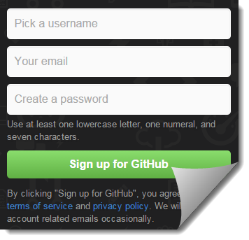
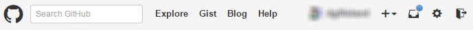

# git Basics with [GitHub Desktop](https://desktop.github.com) (formerly GitHub for Windows)

When placing your material into online repositories such as GitHub, you (the student) are responsible to ensure that you use **private** repositories for any and all exercises, assessment, labs, and other items for marks. Also note that for some markable items, you may be instructed to **not** post the item(s) into online repositories.

Failure to follow these guidelines will result in you being assigned a mark of zero for the work and/or course.

 What are *git* and *GitHub Desktop*? At it's simplest, git is a DVCS program that can be run at the command line while GitHub Desktop (GitHub Desktop) is a graphical front-end to git. GitHub Desktop is from GitHub, an online hosting provider for git repositories.

## Signing Up With GitHub.com

[GitHub](https://github.com) offers free accounts where you can host as many public git repositories as you want. Simply go to their website and fill out the form to sign up for GitHub. We recommend the following when filling out the form:

- **Pick a username** - Your NAIT login name when signing into the lab computers
- **Your email** - Your NAIT Email
- **Create a password** - Make it strong & secure, and don't share it with anyone

GitHub charges for private repositories, but students can request free private repositores. Simply log onto GitHub.com, then navigate to [Education.GitHub.com](https://education.github.com) and click on the "Request a discount" button. From there, fill out the form according to the instructions of your teacher.

## Installing GitHub Desktop

Installing GitHub Desktop (formerly GitHub for Windows) is extremely easy. You only have to do it once (for each computer you plan to use it on), but the steps are slightly different if you're doing it on the lab computers than if you're doing it at home.

- **DMIT Lab Computers** - Click on the Windows icon and type "GitHub" in the search box. Click on the results item named "GitHubSetup" to launch the installer.
- **Your Computers** - Go to [desktop.github.com](https://desktop.github.com), then download and run the installer on your computer.

After installation is complete, GitHub Desktop will launch and guide you through associating the app with your GitHub.com account. You will now be able to work with local repositories on your computer using GitHub Desktop. (Tip: You might want to pin GitHub Desktop to your task bar, so it's easier to launch whenever you need it.)

## Exploring Your GitHub Account

It's a good idea to begin familiarizing yourself with the GitHub.com website. If you aren't already signed in, click the button on the top-right of the GitHub.com home page to sign in.

An excellent place to start getting familiar is with the top part of the page, where you can find links to the GitHub home page (the [octocat icon](https://github.com/logos)) and the homepage of your account. If you click on the ["Help"](https://help.github.com/) link, you can find guidance for most of what you will want to do on GitHub.

The gear icon will take you to your account settings, where you can do things such as adding or confirming your email accounts, changing your password, etc. Beyond that, there is a lot of information available to you on your GitHub account. GitHub.com is effectively a social network and git repository host, all rolled into one. As you become more active in building open-source projects on GitHub, it can easily become one of your best references when it comes to doing your job search. By the way, you should also check out [GitHub Jobs](https://jobs.github.com/) as a place to both advertise yourself and look for available jobs.

## Repositories

> In revision control systems, a repository is an on-disk data structure which stores metadata for a set of files and/or directory structure. &hellip; The main purpose of a repository is to store a set of files, as well as the history of changes made to those files.

Git works by tracking individual files in a repository. A repository is simply a folder (that may have files and sub-folders with files) that has another folder named ".git". (If you don't see the .git folder, it's because it's a hidden folder, and you would need to adjust your file settings in File Explorer to see those.) To track a new file or changes to a file, the file must be a) added as an item/change to track and b) committed to the repository.

 Where is it? Local, Remote

 Who sees it? Public, Private

 What is it? Give the Clone a Fork

 How you make them? In GitHub Desktop or On GitHub.com

## Git in Sync with Commits

Two commonly used configuration files can be placed at the root of a repository - "*.gitignore*" and "*.gitattributes*". A repository can be configured to ignore (not track) certain kinds of files or folders (such as binary files) using the settings in ".gitignore". The ".gitattributes" file is for other configuration settings, such as telling git how to treat new line characters ([little endian](http://en.wikipedia.org/wiki/Endianness#Little-endian) or [big endian](http://en.wikipedia.org/wiki/Endianness#Big-endian)).

In your *.gitignore* file, you want to certain ignore files related to your development environment. The best way to get a good list of files to ignore, check out [gitignore.io](https://www.gitignore.io/). For Visual Studio, you can use [this one](https://www.gitignore.io/api/macos,windows,visualstudio).

The *.gitattributes* you will need will deal with line-endings and other settings of your Windows environment. You can use [this one](https://gitattributes.io/api/common%2Ccsharp%2Cweb%2Cvisualstudio) or customize your own at [gitattributes.io](https://gitattributes.io/).

When it comes to making your commits, you should follow these general guidelines:

- Commit Frequently
- Only commit if there are no compiler errors in your code
- Write good commit messages: Make them obvious and meaningful
- Treat your central repository as your main backup - don't make "USB" copies - your repository *is* your backup

## Help.GitHub.com

We could write up a lot of extra information ourselves on using git and GitHub, but the better strategy is to point you to the [help files on GitHub.com](https://help.github.com/). Here's a few sections that are likely to be of interest to you.

- [Bootcamp](https://help.github.com/categories/bootcamp/) - Covers the basics of working with repositories, including how to create a repository and how to fork a repository.
- [Setup](https://help.github.com/categories/setup/) - Covers how to sign up for a GitHub account and set your email and username.
- [Using Git](https://help.github.com/categories/using-git/) - Covers basic git commands and .gitignore files as well as how to use a good team workflow with git and how to resolve merge conflicts.
- [GitHub Desktop](https://help.github.com/categories/github-for-windows/) - Covers all of the basic operations and troubleshooting when using GitHub Desktop.
- [GitHub for Mac](https://help.github.com/categories/github-for-mac/) - Covers all of the basic operations and troubleshooting when using GitHub for Mac.
- [Security](https://help.github.com/categories/security/) - Covers how to deal with GitHub passwords and access credentials.
- [Keyboard Shortcuts](https://help.github.com/articles/using-keyboard-shortcuts/) - Covers useful keyboard shortcuts when browsing a GitHub repository in your browser.
- [Managing Remotes](https://help.github.com/categories/managing-remotes/) - Covers many questions people have when working with and troubleshooting remote repositories.
- [How to write a great job post](https://help.github.com/articles/how-to-write-a-great-job-post/) - At some point, you want to get a job. Here's tips on leveraging your GitHub presence in marketing yourself.
