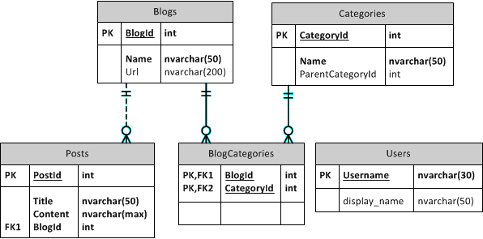
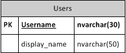

---
title: Entity Framework
---
# Entity Framework

Entity Framework (EF) is an ORM solution from Microsoft that makes querying and modifying database data very simple. The Entity Framework (currently at version 6.1) can be added to your Visual Studio solution through NuGet. (In VS2013, EF is installed as part of the template for ASP.Net Web Forms web sites.)

There are certain terms that come up when using Entity Framework. Here are some definitions that can get you started.

Entity
  ~ An Entity is simply a class that is designed to hold data from one row in a database table. One key characteristic of entities is that they have a property for every column in the corresponding database table.

Navigation Property
  ~ Database tables have relationships, and those can be modelled in Entity Framework through the use of Navigation Properties. A navigation property is simply a property on the entity class that represents a single instance ("to-one" relationship) or a collection of instances ("to-many" relationship) of some other entity.

Database Context
  ~ A database context class is a class that inherits from `DbContext`. The database context identifies properties for each entity that is being mapped to a database table. Each property is a `DbSet<T>` instance, where the `<T>` is an entity. The `DbContext` base class along with `DbSet<T>` give us all the built-in functionality needed to perform CRUD operations on the database.

Model
  ~ This term refers to the set of entities (and their relationships) that belong to a database context. The term is also used at times to refer specifically to an `.edmx` file that can be used to visually "draw" the entities and their relationships. In a code-first context, this term simply refers to the entities and their relationships.

Code-First
  ~ An approach to using the Entity Framework where entity and database context classes are coded directly, rather than being auto-generated based on an `.edmx` file.

Model-First
  ~ An approach to using the Entity Framework that emphasizes a visual representation of entities and their relationships. The model-first makes use of an XML file (`.edmx`) that Visual Studio uses to "draw" the model in a manner similar to an ERD along with definition template (`.dt`) files to auto-generate the actual entity and database context classes.

Conceptually, Entity Framework is designed around a class-per-database-table approach. That is, for every database table that you want to model in your application, you code a corresponding class (known as an Entity).

Along with the entity classes, you application will need a class to serve the core functionality of the DAL. This class is your Database Context, and it must inherit from the `DbContext` class in the Entity Framework.

Part of the power of the Entity Framework is that it can be used with or without an existing database. If the database does not exist, then it can be automatically created from your model when you run your application. Additionally, Entity Framework supports the idea of Migrations, which can be very helpful when dealing with a database model that changes over time.

Visual Studio supports two approaches to working with Entity Framework - Code-First and Model-First. Combined with the fact that EF can work with or without a database, that means that there are four distinct ways that you can develop your application with Entity Framework. In this course, our emphasis will be to use a Code-First approach, and although we are using an existing database, we will not be using Visual Studio's capacity to auto-generate the entity and DbContext classes based on the database.

There are various online resources on [getting started](http://msdn.microsoft.com/en-US/data/ee712907) with Entity Framework that are available through [ASP.Net](http://www.asp.net/entity-framework). In the discussion below, we will use and expand upon the Blog and Post example that is demonstrated in the tutorials ["Code First to a New Database"](http://msdn.microsoft.com/en-us/data/jj193542) and ["Code First to an Existing Database"](http://msdn.microsoft.com/en-us/data/jj200620). The following ERD shows the database tables used in this discussion.

<!--  -->



## Coding Entities

Coding an entity is fairly straight-forward. Simply create a class to correspond to a database table, and create a property for each column in the database table.

Entity Framework employes a [Convention over Configuration](http://en.wikipedia.org/wiki/Convention_over_configuration) approach (see [Code First Conventions](http://msdn.microsoft.com/en-us/data/jj679962)). These conventions can be overridden or extended with your own [custom conventions](http://msdn.microsoft.com/en-us/data/jj819164.aspx).

The configurations are used by Entity Framework to provide mappings between database tables and entities. There are various ways to provide custom mappings. One such way is shown in the article [Entity Framework 5 First Steps](http://dotnet.dzone.com/articles/entity-framework-5-first-steps).

Entity Framework employs certain [conventions](http://msdn.microsoft.com/en-us/data/jj679962) that simplify the process of doing code-first development. One of those has to do with the property names on our entity: As long as the property name matches the name of the column in the database table, EF will map to it by default. For example, the Blog entity below maps to the Blogs table.

```csharp
public class Blog
{
    public int BlogId { get; set; }
    public string Name { get; set; }
    public string Url { get; set; }
}
```

Another convention has to do with modelling primary keys. If your entity has a property with either the name `ID` or the same name as the class and a suffix of "Id", then EF will assume that property to be mapping to a primary key in the database table. If the property that is supposed to map to a primary doesn't follow this convention, then you will need to use the `[Key]` attribute to mark it as the entity's primary key. (See more on "Using Attributes" below)

Relationships between entities can also be modelled using properties. In these scenarios, they are referred to as Navigational Properties. It is a good practice to mark these properties with the [`virtual`](http://msdn.microsoft.com/en-us/library/9fkccyh4.aspx) modifier, which allows collections to be lazy-loaded and makes change-tracking more efficient (see [this SO comment](http://stackoverflow.com/a/5599270/2154662)). The following code samples show the Blog and Post entities with their navigational properties.

```csharp
public class Blog
{
    public int BlogId { get; set; }
    public string Name { get; set; }
    public string Url { get; set; }

    public virtual ICollection<Post> Posts { get; set; }
}
```

```csharp
public class Post
{
    public int PostId { get; set; }
    public string Title { get; set; }
    public string Content { get; set; }

    public int BlogId { get; set; }
    public virtual Blog Blog { get; set; }
}
```

### Using Attributes

```csharp
[Table(Speaker.TABLENAME)]
public class Speaker : BaseModel
{
    public const String TABLENAME = "Speaker";

    [Key, DatabaseGenerated(DatabaseGeneratedOption.Identity)]
    public Guid Id { get; set; }

    [Required]
    [MaxLength(50, ErrorMessage = "Name must be 50 characters or less")]
    public string Name { get; set; }
}
```

There are a number of C# attributes that can be applied to the properties of an entity to help describe how it models the database table ("schema" attributes) and how it should perform validation (effectively mirroring simple CHECK constraints in SQL). Validation attributes are checked when the `.SaveChanges()` method is called on your database context class. The validation attributes can also be used to help support the user interface in web applications; when used this way, it is often helpful to specify an (optional) error message for the end-user. Entity attributes are discussed in more detail in the [Code First Data Annotations](http://msdn.microsoft.com/en-us/data/jj591583) documentation on MSDN, but here are some of the more commonly used annotations.

`[Key]`
  ~ Identifies the property as representing the Primary Key in the database. Can be used with the `[Column]` attribute

`[Column]`
  ~ Used with the `[Key]` attribute to specify the order of columns when mapping against a composite key in the database table.

`[DatabaseGenerated]`
  ~ Identifies the property as having a value that is controlled by the database (and therefore, not a value that should be "saved" into the corresponding column). This attribute takes a single [DatabaseGeneratedOption](http://msdn.microsoft.com/en-us/library/system.componentmodel.dataannotations.schema.databasegeneratedoption(v=vs.110).aspx) value:
  ~ `Computed` - The database generates a value when a row is inserted or updated.
  ~ `Identity` - The database generates a value when a row is inserted.
  ~ `None` - The database does not generate values.

`[NotMapped]`
  ~ Identifies that the property in your entity does not have a corresponding column in the database table. This is useful when you want to create a property whose value is derived from other properties, such as a `FullName` that is a concatenation of the first and last name.

`[ForeignKey]`
  ~ Identifies the property as acting as a foreign key to another entity/table.

`[Index]`
  ~ TBA

`[Required]`
  ~ (Validation attribute) TBA

`[Range]`
  ~ (Validation attribute) TBA

`[StringLength]`
  ~ (Validation attribute) TBA

`[MaxLength]`
  ~ (Validation attribute) TBA

`[Table]`
  ~ TBA

## Database Context

For the DAL of your application, create a class that inherits from Entity Framework's `DbContext` class and add a `DbSet` property for each table that you want to map an entity to. The `DbContext` class has a method called `OnModelCreating` that you can override to provide additional instructions for mapping entities to the underlying database as well as to over-ride default naming conventions (as in the following sample where the `User` class maps its `DisplayName` property to a column named `display_name`.)

```csharp
using System.Data.Entity;
public class BloggingContext : DbContext // System.Data.Entity.DbContext
{
    public DbSet<Blog> Blogs { get; set; }
    public DbSet<Post> Posts { get; set; }
    public DbSet<User> Users { get; set; }

    protected override void OnModelCreating(DbModelBuilder modelBuilder)
    {
        modelBuilder.Entity<User>()
            .Property(u => u.DisplayName)
            .HasColumnName("display_name");
    }
}
```



```csharp
public class User
{
    [Key]
    public string Username { get; set; }
    public string DisplayName { get; set; }
}
```

## web.config and Entity Framework

The web.config of your website will have custom settings for Entity Framework. One of the important settings you should add has to do with turning off database initialization for your database context. The following example turns off database initialization for the `BloggingContext`. Note that in the element `<context type="BlogDemo.BloggingContext, BlogDemo" disableDatabaseInitialization="true" />`, the type is a string with the fully-qualified class name followed by a command and then the name of the assembly.

```xml
<contexts>
  <context type="BlogDemo.BloggingContext, BlogDemo" disableDatabaseInitialization="true" />
</contexts>
```

This element should be placed inside the `<entityFramework>` element.

Another customization you can do between your database context and the web.config is to specify a connection string for your database context. For example, if your web.config has a connection string named "MyBlog", you would have your database context's constructor call the base class with a string that follows the pattern "name=MyBlog".

```xml
<add name="MyBlog"
     connectionString="Data Source=.;Initial Catalog=BloggingDB;Integrated Security=true;"
     providerName="System.Data.SqlClient" />
```

```csharp
public class BloggingContext : DbContext
{
    public BloggingContext() : base("name=MyBlog") { }

    public DbSet<Blog> Blogs { get; set; }
    public DbSet<Post> Posts { get; set; }
    public DbSet<User> Users { get; set; }

    protected override void OnModelCreating(DbModelBuilder modelBuilder)
    {
        modelBuilder.Entity<User>()
            .Property(u => u.DisplayName)
            .HasColumnName("display_name");
    }
}
```

```csharp
public class User
{
    [Key]
    public string Username { get; set; }
    public string DisplayName { get; set; }
}
```
