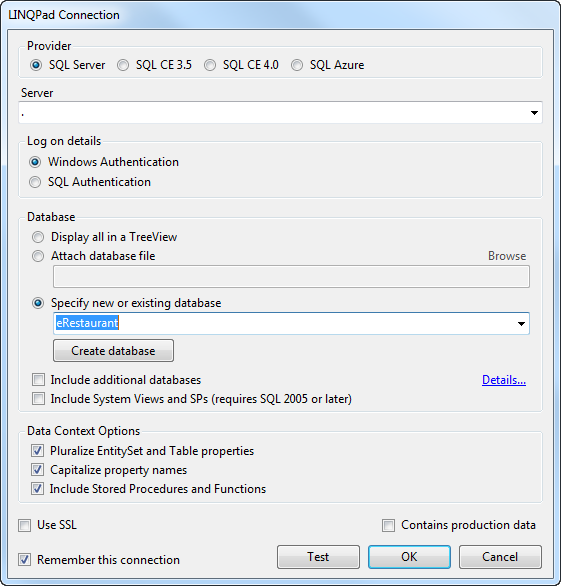

# LINQ - Language INtegreated Query

LINQ – **L**anguage **IN**tegrated **Q**uery – is a powerful feature of the C# language that allows SQL-like querying of collections of data, including data that is stored in databases. LINQ statements can be written in [two ways](http://msdn.microsoft.com/en-us/library/bb397947.aspx): using *Query syntax*, and using *Method syntax*.These ways are not in conflict either; you can actually combine Query syntax and Method syntax in a single statement.

## Query Syntax

Query syntax appears, at first glance, to be a lot like SQL. LINQ queries use keywords that closely resemble keywords in SQL, but [LINQ's keywords](http://msdn.microsoft.com/en-us/library/bb310804.aspx) act as operators in that they are used to form an expression. LINQ query operators perform specific processing acts on the objects that act as their "operands". They flow together in a kind of "sequence" and culminate with the `select`.

Query syntax includes seven major clauses (five of which are the more commonly used).

`from` clause
  ~ A query expression must begin with a from clause. Additionally, a query expression can contain sub-queries, which also begin with a from clause. (see [from clause](http://msdn.microsoft.com/en-us/library/bb383978.aspx))

`where` clause
  ~ The where clause is used in a query expression to specify which elements from the data source will be returned in the query expression. (see [where clause](http://msdn.microsoft.com/en-us/library/bb311043.aspx))

`select` clause
  ~ In a query expression, the select clause specifies the type of values that will be produced when the query is executed. The result is based on the evaluation of all the previous clauses and on any expressions in the select clause itself. A query expression must terminate with either a select clause or a group clause. (see [select clause](http://msdn.microsoft.com/en-us/library/bb384087.aspx))

`group` clause
  ~ The group clause returns a sequence of IGrouping<TKey, TElement> objects that contain zero or more items that match the key value for the group. (see [group clause](http://msdn.microsoft.com/en-us/library/bb384063.aspx))

`orderby` clause
  ~ In a query expression, the orderby clause causes the returned sequence or subsequence (group) to be sorted in either ascending or descending order. Multiple keys can be specified in order to perform one or more secondary sort operations. (see [orderby clause](http://msdn.microsoft.com/en-us/library/bb383982.aspx))

`join` clause
  ~ The join clause is useful for associating elements from different source sequences that have no direct relationship in the object model. (see [join clause](http://msdn.microsoft.com/en-us/library/bb311040.aspx))

`let` clause
  ~ In a query expression, it is sometimes useful to store the result of a sub-expression in order to use it in subsequent clauses. You can do this with the let keyword (see [let clause](http://msdn.microsoft.com/en-us/library/bb383976.aspx)).

An example of the flow seen in a typical LINQ query can be illustrated the following \[over-simplified\] grammar. (Hover over the blue elliptical items to get a longer description of that part.)

<!-- IMPORTANT: The following 

<!--
    BOLD    <b>keyword</b>
    VAR     <var>variable</var>
    STRIKE  <s>Optional</s>
    ITALIC  <i>choice of</i>
-->
<pre class="grammar">
<b data-title="The from clause - declares a variable to represent each item in a collection of items">from</b> <s><var data-title="a data type">type-name</var></s> <var data-title="a variable or object name that you are declaring">identifier</var> <b>in</b> <var data-title="a collection of values, which can be an array, List<T>, DbSet<T>, etc.">enumerable-expression</var>
<s><b data-title="The orderby clause [optional] - used to perform sorting of data">orderby</b> <var data-title="typically some property or sub-property of the identifier in the from clause; you can sort by more than one item, just separate them by commas">expression <ins>, ..n</ins></var>  <s><i><b>ascending</b> <b>descending</b></i></s></s>
<s><b data-title="The where clause [optional] - used to filter the result set">where</b> <var data-title="any boolean expression; typically you are testing some property on the identifier in the variable name">boolean-expression</var></s>
<s><b data-title="The group clause [optional] - used to group information for aggregation purposes">group</b> <var data-title="the identifier in the from clause, or some property on the identifier">group-object</var> <b>by</b> <var data-title="a property of the group object">group-obj-property</var> <s><b>into</b> <var data-title="a variable or object name that you are declaring; this can be used in the select clause, for example">group-identifier</var></s></s>
<b data-title="The select clause [optional if there is a group clause] - identifies the data to obtain from previous clauses">select</b> <var data-title="this expression can be an identifier based on the from or group clause or a new object instantiation">expression</var></pre>

## LinqPad - A Scratch-pad for LINQ

[LinqPad](http://linqpad.net/) is a stand-alone application that you can use in place of creating ad-hoc console applications in order to explore LINQ. While it's [not limited to LINQ](http://www.linqpad.net/CodeSnippetIDE.aspx), it does work very well to explore LINQ-based queries against a database.

The LinqPad editor window allows you to select from three main contexts:

- **Expressions** - In this simplest context, you simply have to generate an expression in the editor and run the expression. LinqPad will show the output in the Results window (just below the editor).
- **Statements** - Imagine lines of code in a method, and you have the Statements context. Here you write complete program statements – declaring variables, making calculations, performing queries, writing `if` or other flow-control statements, etc. – and LinqPad executes these like it was the body of some method call. If you want to output anything to the results window, simply call the `.Dump()` extension method that LinqPad includes for all objects.
- **Program** - This context most closely represents a conole application. You are given a `Main()` method and you can add additional methods and/or classes to build a complete console-like application. In this context, however, instead of calling `Console.WriteLine(...)`, you continue to use the `.Dump()` method to output content to the results window.

LinqPad allows you to connect to a database. Clicking "Add Connection..." opens the "Choose Data Context" dialog. Click "Next" (leaving the default) move you to the "LINQPad Connection" dialog where you specify your server name and your existing database. From there, you can see the database and its tables and columns in the explorer pane on the left.

1. Click "Add Connection..."   
2. Accept the default LINQ to SQL driver in the dialog and click "Next".   
3. In the "Identify your server and database" section, type in the name of your server (. for the local machine) and select your existing database in the dropdown for "Specify new or existing database".   

You can use the tree-view in the Explorer Panel to expand the tables and view column names and data types as well as navigation properties to other tables.

