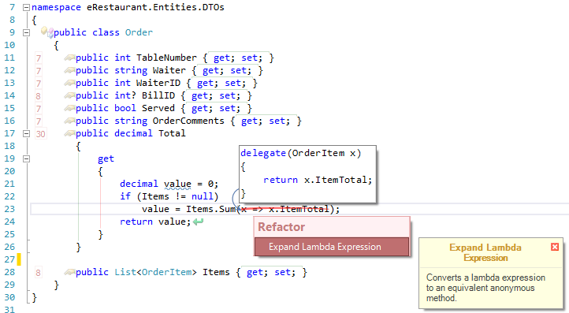
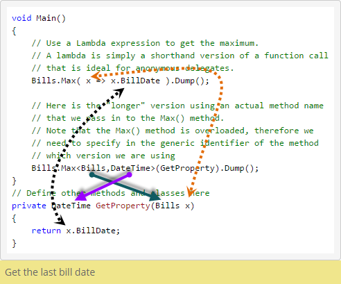

---
title: Lambdas and Delegates
---
# LINQ - Lambdas and Delegates

C# supports the concept of [delegates](http://msdn.microsoft.com/en-us/library/900fyy8e.aspx).

> A **delegate** is a reference type that can be used to encapsulate a named or an anonymous method. Delegates are similar to function pointers in C++; however, delegates are type-safe and secure. For applications of delegates, see [Delegates](http://msdn.microsoft.com/en-us/library/ms173171.aspx) and [Generic Delegates](http://msdn.microsoft.com/en-us/library/sx2bwtw7.aspx).
> [http://msdn.microsoft.com/en-us/library/900fyy8e.aspx](http://msdn.microsoft.com/en-us/library/900fyy8e.aspx)

The `=>` operator is known as the [Lambda Operator](http://msdn.microsoft.com/en-us/library/bb311046.aspx) in C#.

Delegates allow methods to be passed to other methods, effectively creating callback functionality. In other words, one of the parameters for a method can be a delegate. Combined with the ability to create [anonymous methods](http://msdn.microsoft.com/en-us/library/0yw3tz5k.aspx), delegates form an important basis for what are known as [Lambda Expressions](http://msdn.microsoft.com/en-us/library/bb397687.aspx). The method syntax of LINQ makes heavy use of lambda expressions.

Review the information in the following resources:

- [Understand Lambda Expressions in 3 minutes](http://www.codeproject.com/Tips/298963/Understand-Lambda-Expressions-in-minutes)
- [Lambda Expressions](http://msdn.microsoft.com/en-us/library/bb397687.aspx)
- [Delegates (C# Programming Guide)](http://msdn.microsoft.com/en-us/library/ms173171.aspx)
- [Using Delegates (C# Programming Guide)](http://msdn.microsoft.com/en-us/library/ms173172.aspx)
- [How to: Declare, Instantiate, and Use a Delegate (C# Programming Guide)](http://msdn.microsoft.com/en-us/library/ms173176.aspx)

In the following LinqPad illustration, a Lambda is compared to a delegate. With the Lambda, the data types for the delegate's parameters and return type are inferred from the "body" of the Lambda and the type of object in the collection that the `Max` method is coded on.

