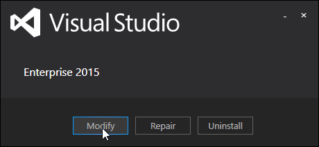

# Install Reporting Tools for VS2015

Microsoft's Reporting Tools for Visual Studio are bundled in a separate feature called **SQL Server Data Tools**. To get the reporting tools installed on your current copy of Visual Studio 2015, follow these steps:

1. Press the Windows Key and search for the Control Panel   
2. Click on the Programs setting   
3. Click on Programs and Features   
4. Select Visual Studio 2015 and click the Change button   
5. Click the Modify button in the Visual Studio setup   
6. Select the "Microsoft SQL Server Data Tools" feature and continue through the installation dialog   
