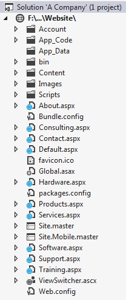

# Site Navigation

Note: The styling of the menu display is based on ASP.NET Website templates from Visual Studio 2010 or earlier. Since Visual Studio 2012, an entirely different site layout and design is used. As such, the screen shots in this lesson may not match your working solution. However, the basics of SiteMap-based controls as outlined in this document remain the same.

## Why Use Web.sitemap

Websites need navigation to help users get to different pages on the website. It's not unusual to see many sites use hard-coded navigation links for a website. ASP.Net offers an alternative - the Web.sitemap. The Web.sitemap file in ASP.Net is used to provide a structure and content for navigational controls such as the `<asp:Menu>`, `<asp:SiteMapPath>` and `<asp:TreeView>` controls. Sitemaps offers a number of advantages:

- The navigational structure is kept outside of the actual Site.master file, making it easier to modify or change independent of other code or markup
- A sitemap can arrange the navigation for the site in a different hierarchy than the physical file/folder layout of the site
- The sitemap integrates nicely with the Universal Providers to ensure that the ASP.Net controls only show the navigational items associated with a particular security role

## ASP.NET SiteMap Files



Site maps are XML files used in conjuncture with navigational controls such as the Menu, TreeView and SiteMapPath controls. The whole purpose of site maps is to provide a simple, centralized way to structure navigation for an ASP.NET web site.

Site map files have the file extension .sitemap and are simple XML files with a root element of `<siteMap>` and child elements of `<siteMapNode>`. As such, the site map is a hierarchical structure, which is ideally suited for menus and tree-views. The `<siteMap>` element can contain only one direct child `<siteMapNode>` element, but that siteMapNode can contain any number of other siteMapNodes.

The siteMapNode elements can be nested and stacked to produce the desired navigational structure for the site; the stacking/nesting of siteMapNodes does not have to match the actual file/folder structure of the website.

The siteMapNode has three key attributes:

- The title attribute represents the text that is displayed in the navigational control.
- The url attribute represents the path to the page to be displayed when the user clicks on the item in the navigational control.
- The description attribute is used to provide tooltip descriptions for the page when the user hovers over the item in the navigational control.

The url attribute should start with "∼/" to anchor the relative path to the root of the web application. Thus, the default page's url would be "∼/Default.aspx".

In order for the site map to be valid, there cannot be any duplicate URLs (although more than one siteMapNode can have an empty url attribute).

The following is a site map for a web site with the pages in the diagram above. It produces a tree-like hierarchy seen in the following image.


```xml
<siteMap>
    <siteMapNode title="Root" description="(do not display)" url="~/">
        <siteMapNode title="Home" description="Home" url="~/Default.aspx" />
        <siteMapNode title="Products" description="Our products"
            url="~/Products.aspx">
            <siteMapNode title="Hardware" description="Hardware choices"
                url="~/Hardware.aspx" />
            <siteMapNode title="Software" description="Software choices"
                url="~/Software.aspx" />
        </siteMapNode>
        <siteMapNode title="Services" description="Services we offer"
            url="~/Services.aspx">
            <siteMapNode title="Training" description="Training classes"
                url="~/Training.aspx" />
            <siteMapNode title="Consulting" description="Consulting services"
                url="~/Consulting.aspx" />
            <siteMapNode title="Support" description="Supports plans"
                url="~/Support.aspx" />
        </siteMapNode>
        <siteMapNode title="About" description="About" url="~/About.aspx" />
    </siteMapNode>
</siteMap>
```

## SiteMapDataSource

For a site map to be accessible to a page, a SiteMapDataSource control must be added. A single SiteMapDataSource control can be used by multiple navigational controls at once.

One important attribute of this control is the ShowStartingNode attribute. Recall that there must be a single direct siteMapNode child under the siteMap element in a site map. This has the effect of producing a single siteMapNode root element, but our intent may be to show the next layer of elements as the top level of our menu. Giving the ShowStartingNode attribute a value of "false" helps control this display by filtering out the first siteMapNode element, as in the following code sample.

```xml
<asp:SiteMapDataSource ID="SiteMapDataSource" runat="server" ShowStartingNode="false" />
```

## Navigation Controls

The navigation controls (Menu, SiteMapPath, and TreeView) are designed to work easily with site maps. Simple add a SiteMapDataSource control to the page containing your navigation control and set the navigation control's DataSourceID property to reference that data source control, as in the following sample (taken from http://msdn.microsoft.com/en-us/library/ms178418.aspx).

```xml
<%@ Page Language="C#" %>
<!DOCTYPE html PUBLIC "-//W3C//DTD XHTML 1.0 Transitional//EN" "http://www.w3.org/TR/xhtml1/DTD/xhtml1-transitional.dtd">
<script runat="server">
</script>
<html xmlns="http://www.w3.org/1999/xhtml" >
  <head runat="server">
    <title>Simple Navigation Controls</title>
  </head>
<body>
  <form id="form1" runat="server">
  <div> <h2>Using SiteMapPath</h2>
    <asp:SiteMapPath ID="SiteMapPath1" Runat="server">
    </asp:SiteMapPath>
    <asp:SiteMapDataSource ID="SiteMapDataSource1" Runat="server" />

    <h2>Using TreeView</h2>
    <asp:TreeView ID="TreeView1" Runat="Server" DataSourceID="SiteMapDataSource1">
    </asp:TreeView>

    <h2>Using Menu</h2>
    <asp:Menu ID="Menu2" Runat="server" DataSourceID="SiteMapDataSource1">
    </asp:Menu>

    <h2>Using a Horizontal Menu</h2>
    <asp:Menu ID="Menu1" Runat="server" DataSourceID="SiteMapDataSource1"
       Orientation="Horizontal"
       StaticDisplayLevels="2" >
    </asp:Menu>

  </div>
  </form>
</body>
</html>
```

## Menu Control

The ASP.NET Menu Control is a navigational tool that displays a hierarchical set of links. The items at the top of the hierarchy are called "menu items" while items underneath each menu item are called "submenus".


Typically, the Menu control is placed on a master page (.master) to help centralize the navigation. A web site can have multiple Menu controls, however, with each on pointing to the same site map data source. Each level of the menu corresponds to the level or depth of the nodes in the site map's data source.

Menus can display their submenus as either "static" or "dynamic". Menu and submenu items are said to be "static" when they are always displayed. Dynamic submenus are items that are displayed only when the user hovers the mouse over the menu item. This is all controlled by setting the depth at which static menus appear (using the StaticDisplayLevels property) and then setting how many levels beyond the static menu are displayed dynamically (using the MaximumDynamicDisplayLevels).

The minimum (and default) value for the StaticDisplayLevels is 1; this is to ensure that there is always a top level of items to display in the menu. If you set the StaticDisplayLevels to a higher number (3, for example), then the first three levels of the menu control's items are always displayed. All the levels that are statically displayed are "flattened" to appear as a single level (though you can control this appearance bit with some clever use of CSS).


The MaximumDynamicDisplayLevels property has a default of 3; the minimum allowable value is 0. Dynamic submenus display while the user hovers over the menu item or its submenu items. You can also control the duration that submenus will stay expanded before disappearing by setting the DisappearAfter property to the number of milliseconds to keep the menu expanded.

Menu controls have an Orientation property that can be set to either Vertical or Horizontal. This orientation applys only to the statically displayed menu items; dynamic submenus are displayed vertically by default, although this can be controlled by the use of CSS.

By default, the Menu control will output the menu and submenu items as an HTML table. Through the use of Control Adapters, however, you can force the Menu control to render a table-less output. An excellent example of this can be found on the ASP.NET website at http://www.asp.net/cssadapters/menu.aspx.

## SiteMapPath Control

The SiteMapPath control is different from the other navigational controls in that it does not need a SiteMapDataSource. Instead, it goes directly to the SiteMap file. An important implication for this is the question of how one over-rides the root siteMapNode element if there is no SiteMapDataSource. The root node can be controlled by adding a RootNodeTemplate element inside the SiteMapPath, as in the following code sample.

```xml
<asp:SiteMapPath ID="SiteMapPath" runat="server" CssClass="breadcrumb"
                    RenderCurrentNodeAsLink="true">
    <RootNodeTemplate>You are here:</RootNodeTemplate>
</asp:SiteMapPath>
```


