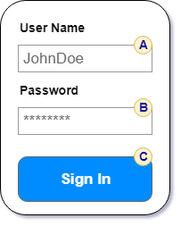
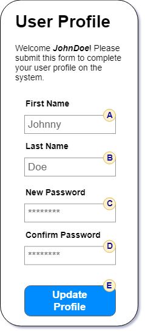

---
title: Intro to UX
---
# Intro to UX

UX (or *U*ser e*X*perience) is fundamentally about giving the user a pleasant experience when interacting with your application. Often times, this means emphasizing the usability of your site, particularly where it includes interactive or functional components. It also includes addressing other issues such as simplifying navigation, creating an intuitive user interface, and effectively meeting the users' needs and expectations. One thing is for certain - at the center of UX is the *user*.

## UX Data-Driven Applications

A data-driven application is simply a program that is supported by a database for back-end storage of information. Storing and retrieving information in a database is all about CRUD - making sure that way we handle information in storage will ensure the general integrity of the data (i.e.: that regular maintenance of the data will not inadvertantly corrupt it). But how information is *packaged* for storage (i.e. - normalized into related tables) is entirely different from how it is *unpacked*, *used* and *moved* around in the application (i.e. - DTOs, POCOs, etc.).

In building data-driven applications, it's important to consider how the data is going to be *displayed to* and *used by* the end-user. Remember, the database is designed to work well for data **storage**, not presentation. It's not unusual for the *shape* or structure of the data to appear differently in a user interface than how it is structured for data storage.

## Designing Data-Driven Applications

When it comes to *designing* the parts of an application that allow users to work with their data-centric needs, you want to create something that is **focused** or **targetted** on the task that they want to accomplish while keeping the interactions **succinct** and **informative**.

How do we accomplish this? What steps should we follow to make this happen? If you are designing within the constraints of an established state-based database as the backing store, let me suggest the following steps:

1. Clarify the requirements by **listing** out the **explicitly mentioned data items** in the problem statement.
1. **Compare** the problem statement's data items **to the stored data structure** as identified by the ERD.
1. **Distinguish** between data that has to be ***presented to*** the user **versus** that which has to be ***entered by*** the user.
1. **Design** a user interface (**user interactions**) that will facilitate presenting and gathering data.
1. Generate DTO/POCO classes to **model the data** that will be exchanged between the BLL and the Presentation Layer. You can also **model the BLL methods** that will be used, effectively providing a "contract" between the PL and BLL.
1. Determine the **order of events** that will allow the user to see what they need to know and enter what we need to gather.
1. Sketch an **implementation plan** that details what will have to happen behind the scenes of the user interface. Pay particular attention to separating the **interactions with the UI** from the **business processing** that is required to validate and persist the data.

## Clarifying

Sometimes we are fortunate enough to get requirements in writing. Other times we have to write out the requirements ourselves (usually after several discussions with the client). In either case, you get to a point where you need to specifically identify and name the data points in a given part of the program. Naming the data that the end user is working with helps turn our focus to the **informational** aspects of the problem.

Take, for example, the simple case of creating a login page. The general requirement might be expressed as follows.

> "We only want authorized users to access our system. In order to do that, we want them to sign in to the application. Everybody has an assigned user name and password that they use to sign in."

In this description, we identify two pieces of information: `UserName` and `Password`.

We might have additional information about user registration. For example:

> "Employees are assigned a user name and initial, temporary password. Then, when they sign in for the first time, the system will ask them to enter and confirm a permanent password along with their first and last name. At that point, the user will be able to access the secured parts of the site. Subsequent logins won't require this profile setup of the user."

Here, we have something that happens *after* the user logs in. The information that must be captured is the user's `FirstName`, `LastName`, `Password`, and `PasswordConfirmation`.

## Comparing

With the data items explicitly listed for the two forms in the login portion of our application, we would need to compare those against the ERD. The relevant ERD for this might look like the following:

*TODO: ERD* - UserName (PK), Password, Salt, FirstName, LastName, Email, InitialLoginDate, AccountLockOutDate (O)

In the ERD, we see that there are columns in the `Users` table that match up with the data in our two forms:

- **Login Form** - `UserName` and `Password`
- **Initial Profile Form** - `FirstName`, `LastName`, and `Password`

We can also see that the `PasswordConfirmation` listed in our earlier step doesn't appear in the database, and that there are additional columns of data in the `Users` table that haven't been mentioned at all in the earlier requirements.

These comparisons lead us toward our next step of distinguishing between data we show to the user from data that the user has to enter for themselves.

## Distinguishing

In the **Login Form**, the display vs input distinction is fairly self-evident. No specific database information has to be presented to the user, but the user has to enter their username and password in order to sign in.

In the **Initial Profile Form**, however, we might want to display the person's `UserName` while having them input their `FirstName`, `LastName`, `Password`, and `PasswordConfirmation`.

::: tip NOTE:
These distinctions between displaying and entering data fit in nicely with **CQRS** (Command-Query Responsibility Segregation). Any time we have database information to display to the user, it can be obtained as a *Query*, while information that the user gives us for processing and storing in the database can be packaged as a *Command*. A formal CQRS implementation would package the query and command as objects, but in the sample requirements given above this formal structuring is not strictly required.
:::

## Designing

Sketching out a user interface at this stage is helpful in visualizing what the user will be working with. During this step, it's possible that other information from the database might be needed by the user in order for them to complete their task, and that information should be included in the design.

Looking once again at the login form requirements, a simple sketch of the main component would look like this:



Notice the circled tags for the textboxes and button above. Labeling input fields, buttons, and other interactive components with simple identifiers (A, B, C, etc) will make it easier to refer to those parts in the upcoming steps of ordering and planning.

Likewise, the form for initializing the user's profile could look like this.



## Modeling

Modeling the data into classes helps to group related information so that it can be more easily moved between the BLL and Presentation layers.

For example, a `UserLogin` class could be created to hold the login information that will be sent to the BLL.

```cs
public class UserLogin
{
    public string UserName { get; set; }
    public string Password { get; set; }
}
```

The BLL class would have a method to process the login:

```cs
public bool ValidateLogin(UserLogin signin) {}
```

Likewise, the data from the user profile form could be packaged into a class to send into the BLL as a first-time setup.

```cs
public class UserProfile
{
    public string UserName { get; set; }
    public string Password { get; set; }
    public string FirstName { get; set; }
    public string LastName { get; set; }
}
```

and the BLL method could be

```cs
public void SetupProfile(UserProfile info) {}
```

Notice that the implementation details for *how* the presentation layer methods work and *how* the BLL methods work is not needed at present. You are simply organizing information and trying to forsee how you could **exchange data** between the BLL and Presentation layers.

## Ordering

At this step, the sketch of the form is examined in light of the order of events when the user works with the form. The first event of every form is when the it is first requested. (In ASP.Net Web Form applications, this is the `Page_Load()` event.)

Typically, the other interactions to be considered are when the user clicks a button or does some other action that would trigger a call to some background processing on the form.

The login form opens with empty text boxes, so nothing special needs to be done during the page load. Clicking the "Sign In" button (C) is the only other event that triggers processing by the application.

There is a consequence, however, from the user signing in. If the user is signing in for the first time, then they need to enter their profile information. Thus, showing the User Profile form can be thought of as a potential response to the previous event, and this form's own events should be considered.

When the User Profile form loads up, the person's user name is displayed in the welcome message, so that can be thought of as a kind of lookup (though, in the case of security, would not have to involve an extra call to the database - the application presumably knows about the user's login credentials on each page, and we can get their username directly from the page).

The last interaction is when the user clicks the "Update Profile" button (E on the second form). The final step before actually coding the solution is to plan out what is happening during each event and detailing what needs to be done at the levels of the Presentation, Business Logic, and Data Access layers.

## Planning

Once you have a mockup of the user interface and you know the order of events for the users' interactions, you can develop a plan of what needs to be done at each level of your application, from the front end to the database in the back end.

There are many different ways you can outline this plan. For example, you can use a simple bulleted outline of the events. Here is an example using this approach that combines the earlier login and user profile forms on a single page.

### Login Form


- **Form Design:**
  - `RequiredFieldValidator` for (A) and (B)
- **Behaviour:**
  - `Page_Load()` - (A) and (B) are empty on GET request
  - (C) - `SignIn_Click()`
    - Check validation
    - Send user login to BLL
      - `ValidateLogin(UserLogin)`
      - returns `true` if user needs to set up profile
      - throws an exception if the login fails

### User Profile Form


- **Form Design:**
  - `RequiredFieldValidator` for (A), (B), (C), and (D)
  - `CompareValidator` for (C) and (D) to match
- **Behaviour:**
  - `Page_Load()`
    - All input fields are empty on GET request
    - `UserName` displayed in welcom message
  - (E) - `UpdateProfile_Click()`
    - Check validation
    - Send profile to BLL
      - `SetupProfile(UserProfile)`
      - throws exception if the profile is already set or if the user does not exist

## Summary

The benefit of developing a plan before you start writing code is that it gives you a chance to confirm your general understanding of both the problem and your proposed solution. It allows you to "fact-check" your design and uncover any problems. Additionally, it gives you a set of page mockups that you can run by your end users and client to validate your understanding.

Development plans save you time as a developer, because they reduce the liklihood of you spending time on code that doesn't meet the needs of the user.
